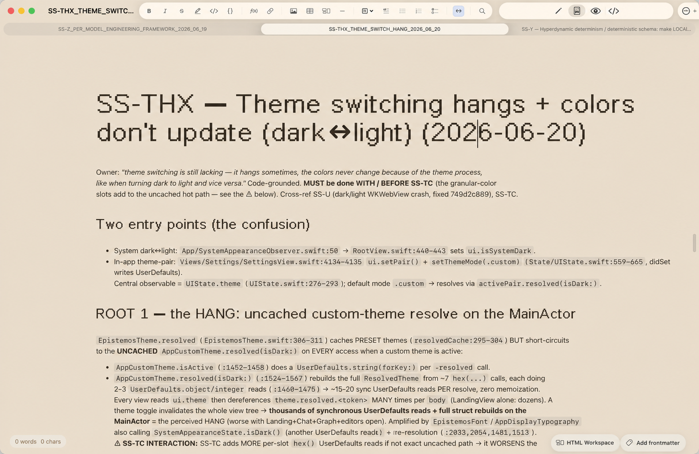
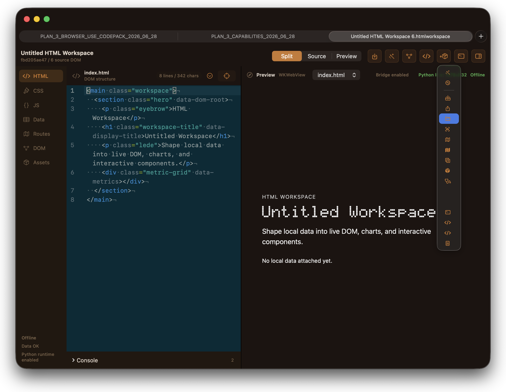
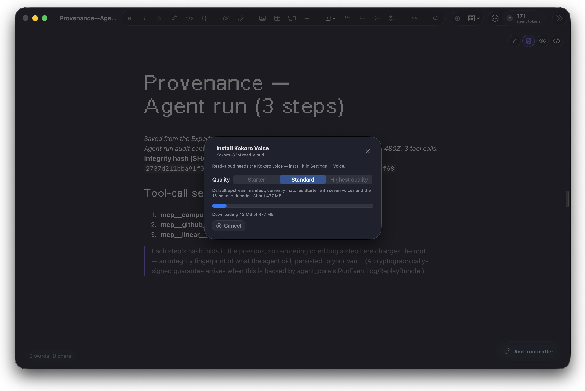
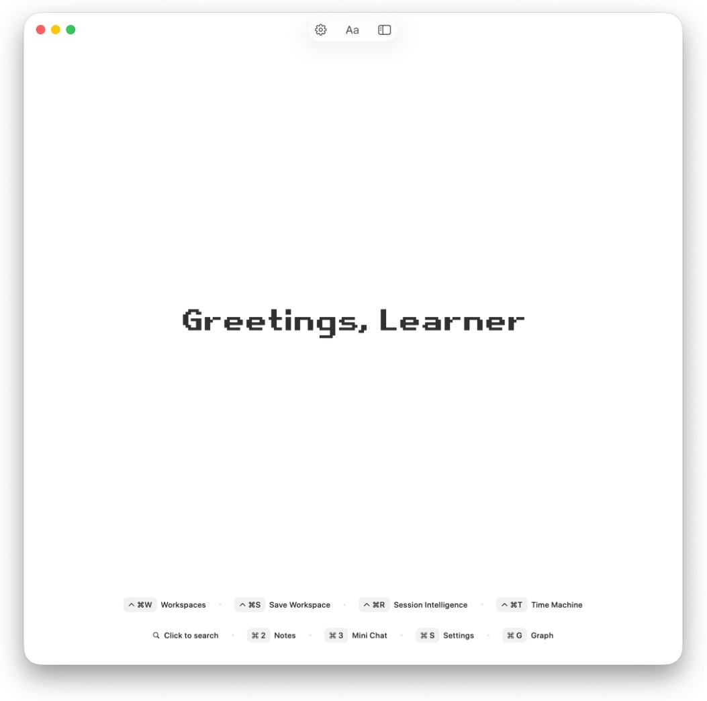
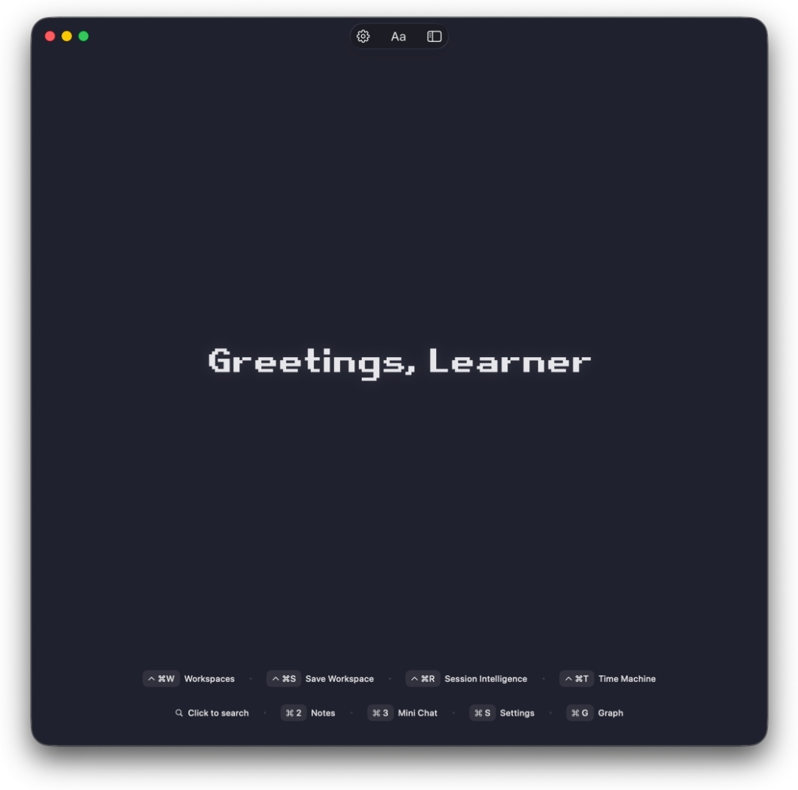
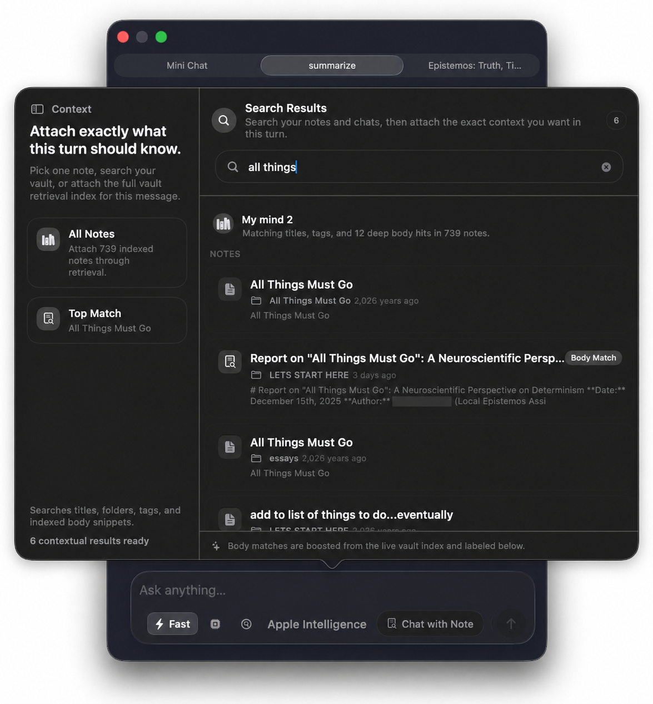
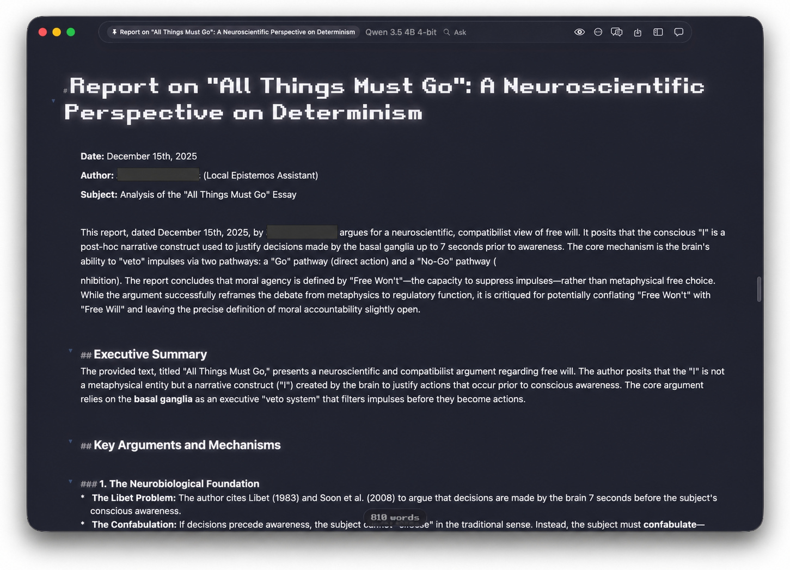
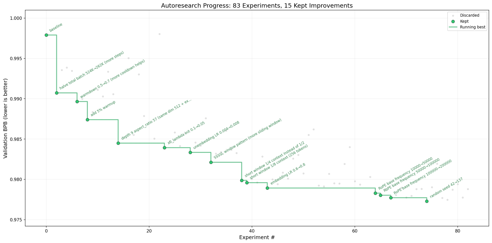

# Epistemos

I started Epistemos because I wanted one serious local research workspace instead of a notes app, a retrieval system, an editor, and an agent bolted together after the fact.

It is a native macOS project with a Swift/AppKit/SwiftUI shell, Rust cores, a TypeScript editor, local vault/search infrastructure, and explicit cloud-assisted paths. It is still in development. I would rather say that plainly than make the README sound like every old research document is already a shipped feature.

## What it looks like

The first three images are isolated crops of development captures I preserved from the working app. They show real work in progress, including rough edges and experimental surfaces; they are not release screenshots or proof that every visible control belongs to the current Free V1 target.

### Notes and theme-performance investigation

### Structured HTML workspace

### Experimental note-run record

### Additional recovered product views

These captures came from the companion site repository. I keep them as an honest visual record of the product's development rather than presenting every surface as current.

| Landing surfaces | Context and research |
| --- | --- |
|  |  |
|  |  |
|  | |

The personal white-chat and 2025/2026-plan captures are intentionally excluded. The older gray graph screenshots are also omitted because they do not represent the current graph design. I will add the red/yellow pixel-art graph when I have the genuine current capture.

## What I am building

The current direction is:

- a native macOS research and writing surface
- local vault context with citations through Eidos
- bounded tools and resources for notes, search, and app actions
- a rich `.epdoc` editor built around Tiptap and CodeMirror
- local-first behavior with cloud use kept explicit and consent-gated
- receipts, falsifiers, and source-backed claims instead of “the architecture says it works”

The big idea is not that an LLM should own the workspace. The workspace should own its data, scope, retrieval, and evidence, and models should operate inside those boundaries.

## What exists in the repo today

### The macOS app

`project.yml` defines the main app targets. The UI and app services live under `Epistemos/`, with separate regular, App Store, and experimental build lanes.

This includes the editor and graph surfaces, vault coordination, Keychain/session handling, local runtime integration, native settings, import/export work, and the bridge code that connects Swift to the Rust libraries.

### Eidos local retrieval

Eidos is my local context and citation layer.

The live source is split between:

- `Epistemos/Eidos/`
- `agent_core/src/eidos/`

There are real retrieval types, bridge paths, local-vault insertion/retrieval, provenance checks, and closed-citation validation in the repo. Some paths are still wiring or research-gated, so the source and tests are the authority—not a roadmap paragraph.

### MCP and vault tooling

`omega-mcp/` contains a Rust registry/dispatcher, execution records, and vault-scoped tools/resources.

It includes JSON-RPC routing, tool listing/calls, bounded reads, path traversal checks, Markdown resource handling, and atomic vault writes. This is where I am trying to make tool use inspectable instead of magical.

### The `.epdoc` editor

`js-editor/` is the TypeScript editor bundle hosted inside the native app. It combines Tiptap and CodeMirror and covers Markdown round trips, code blocks, charts, bridge messages, writeback, and document-graph behavior.

### Explicit cloud paths

Epistemos is local-first, not “cloud never exists.” The repo has opt-in cloud consent, session, proxy, and streaming work under the app and `proxy-server/`.

The intended boundary is simple: vault or personal context should not reach a provider through a hidden fallback. Cloud use has to be visible, consented, and separated from local operation.

### Experimental local runtime surfaces

The experimental lanes include embedded web/agent surfaces, supervised local runtimes, loopback coordination, sanitized child environments, and provider-key bridging from Keychain.

Those are integration surfaces. Their presence does not mean I authored every upstream tool they can host.

## The research history

Epistemos accumulated a lot of deeper work around a typed coordinate substrate, Scope-Rex, deterministic execution, an autogenous kernel, EML and primitive IRs, Lean theorem specifications, lattice/WBO accounting, numerical falsifiers, residency, and closed-citation retrieval.

Some of that became real code. Some became Lean proof terms. Some is still a theorem candidate with `sorry`. Some is architecture research that deserves to stay public without being called finished.

I separated that material so it can be judged on its own:

- [epistemos-research-canon](https://github.com/BlickandMorty/epistemos-research-canon) — the long lattice explainer and recovered research record
- [epistemos-formal-primitives](https://github.com/BlickandMorty/epistemos-formal-primitives) — Lean source with an exact proof/candidate ledger
- [epistemos-labs](https://github.com/BlickandMorty/epistemos-labs) — the tested Rust monorepo for the executable experiments below
  - [primitive-ir-lab](https://github.com/BlickandMorty/epistemos-labs/tree/main/experiments/primitive-ir-lab) — the executable EML and typed primitive floor
  - [deterministic-agent-kernel](https://github.com/BlickandMorty/epistemos-labs/tree/main/experiments/deterministic-agent-kernel) — deterministic decisions and replay receipts
  - [scope-rex-admission](https://github.com/BlickandMorty/epistemos-labs/tree/main/experiments/scope-rex-admission) — bounded, evidence-carrying admission
  - [eidos-closed-citation](https://github.com/BlickandMorty/epistemos-labs/tree/main/experiments/eidos-closed-citation) — a small closed-citation honesty layer
  - [f-ulp-oracle](https://github.com/BlickandMorty/epistemos-labs/tree/main/experiments/f-ulp-oracle) — binary16 ULP witnesses
  - [lattice-wbo-ledger](https://github.com/BlickandMorty/epistemos-labs/tree/main/experiments/lattice-wbo-ledger) — explicit weighted-bound accounting
  - [hyperdynamic-schema-repair](https://github.com/BlickandMorty/epistemos-labs/tree/main/experiments/hyperdynamic-schema-repair) — bounded witnessed repair
  - [vault-recall-benchmark](https://github.com/BlickandMorty/epistemos-labs/tree/main/experiments/vault-recall-benchmark) — deterministic recall evaluation

I kept the unfinished claims too. They are just labeled as unfinished.

## Main languages

- Swift / SwiftUI / AppKit for the native app
- Rust for retrieval, runtime, vault, MCP, graph, and falsifier cores
- TypeScript for the editor, proxy, and embedded web/runtime work
- Metal / C / C++ for kernels and lower-level bridges
- Lean for formal specifications and proof work
- Python for research and utility tooling

## Repo map

| Path | What it is |
| --- | --- |
| `Epistemos/` | Native macOS app source, UI, services, resources, shaders, and integration code |
| `agent_core/` | Retrieval, agent/runtime, falsifier, and research-gated Rust work |
| `omega-mcp/` | MCP registry, dispatcher, execution log, and vault tools/resources |
| `substrate-rt/` | Deterministic event/runtime substrate |
| `epistemos-core/` | Core Rust library linked into the app |
| `graph-engine/` | Graph and syntax engine surfaces |
| `syntax-core/` | Tree-sitter parsing core |
| `epistemos-code-index/` | Code indexing |
| `js-editor/` | Tiptap/CodeMirror `.epdoc` editor bundle |
| `proxy-server/` | Reference cloud proxy and receipt/session routes |
| `lean/Epistemos/` | Formal theorem and primitive-IR source |
| `docs/` | Research, audits, designs, falsifiers, and historical plans |

## Build shape

The Xcode project is generated from `project.yml`. The prebuild path compiles the Rust libraries and editor/runtime bundles before the app build.

Important scripts include:

- `build-rust.sh`
- `build-syntax-core.sh`
- `build-omega-mcp.sh`
- `build-epistemos-core.sh`
- `build-agent-core.sh`
- `build-substrate-rt.sh`
- `build-tiptap-bundle.sh`
- `build-coreeditor-bundle.sh`
- `bundle-app-runtime-assets.sh`

Different build lanes do not expose the same capabilities. Check `project.yml`, feature flags, source, and tests for the lane you care about.

## The honest status rule

When an old document and the current source disagree, the current source wins.

When a Lean declaration contains `sorry`, it is a candidate, not a proof.

When a benchmark uses a synthetic fixture, it proves the harness, not real-world quality.

When a feature is behind an experimental flag, I call it experimental.

Epistemos moves quickly, but that does not need to mean the claims move faster than the evidence.

## License

To be determined. Until a license is added, normal copyright rules apply to this repository.
