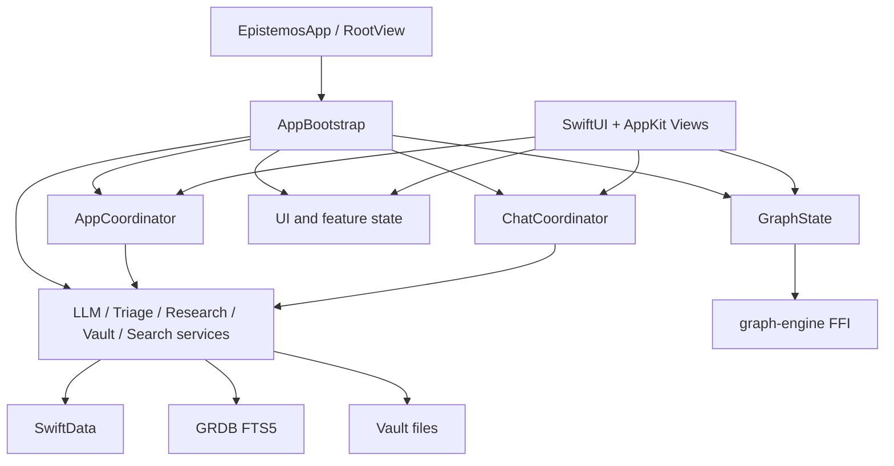

# Epistemos Deep Hardening Cycle Plan

> **Index status**: SUPERSEDED-HISTORICAL — Older plan tree predecessor of `docs/plan/`; superseded by MASTER_FUSION.md + V1_5_IMPLEMENTATION_TRACKER.md.
> Classified in [`docs/_INDEX.md §14`](_INDEX.md).

Date: March 13, 2026
Scope: production hardening for the current Swift + Metal + Rust application, not a rewrite

## Goal

Turn the current release-capable app into a calmer, faster, and more failure-resistant system through additive hardening passes. Every change in this program must do one of three things:

- remove a real correctness risk
- measurably reduce latency, contention, or memory churn
- improve verification so regressions are caught earlier

Anything else is churn.

## Operating Rules

- Every phase starts with a git checkpoint tag: `checkpoint/<phase>-prepass-YYYY-MM-DD`.
- Every code change needs a proving test first, or a benchmark first if the target is pure performance.
- No broad rewrites inside a hardening phase. Touch the smallest surface that fixes the real problem.
- Any optimization with no measured win gets reverted.
- Swift `xcodebuild test` and Rust `cargo test` stay green at the end of every kept phase.

## Current Verification Commands

Use these as the baseline matrix before phase-specific additions:

- Swift build: `xcodebuild -project Epistemos.xcodeproj -scheme Epistemos -destination 'platform=macOS' build`
- Swift tests: `xcodebuild -project Epistemos.xcodeproj -scheme Epistemos -destination 'platform=macOS' test`
- Rust tests: `cd graph-engine && cargo test`
- Rust race regression: `cd graph-engine && cargo test hardened_race_tests -- --nocapture`
- Graph benchmark matrix: `cargo test benchmark_graph_phase1_matrix --manifest-path /Users/jojo/Epistemos/graph-engine/Cargo.toml -- --nocapture`

Add a dedicated Thread Sanitizer scheme in Phase 0 and append its exact invocation here once the scheme exists.

## Current Architecture Snapshot

### Swift Inventory

| Area | Swift Files | Current Risk |
|---|---:|---|
| `Views/` | 67 | Highest invalidation and AppKit bridge risk |
| `Engine/` | 33 | Highest async/network/pipeline risk |
| `Models/` | 20 | Medium persistence risk |
| `Intents/` | 16 | Medium actor-boundary risk |
| `State/` | 13 | Medium invalidation risk |
| `Graph/` | 10 | Highest Swift↔Rust handoff risk |
| `Sync/` | 10 | Highest data-integrity risk |
| `App/` | 9 | High lifecycle/orchestration risk |
| `Theme/` | 8 | Low runtime risk |

### Rust Inventory

The Rust engine is a single crate with these live subsystems:

- engine orchestration: `engine.rs`, `renderer.rs`, `simulation.rs`, `spatial.rs`
- graph/search/layout: `types.rs`, `cluster.rs`, `cluster_cache.rs`, `search.rs`, `quadtree.rs`, `forces.rs`
- editor/block work: `markdown.rs`, `block_kernel/*`, `code_highlight.rs`
- FFI boundary: `lib.rs`
- verification: `bench_tests.rs`, `hardened_race_tests.rs`, `graph_tests.rs`, comprehensive test modules

### Concurrency / Criticality Heatmap

Heuristic score from `@MainActor`, `await`, `Task`, AppKit bridge usage, `ModelContext`, and `nonisolated(unsafe)` density. This is not the final heatmap deliverable; it is the recon ranking for the program.

| Rank | File | Score | Why it matters |
|---:|---|---:|---|
| 1 | `Epistemos/Views/Notes/ProseEditorRepresentable.swift` | 126 | AppKit bridge, page swapping, debounce, streaming, notifications |
| 2 | `Epistemos/Views/Graph/MetalGraphView.swift` | 113 | Swift↔Rust engine lifecycle and per-frame coordination |
| 3 | `Epistemos/Engine/LLMService.swift` | 110 | high async density, network fan-out |
| 4 | `Epistemos/Sync/VaultSyncService.swift` | 103 | background import/export and data integrity |
| 5 | `Epistemos/Views/Graph/HologramOverlay.swift` | 94 | AppKit window lifecycle and observer churn |
| 6 | `Epistemos/Graph/GraphState.swift` | 76 | load/recommit/refresh coordination |
| 7 | `Epistemos/App/AppBootstrap.swift` | qualitative | lifecycle concentration and residual boot-time fan-out |
| 8 | `graph-engine/src/lib.rs` | highest unsafe density | FFI correctness boundary |
| 9 | `graph-engine/src/engine.rs` | mutex/thread/render coordination | primary Rust runtime hotspot |
| 10 | `Epistemos/Sync/SearchIndexService.swift` | cross-storage boundary | concurrency-safe search path already in use |

### Existing Wins To Preserve

- background graph loading already exists and removed the worst cold-open stall
- `AppCoordinator` and `ChatCoordinator` already pulled orchestration out of `AppBootstrap`
- vault import/export work is already moving into `VaultIndexActor` instead of main-thread sweeps
- GRDB FTS5 search already replaced the weakest in-memory search path
- graph storage already moved to compact Int-indexed structures
- the note editor already avoids the SwiftUI `ScrollView` feedback loop by staying AppKit-native

Do not erase these wins with a “clean rewrite.”

## Hardening Triage Of The Research Note

### Worth Doing

- stricter concurrency boundaries where actor crossings are still fuzzy
- targeted off-main movement for real CPU or I/O hotspots
- deterministic async tests and sanitizer passes
- deeper metrics around launch, graph load, sync latency, editor page swaps, and render smoothness
- selective state localization where broad environment invalidation is still measurable

### Worth Spiking First, Not Blindly Adopting

- Tree-sitter for incremental editor parsing
- more granular environment wrappers than `withAppEnvironment(_:)`
- renderer-side GPU work beyond the current Metal path
- Rust-side concurrency structure changes inside the engine

### Reject For Now

- wholesale SwiftData removal in favor of a custom WAL/mmap database
- lock-free maps or `crossbeam`/`flurry` insertion without contention proof
- broad “strict concurrency” churn that only adds annotations without reducing risk
- replacing working synchronous pure functions with extra async layers
- any optimization justified only by aesthetics like “more Apple-like”

## Target Dependency Graph

The hardening rule for this graph is simple: views depend on focused state; coordinators depend on services; services do not depend on views.

## Five-Month Program

## Phase 0: Baseline And Guardrails
Weeks: 1-2

Goals:

- make performance and correctness visible before more edits land
- create a repeatable checkpoint and rollback habit

Work:

- add a hardening dashboard doc with baseline numbers for:
  - app cold launch
  - graph cold-open
  - vault attach/import
  - note page swap
  - note save/export
  - graph recommit
- add signpost coverage where it is still missing in:
  - `AppBootstrap.swift`
  - `GraphState.swift`
  - `VaultSyncService.swift`
  - `ProseEditorRepresentable.swift`
  - `MetalGraphView.swift`
- define one benchmark command per subsystem and store the commands in this plan
- add a Thread Sanitizer test scheme and a small deterministic async test matrix

Exit criteria:

- one command list exists for build, tests, sanitizer, and perf spot-checks
- baseline measurements are recorded before touching deeper architecture

## Phase 1: State Localization Without Framework Churn
Weeks: 3-5

Goals:

- reduce broad invalidation from large environment surfaces
- keep `AppBootstrap` as a factory, not a behavior sink

Work:

- map which views actually read which environment values
- split high-fanout state reads in the hottest surfaces first:
  - graph overlay and graph inspector
  - note editor workspace
  - landing/command palette shell
- continue coordinator extraction only where `AppBootstrap` still owns behavior
- prefer narrow environment objects or tiny facade types over a repo-wide DynamicProperty rewrite

Do not do:

- a wholesale replacement of `withAppEnvironment(_:)`
- view model proliferation for files that are not hot or unstable

Exit criteria:

- hot views stop invalidating for unrelated state changes
- `AppBootstrap` owns construction and boot lifecycle, not feature workflows

## Phase 2: Concurrency Audit And Structured Task Cleanup
Weeks: 6-8

Goals:

- make actor boundaries boring
- remove accidental task lifetimes and fragile reentrancy

Work:

- audit the top heatmap files for:
  - unstructured `Task {}` usage
  - main-actor callbacks that assume thread affinity
  - long loops without cancellation checks
  - actor methods that cross `await` while invariants are half-updated
- move true CPU or blocking work off the cooperative pool only when profiling shows it matters
- replace opportunistic task spawning with task groups, `async let`, or coordinator-owned tasks where cancellation should propagate
- add regression tests around:
  - graph load + recommit ordering
  - vault import/export and dirty-page preservation
  - note editor streaming + page swap interactions

Do not do:

- GCD rewrites for code that is already cheap
- `Sendable` annotation sweeps without real boundary review

Exit criteria:

- no known fragile task lifetime remains in the top-risk files
- the app passes a Thread Sanitizer sweep on the critical flows

## Phase 3: Editor Pipeline And Parsing Evaluation
Weeks: 9-12

Goals:

- make large-note editing feel constant-time enough for real use
- prove whether Tree-sitter is worth the complexity

Work:

- measure current editor costs for:
  - initial open of small, medium, and large notes
  - per-keystroke cost in long notes
  - page swap cost with overlays and folding active
  - markdown highlighting and block sync cost
- tighten the existing pipeline first:
  - reduce notification churn
  - reuse buffers/state where easy
  - shrink any remaining main-thread parsing or detection bursts
- run a Tree-sitter spike only if current parser/highlighter costs stay above the budget after the cheap wins

Decision gate:

- keep the current parser if measured typing and page-swap latency are already within target
- adopt Tree-sitter only if the spike clearly wins on large-note editing without undo/selection regressions

Exit criteria:

- typing and page-swap latency targets are met on a large synthetic vault
- parser replacement decision is backed by numbers, not taste

## Phase 4: Persistence, Search, And Vault Integrity
Weeks: 13-15

Goals:

- harden the storage boundary without creating a migration tax
- keep search and sync boring under load

Work:

- audit every path that mutates `needsVaultSync`, body hashes, and body persistence
- continue moving heavy sync and reconciliation into actor-owned paths
- benchmark SwiftData fetch/save hot paths before proposing any storage replacement
- harden search indexing around incremental updates, stale index rebuilds, and vault reattach flows
- add crash-resistant recovery tests for:
  - interrupted import
  - interrupted export
  - stale bookmark restore
  - index rebuild on missing or corrupt search database

Do not do:

- a SwiftData-to-SQLite rewrite unless benchmarks prove SwiftData is the dominant release blocker
- mmap work at the Swift/Rust boundary unless it removes a measured allocation bottleneck

Exit criteria:

- sync integrity is deterministic under repeated attach/import/export cycles
- search stays correct after forced index loss and rebuild

## Phase 5: Graph Engine And Rendering Hardening
Weeks: 16-18

Goals:

- keep graph open, pan, selection, and focused updates fluid at realistic scale
- reduce whole-engine churn when only local changes happened

Work:

- continue the graph performance plan, but only where it now pays:
  - incremental graph updates instead of full recommits where safe
  - reduced buffer rebuild scope in renderer paths
  - lower lock hold times in the Rust engine
  - better recommit triggers and diff discipline from Swift
- produce a real graph heatmap:
  - cold-open
  - first frame
  - recommit
  - pan/zoom
  - search highlight
  - selection/focus
- validate frame smoothness on large graphs after each engine change

Do not do:

- GPU compute physics or a renderer rewrite in this hardening cycle
- lock-free container experiments without profiler evidence

Exit criteria:

- graph interactions stay smooth at the agreed test sizes
- local graph edits do not force whole-engine rebuilds unless topology truly requires it

## Phase 6: Release Gate, Soak, And Finish Work
Weeks: 19-20

Goals:

- stop changing architecture and prove the system holds

Work:

- run three clean passes of the release matrix:
  - full Swift tests
  - full Rust tests
  - sanitizer pass
  - benchmark spot checks
  - manual smoke tests for note editing, sync, chat, graph, and window management
- produce two final artifacts:
  - Concurrency Heatmap
  - App Performance Checklist
- only spend the last phase on:
  - regressions found by the matrix
  - warning cleanup with signal
  - release notes and residual-risk documentation

Exit criteria:

- three successive clean hardening passes
- no open high-severity stability item without an explicit defer note

## Recursive Pass Template

Every phase uses the same loop:

1. tag checkpoint
2. record baseline numbers
3. add or tighten the test
4. make the smallest high-confidence change
5. rerun build, tests, and targeted perf checks
6. keep only changes with a clear win
7. update the hardening dashboard and residual-risk list

## Immediate Candidates Worth Starting First

- finish the concurrency/task audit in the top heatmap files before deeper architectural work
- add deterministic coverage around graph load/recommit and note editor page-swap races
- instrument note editor page swap, graph overlay first-open, and vault attach/import with signposts
- narrow the broadest environment reads in graph and note surfaces only after measuring invalidation

## Explicit Non-Goals For This Program

- no storage-engine rewrite just because WAL/mmap sounds faster
- no Tree-sitter adoption unless the spike beats the existing editor in practice
- no repo-wide environment abstraction rewrite
- no lock-free Rust rewrite without contention data
- no optimization PR that cannot point to a failing test, profiler trace, or benchmark delta

## Release Standard

Epistemos is ready when the slow paths are intentional, the risky paths are covered, and the remaining complexity is measured rather than guessed at.
