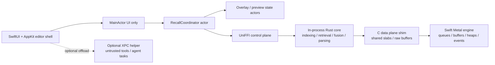
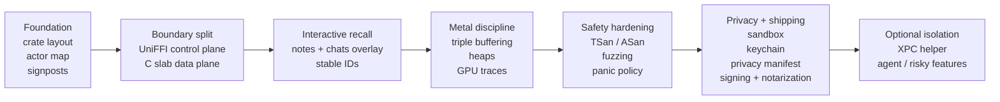

# High-Performance Native macOS Cognitive App in Swift, Rust, and Metal

## Executive summary

The best default architecture for this app is **a hybrid, not a monoculture**: keep the **UI, state presentation, and Metal ownership in Swift**, run the **core retrieval / parsing / ranking / indexing engine in-process in Rust**, use **UniFFI for the control plane**, and add **a very small C-compatible data-plane shim for zero-copy slabs and buffer ownership** on the hottest paths. That design lines up with how Swift concurrency isolates UI state, how UniFFI lifts and lowers types, and how Metal wants CPU-visible buffers and command submission to be managed on the Apple side. It also avoids the biggest trap here: trying to make UniFFI carry your raw high-throughput memory traffic, even though UniFFI explicitly lowers many complex values through buffer serialization. citeturn0search14turn0search0turn2search4turn2search14turn16search2

For **instantaneous feel**, design around **tail latency**, not average latency. A good target is: **main-thread work per keystroke under 2 ms p99**, **interactive retrieval update within 50 ms p50 and 100 ms p95 after debounce**, **no UI path that waits synchronously on Rust or the GPU**, and **graph / overlay rendering that never exceeds the frame budget**. On the GPU side, Apple’s guidance is consistent: reduce CPU overhead with argument buffers, use multiple resource instances to avoid CPU/GPU stalls, profile with Metal System Trace and GPU counters, and choose resource storage modes deliberately. citeturn7search3turn7search11turn17search17turn23search0turn23search2turn23search5

For **safety and robustness**, treat the language boundary as a **hostile seam**. Swift actors and `Sendable` help only on the Swift side; UniFFI objects may be called from any thread, and Rust must still enforce `Send + Sync`, interior mutability discipline, and panic containment. The Rustonomicon is very clear that foreign calls are unsafe, that raw pointers sit outside Rust’s safe memory model, and that unwinding across non-`-unwind` FFI boundaries is not acceptable. citeturn2search14turn0search2turn0search9turn26view2turn26view0

For **privacy**, the strongest posture is **on-device by default**, minimal entitlements, App Sandbox, Keychain for secrets, security-scoped bookmarks for user-selected files, notarized and properly signed binaries, and a privacy manifest that documents any collection or access patterns. If you add helper processes, prefer **XPC services** over ad hoc subprocesses: Apple explicitly positions XPC services for **stability and privilege separation**, while helper tools launched directly from a sandboxed app inherit the app’s sandbox capabilities. citeturn5search13turn5search1turn6search3turn6search6turn24search0turn24search2turn4search2turn4search3turn22search3

Your own implementation brief already points at the right repo-specific priorities: **unwired instant recall/contextual shadows, MainActor FFI work, graph stutter, and the dynamic recall surface that appears while typing**. Those are exactly the first things to fix, because they sit directly on the p99 interaction path. fileciteturn0file0

## Architecture

The architecture I recommend is **three layers plus one optional isolation boundary**.

The **presentation layer** is SwiftUI plus targeted AppKit bridges for the editor, text system, windowing, and high-frequency view updates. Its only hard real-time job is to stay responsive: cursor movement, selection, composing text, hover previews, and overlay presentation must remain on the main thread; everything else should be pushed off the main actor immediately. Swift actors execute on a shared global concurrency pool by default, which makes them excellent for ownership and serialization, but a poor place to hide blocking or long-running foreign work. citeturn0search14turn0search3turn0search17

The **core cognition layer** should be a Rust `cdylib` embedded in the app process. Put retrieval indexes, note/chat segmentation, ranking, fuzzy matching, hybrid lexical-plus-vector scoring, result fusion, tokenizer-like preprocessing, and any cache-heavy data structures here. This is where Rust pays off: the hot loops stay out of the UI runtime, you get a strong ownership model, and you can build safe wrappers around very small `unsafe` islands. Approximate nearest-neighbor retrieval is a good fit for graph-based indexes such as HNSW when you need fast top-k retrieval with good recall. citeturn26view2turn0search9turn11search0

The **GPU layer** should stay **owned by Swift**, not Rust. That sounds counterintuitive if you are thinking “Rust for performance,” but it is the right trade. Metal’s official API surface, debugging tools, Instruments workflows, command submission model, capture tooling, and profiling support are centered on Apple’s language stack. The lowest-friction design is: Rust owns CPU-side data and algorithms; Swift owns `MTLDevice`, `MTLCommandQueue`, pipelines, heaps, events, residency sets, and UI-adjacent resource lifetimes. Rust may allocate slabs that Swift wraps into `MTLBuffer`s, but Swift should remain the conductor of the GPU orchestra. citeturn23search0turn23search1turn23search3turn16search2turn16search3

The **optional isolation boundary** is a helper process exposed over XPC. Use it **selectively** for things that are crash-prone, privilege-sensitive, or operationally noisy: experimental agent tooling, ingestion from risky external formats, browser automation, OCR pipelines, model downloaders, or untrusted plugin execution. Do **not** push your keystroke-to-recall loop into that helper by default, because you will pay unnecessary marshaling and scheduling overhead. Also, if you merely launch a helper directly with `Process`, that helper inherits the sandbox capabilities of the app; that is not the strong isolation many teams assume it is. XPC is the right primitive when you actually want an independent failure domain and privilege boundary. citeturn6search6turn6search13turn6search0

For the **ambient / instant recall feature** you described, architect it as a dedicated interactive pipeline: the editor emits **cursor-local query context** into a **RecallCoordinator actor**, which performs debounce and cancellation, asks Rust for **top note hits and top chat hits from separate indexes**, and returns stable IDs plus snippets. The overlay remains non-modal, shows the dynamic button only after the user is actually composing, preserves typing focus, and loads hover previews lazily by note or chat ID. For editable note previews, bind directly to the canonical note model instead of copying text into the panel. For chats, keep the panel read-only and dispatch actions like **Open thread** or **Summarize thread** to a coordinator action. That design satisfies the interaction you want without putting full text duplication or expensive rendering into the hot path. fileciteturn0file0



The concrete thread model should be equally opinionated. Use **MainActor only for UI**, a **Swift actor for editor-local recall orchestration**, one **dedicated serial queue or custom worker actor for FFI ingress/egress**, and a **small bounded set of named Rust worker threads** for interactive work. Do not let interactive retrieval share a giant general-purpose pool with background reindexing and model maintenance. Named native threads are easier to profile and reason about than mystery work on a common scheduler. citeturn18search1turn18search3turn18search15

## FFI boundary and ABI design

The highest-value FFI rule is simple: **use UniFFI for ergonomics, not for bulk transport**. UniFFI is excellent for configuration objects, lightweight requests, result records, `throws`-style error mapping, object handles, and async control flow. It is **not** the place to push giant rank arrays, embedding matrices, frame-sized chunks, or dense candidate sets many times per second, because UniFFI explicitly lifts and lowers many complex values through buffer serialization. That is a control-plane pattern, not a data-plane pattern. citeturn2search4turn2search13turn2search14

Use this boundary policy:

| Boundary | What goes through it | What stays out |
|---|---|---|
| **UniFFI** | config, commands, object handles, small result records, async task lifecycle, typed errors | large vectors, per-frame tensors, raw embedding slabs, GPU-owned resources |
| **C-compatible shim** | raw pointer + len + cap slabs, zero-copy borrowed slices, release callbacks, opaque handles for hot-path buffers | business logic, user-facing errors, complex object graphs |
| **Swift-native** | `MTLDevice`, `MTLBuffer`, queues, views, state publication | Rust memory ownership beyond explicit slabs |

That split is supported by the source material itself. UniFFI exposes scalar and collection types, `bytes`, and `[ByRef]` support for things like `&str` and `&[T]`; it also checks an internal contract version and builds around `RustBuffer` for lifted/lowered data. Use those capabilities, but do not confuse them with a stable promise of zero-copy bulk interchange. citeturn2search0turn2search6turn2search7

For **memory ownership**, adopt one of only two patterns, and ban everything else in code review.

The first is **Rust-owned slabs**. Rust allocates a contiguous block, returns `{ptr, len, cap}`, Swift wraps it with `makeBuffer(bytesNoCopy:length:options:deallocator:)`, and the Metal buffer’s deallocator calls back into Rust to release the slab. This is the cleanest path when Rust fills data and Swift / Metal consume it. Apple explicitly supports wrapping existing contiguous memory allocations into `MTLBuffer`s with `bytesNoCopy`, and buffer `contents()` exposes the CPU address for shared or CPU-visible buffers. citeturn16search2turn16search0turn16search19

The second is **Swift-owned borrowed memory**. Swift allocates a `Data`, `UnsafeMutableRawPointer`, or shared MTL buffer-backed region, then passes the raw pointer and length to Rust for **call-scoped use only**. Rust must never retain that pointer after the call returns unless ownership transfer is made explicit. The Rustonomicon’s guidance is blunt here: raw pointers are unsafe, foreign declarations must be correct, and the safe interface is a wrapper that constrains what the caller can do. citeturn26view2turn0search5

A concrete zero-copy slab pattern looks like this:

```rust
// Rust: data-plane shim, separate from your UniFFI control plane.
use std::{mem::ManuallyDrop, ptr::NonNull, slice};

#[repr(C)]
pub struct SharedSlab {
    pub ptr: *mut u8,
    pub len: usize,
    pub cap: usize,
}

#[no_mangle]
pub extern "C" fn rust_alloc_slab(len: usize) -> SharedSlab {
    let mut buf = ManuallyDrop::new(vec![0u8; len]);
    SharedSlab {
        ptr: buf.as_mut_ptr(),
        len,
        cap: buf.capacity(),
    }
}

#[no_mangle]
pub unsafe extern "C" fn rust_free_slab(slab: SharedSlab) {
    if let Some(ptr) = NonNull::new(slab.ptr) {
        drop(Vec::from_raw_parts(ptr.as_ptr(), slab.len, slab.cap));
    }
}

#[no_mangle]
pub unsafe extern "C" fn rust_fill_f32(ptr: *mut f32, count: usize) -> i32 {
    let out = slice::from_raw_parts_mut(ptr, count);
    for (i, v) in out.iter_mut().enumerate() {
        *v = (i as f32).sin();
    }
    0
}
```

```swift
import Metal

enum SlabError: Error {
    case allocationFailed
    case metalWrapFailed
}

struct RustSharedSlab {
    var ptr: UnsafeMutableRawPointer?
    var len: Int
    var cap: Int
}

final class SharedMetalSlab {
    let metalBuffer: MTLBuffer

    init(device: MTLDevice, byteCount: Int) throws {
        let slab = rust_alloc_slab(byteCount)
        guard let raw = slab.ptr else { throw SlabError.allocationFailed }

        let ptr = raw
        let len = slab.len
        let cap = slab.cap

        guard let buffer = device.makeBuffer(
            bytesNoCopy: ptr,
            length: len,
            options: [.storageModeShared],
            deallocator: { p, _ in
                rust_free_slab(RustSharedSlab(ptr: p, len: len, cap: cap))
            }
        ) else {
            rust_free_slab(RustSharedSlab(ptr: ptr, len: len, cap: cap))
            throw SlabError.metalWrapFailed
        }

        self.metalBuffer = buffer
    }

    func fillFromRust(floatCount: Int) {
        let p = metalBuffer.contents().bindMemory(to: Float.self, capacity: floatCount)
        _ = rust_fill_f32(p, floatCount)
    }
}
```

This snippet is the **right idea**, not a full production boundary. In production, add alignment guarantees, typed wrapper structs, overflow checks, a provenance tag, and a lifetime audit. Also note the platform nuance: for **Apple silicon**, shared buffers are often exactly what you want for CPU/GPU interchange; if you support older Intel/AMD Macs, storage-mode policy changes and explicit synchronization become more important. Apple’s storage-mode guidance differentiates Apple-family GPU behavior from Intel/AMD macOS behavior, including `managed` memory and manual synchronization semantics. citeturn16search1turn16search5turn16search17turn16search9

For **ABI stability**, do not pretend Rust ABI is stable. Your stable boundary is either **the generated UniFFI contract plus the shipped build artifact**, or **a minimal C ABI that you own explicitly**. UniFFI itself exposes a contract version check in its generated FFI layer. Operationally, that means the app, binding generator version, Rust crate version, XCFramework artifact, and index/model format versions should ship and roll together. The moment you need independent version skew, add a runtime handshake that validates: Rust crate semver, UniFFI contract version, schema version, model format version, and feature flags. citeturn2search6turn1search3

For **error handling**, return typed Rust `Result<T, E>` values that UniFFI maps to Swift `throws`; reserve panics for unrecoverable programmer errors. UniFFI’s error model expects an enum-like Rust error type, and the generated Swift bindings surface these as `throws`. Unexpected panics are different: Rust’s FFI rules around unwinding are strict, so either compile FFI crates with `panic = "abort"` or catch panics at the boundary and convert them into an internal error code before control crosses into Swift. Do not let a panic wander across an ordinary `extern "C"` boundary. citeturn2search1turn2search13turn26view0

For **tooling integration**, use a **Cargo workspace** with at least three crates: `core`, `ffi`, and `c_shims`. Generate UniFFI bindings during the Rust build, package the result as an XCFramework or Swift package, and pin builds with the lockfile. Cargo’s own guidance is to check in `Cargo.lock`, and `--locked` exists specifically to force reproducible dependency resolution. The UniFFI ecosystem also explicitly supports packaging Swift artifacts from Rust code. citeturn3search4turn3search6turn3search11turn1search1

## Performance engineering

The acid test for this app is not “high throughput.” It is **interactive tightness**. The user should feel that typing, searching, hovering, opening previews, and dragging graph views happen at the speed of thought. That means the performance program has to be **end to end**.

These are the targets I would actually hand to the team:

| Path | Target |
|---|---|
| Keystroke → button visibility decision | **< 8 ms p99** |
| Keystroke → local state update on main thread | **< 2 ms p99** |
| Debounced keystroke → related notes/chats returned | **< 50 ms p50, < 100 ms p95** |
| Hover preview open | **< 30 ms p95** |
| “Summarize this chat” dispatch acknowledged | **< 50 ms p95** |
| Graph pan / zoom frame time | **< 16.7 ms always**, ideally **< 8.3 ms** on ProMotion hardware |
| Cold app startup to useful UI | **< 800 ms** |
| Warm start to editor ready | **< 250 ms** |

Those are **engineering targets**, not vendor specs. They are what it takes for the app to feel magical rather than merely fast.

The right profiling stack is straightforward. Use **Time Profiler** for CPU hotspots, **Allocations** and **Leaks** for memory churn, **Metal System Trace** for CPU/GPU overlap and stutters, **GPU counters** for utilization and bandwidth diagnosis, **Metal frame capture / debugger** for pipeline and resource inspection, **shader validation** while developing kernels, and **OS signposts / OSSignposter** to mark every major phase in the recall path. Apple’s own documentation repeatedly points at this stack. citeturn3search5turn3search15turn23search0turn23search3turn23search5turn23search16turn21search14turn15search0turn15search4turn15search12

The performance method should be **instrument → capture → budget → gate**. Put signposts around: editor debounce start, context extraction, UniFFI dispatch, Rust retrieval start/end, result fusion, overlay diffing, Metal encode start/end, command buffer commit, command buffer completion, preview render, and summarization start/end. Then make those durations visible in Instruments and also export a privacy-safe aggregate in debug builds. Without signposts, you will spend weeks arguing about whether the lag is “probably in Metal” or “probably in Rust.” With signposts, you will know. citeturn15search0turn15search4turn15search12turn23search15

On the **CPU/GPU split**, keep this rule: **branchy, latency-sensitive, low-cardinality work stays on the CPU**; **large batched dense math or expensive visualization passes move to the GPU**. That usually means: query parsing, lexical filters, candidate pruning, top-k fusion, and small rerankers stay in Rust on CPU; embedding batch transforms, matrix-heavy rescoring, and graph visualization passes may use Metal. Don’t force the GPU to do tiny dispatches simply because the GPU is “faster.” The real metric is end-to-end latency including command encoding, submission, and synchronization. Apple’s profiling tools exist precisely to tell you where the real bottleneck is. citeturn23search2turn23search3turn23search23turn23search24

For **batching and pipelining**, Apple’s guidance is to use **multiple resource instances** so CPU and GPU can work in parallel without stalls. In practice, that means **double or triple buffering** for any mutable buffer that is updated each frame or interaction tick. Never write into a buffer that may still be in flight on the GPU. This is one of the easiest ways to make a “fast” app feel randomly sticky. citeturn7search3turn7search25

```swift
import Metal

final class TripleBufferedUploadRing {
    private let queue: MTLCommandQueue
    private let pipeline: MTLComputePipelineState
    private let inflight = DispatchSemaphore(value: 3)
    private var frameIndex = 0
    private let buffers: [MTLBuffer]

    init(device: MTLDevice, pipeline: MTLComputePipelineState, bytesPerBuffer: Int) {
        self.queue = device.makeCommandQueue()!
        self.pipeline = pipeline
        self.buffers = (0..<3).map { _ in
            device.makeBuffer(length: bytesPerBuffer, options: [.storageModeShared])!
        }
    }

    func run(fill: (UnsafeMutableRawPointer) -> Void) {
        inflight.wait()

        let idx = frameIndex % buffers.count
        frameIndex += 1
        let buffer = buffers[idx]

        fill(buffer.contents())

        let commandBuffer = queue.makeCommandBuffer()!
        commandBuffer.addCompletedHandler { [inflight] _ in
            inflight.signal()
        }

        let encoder = commandBuffer.makeComputeCommandEncoder()!
        encoder.setComputePipelineState(pipeline)
        encoder.setBuffer(buffer, offset: 0, index: 0)
        encoder.dispatchThreads(
            MTLSize(width: 1024, height: 1, depth: 1),
            threadsPerThreadgroup: MTLSize(width: 64, height: 1, depth: 1)
        )
        encoder.endEncoding()

        commandBuffer.commit()
    }
}
```

On the **lock-free / lock-minimizing** side, the best design is usually **single-writer, many-readers** rather than heroic lock-free cleverness everywhere. Keep one writer for each mutable index, publish immutable snapshots to readers, and use bounded queues between producers and consumers. This plays nicely with Swift actors, Rust `Arc`-backed snapshots, and p99 latency. Rust guarantees no data races in safe code, but it does **not** guarantee good latency if you scatter contended mutexes through the hot path. citeturn0search9turn0search2turn1search2

For **cache friendliness**, prefer **contiguous arrays, structure-of-arrays layouts, fixed-stride candidate records, and preallocated scratch space** over pointer-rich graphs in the inner loop. The Rustonomicon points out that vectors are contiguous blocks of memory; that matters here because contiguous candidate buffers are much easier to SIMD over and much less cache-hostile than linked or hash-heavy structures. The trick is not exotic vectorization first; it is data layout first. citeturn26view2

On the **Metal side**, there are several non-negotiables:

Use **argument buffers** when you have many resources that would otherwise create CPU binding overhead. Apple’s guidance is explicit that argument buffers reduce CPU overhead, and using them with resource heaps can further improve efficiency. citeturn7search4turn7search11turn17search1turn17search17

Use **heaps** for transient allocations that are created and destroyed frequently, especially in visualization or multistage compute passes. Heaps reduce kernel-call overhead because the heap is allocated up front and suballocations come from it; Apple’s Metal guidance explicitly calls out efficiency benefits here. Use `makeAliasable()` after the last read if you want later heap resources to reuse the same memory. citeturn17search4turn17search8turn17search16turn17search35

Use **residency sets** only when your working set is big enough that explicit residency management matters. They are powerful, but they are not a free lunch and they do add mental and operational complexity. Apple positions them as a way to tell Metal which allocations should be resident; that is valuable when your graph or model resources get large, not for every tiny project by default. citeturn17search2turn17search6turn17search21turn17search29

Use **memoryless textures only for temporary render targets** and only on supported Apple-family GPUs. Apple’s docs are unusually clear on this: memoryless resources live in tile memory, are temporary, and are only available on Apple-family GPUs. Do **not** design your core data path around them. citeturn7search2turn7search10

Choose storage modes deliberately. If the GPU alone uses the resource, `private` is usually the best choice. If CPU and GPU need to share access on Apple silicon, `shared` is usually right for buffers. If you must support Intel/AMD macOS, `managed` enters the picture and explicit synchronization becomes part of correctness and performance. Buffer `contents()` is nil for private buffers because there is no CPU-visible storage to access. citeturn16search0turn16search1turn16search5turn16search17turn16search24

For **CPU/GPU synchronization**, prefer **events and fences** over brute-force waiting, and prefer **in-flight resource replication** over synchronization when the working set is small enough. Apple exposes fences for ordering memory operations between passes, and shared events for synchronization across CPUs, GPUs, and even processes. What you should not do is sprinkle `waitUntilCompleted()` calls into interactive paths. citeturn17search7turn17search15turn17search38turn16search7turn16search29turn7search7

## Concurrency, memory, and resource safety

A clean mental model here is **ownership domains**.

Swift owns **UI state and UI-visible lifetimes**. Values that cross concurrency domains should be `Sendable`, and actor boundaries should reflect actual ownership, not just “somewhere to put async code.” Swift’s own model is explicit that sendable values are what can safely cross concurrency domains. citeturn0search0turn0search3

Rust owns **algorithmic state and memory discipline**. `Send` means a value can move to another thread. `Sync` means it can be shared safely. UniFFI’s own object-reference documentation says calls may come from foreign languages on any thread, and therefore the Rust side typically needs `Mutex`, `RwLock`, or atomics as appropriate. Put differently: **a Swift actor is not a shield around unsound Rust**. citeturn0search2turn2search14

The consequence is operationally important. If a Swift actor protects the editor state, and that actor calls a UniFFI object that internally mutates a non-thread-safe Rust structure, you can still lose. The correct pattern is **double correctness**: Swift isolation for Swift state, Rust thread-safety for Rust state, and a narrow FFI layer between them. citeturn0search14turn2search14turn26view2

To avoid **priority inversion**, define explicit priority classes. Interactive recall, hover preview preparation, and cursor-local snippet rendering should run at **user initiated** priority. Reindexing, compaction, cache warming, and background summarization should be **utility** or **background**. Do not let a high-priority Swift task await a low-priority queue that is also serving maintenance work. If you use Rust async, be careful with blocking work inside async runtimes: Tokio, for example, documents that `spawn_blocking` is meant for bounded blocking work and that long-lived blocking tasks reduce the effective capacity of that pool. For the hottest interactive work, dedicated named threads or a fixed-size compute pool are safer. citeturn18search0turn18search18

For **memory management**, design like a game engine, not like a CRUD app. The hot path should use **preallocated scratch buffers**, **candidate pools**, **reused `Vec` capacities**, and **document-scoped or query-scoped arenas** for temporary structures. The exact arena library is less important than the discipline: if a keystroke triggers a burst of heap allocations, your p99 will wobble no matter how elegant the algorithm is.

On the Metal side, **resource reuse** is first-class. Reuse pipeline state objects, argument encoders, heaps, and upload rings. Avoid pipeline compilation in response to user interaction. Reuse encoders and descriptors when possible, and keep transient buffers in a rotating pool. Apple’s heap and aliasing APIs exist precisely so you can stop treating GPU memory like disposable tissue. citeturn17search0turn17search4turn17search8turn17search17

For **leak and corruption detection**, run three layers in development and CI. First, use Xcode’s **Allocations**, **Leaks**, and **Memory Graph** to find lifetime and graph leaks. Second, use **Address Sanitizer** and **Thread Sanitizer** in debug CI and targeted repro runs. Third, use **Metal validation and shader validation** when changing GPU code. Apple’s testing and diagnostics guidance explicitly points developers to these tools. citeturn3search0turn3search5turn3search12turn21search0turn21search9turn21search14

The single biggest safety policy I would write down for Claude is this:

**No FFI function may both transfer ownership and expose a borrowed alias to the same memory.**

That one sentence catches a shocking number of real bugs: double free, hidden lifetime extension, pinning assumptions, and cross-thread use-after-free. The Rust `Arc::into_raw` / `Arc::from_raw` APIs are instructive here: they are powerful, but improper use is explicitly unsafe and can cause memory unsafety or double-drop. If you need shared ownership across the boundary, say so explicitly and review it like dangerous material. citeturn1search2

## Privacy, security, and distribution

The privacy stance for a cognitive app should be **boringly strict**.

Make **on-device processing the default**. Do not send note text, recall queries, embeddings, screenshots, or chat summaries off device unless the user explicitly invokes a cloud action and the UI makes that boundary obvious. Privacy manifests exist because Apple wants software to declare and explain privacy-relevant behaviors; use that as a design tool, not a compliance afterthought. citeturn4search3turn4search7turn24search9

Use **App Sandbox** and only the entitlements you truly need. Apple’s sandbox documentation frames this exactly the right way: it protects system resources and user data by limiting access to what the app requests through entitlements. If you need user documents, use **user-selected file access** and persist access with **security-scoped bookmarks** rather than squirreling away raw file paths. Apple explicitly documents that access can be passed between processes using bookmarks, which matters if you add an XPC helper. citeturn5search13turn5search1turn6search3

For shared data between app and helper, use an **app group container** for non-secret shared state, and keep actual secrets in the **Keychain**. Apple’s file-manager and security guidance supports app-group containers for sandboxed apps and points to the Keychain as the right home for small secrets and cryptographic keys. If you encrypt cached indexes or model metadata at rest, keep the data-encryption key in the Keychain and rotate it on account reset or secure delete. citeturn4search4turn24search0turn24search1turn24search2turn24search7

If you add an XPC helper, make it **boringly authentic**. Require the expected code signature, keep the interface narrow, and never let the helper accept arbitrary path or shell-like commands from the UI process. Apple’s XPC and code-signing guidance strongly supports code-signature based trust and narrow service design. The most security-positive pattern is: the helper exposes a few typed messages, validates the peer, and never becomes a general-purpose executor. citeturn6search0turn25search5turn22search9

For direct distribution outside the store, produce **Developer ID–signed**, **hardened**, **timestamped**, **notarized** artifacts, and sign **all nested code** in the bundle or installer chain. Apple’s distribution and packaging docs are explicit on this point. For store distribution, stay within the sandbox and entitlement model the store expects. If you support both channels, maintain separate signing and packaging lanes in CI so you do not accidentally test one channel and ship another. citeturn22search0turn22search3turn4search2turn24search9

If you choose to ship helpers, launch agents, or embedded tools, consider **launch environment and library constraints** on modern macOS. Apple positions these constraints as a way to limit where and how privileged components launch and what they can load. They are not mandatory for every app, but for a privacy-sensitive cognitive tool with helpers, they are worth serious consideration. citeturn27search1turn27search2turn27search0

The practical privacy design for the recall overlay should be:

- The overlay index contains only what it needs for retrieval and preview.
- Privacy-sensitive raw artifacts are stored minimally and deleted transactionally.
- Deleting a note or chat purges **raw text, embeddings, snippets, hover preview cache, and any derivative index entries** in one action.
- Logs and traces must never record raw user text by default.
- If cloud summarization exists, make it explicit, per-action, and reversible.

That is partly product policy rather than vendor documentation, but it is the right policy.

## Testing, CI/CD, observability, and debugging

You need **cross-language confidence**, not isolated green check marks.

At the Rust level, use `cargo test` for unit and integration tests, and keep FFI-independent core logic heavily tested there. Cargo’s test model is clear: tests in `src` are unit/doc tests, and tests in `tests/` exercise the crate as an external consumer would. That is exactly how your retrieval core should be validated. citeturn12search0turn12search1turn12search5

At the Swift level, use Xcode unit tests for Swift-only state logic, integration tests that call the real Rust artifact through the shipped boundary, UI tests for editor/reveal/overlay flows, and **performance test plans** for keystroke-to-overlay and graph interaction regressions. Apple’s Xcode testing docs support unit, integration, UI, and performance measurement workflows with test plans and coverage. citeturn14search3turn14search5turn14search7turn14search11turn14search15

For **fuzzing**, cargo-fuzz is worth the effort for the Rust side, especially for parsers, segmenters, importers, markdown / rich text bridges, and any unsafe slab operations. The Rust Fuzz Book explicitly recommends cargo-fuzz as the standard tool, and it integrates libFuzzer-based workflows well. Use it against anything that ingests external text or binary artifacts. citeturn13search0turn13search1turn13search5

For **reproducible builds**, pin both toolchains and dependencies. Check in `Cargo.lock`, use `cargo build --locked`, pin your Swift toolchain / Xcode version in CI, and fail the build if generated bindings differ from the committed state. Cargo’s own docs specifically call out `Cargo.lock` and `--locked` as the reproducibility mechanism. citeturn3search2turn3search4turn3search6turn3search11

For **profiling in CI**, do not try to reproduce all of Instruments headlessly on every PR. Instead, tier it:

- **Per PR:** Rust unit tests, Swift unit tests, integration tests, sanitizer lane, fast performance smoke tests, generated binding diff check.
- **Nightly:** cargo-fuzz corpus regression, longer performance tests, app startup and recall latency baselines, leak checks, selected GPU traces captured from scripted scenarios.
- **Release candidate:** full notarized artifact build, symbol retention audit, signpost regression dashboard review, manual Metal trace pass, delete-and-reindex privacy audit.

For **logging**, use the unified logging system. Apple positions it as performant, centralized telemetry infrastructure. Use `Logger` / OSLog categories for subsystem-level logs, and use signposts for duration-bearing operations so Instruments can visualize them. Keep raw content redacted or hashed unless a developer explicitly enables a content-debug profile. citeturn15search10turn15search2turn15search0turn15search4turn15search12

For **tracing**, I recommend a two-tier model. On device, always-on **signposts** and structured OSLog are the native truth. In development and internal dogfood builds, optionally export **sampled Rust spans** using OpenTelemetry semantics to a local collector for cross-process timelines. OpenTelemetry’s tracing spec is stable, and the collector model exists to aggregate and transform traces. This lets you have a proper timeline for Rust core, helper processes, and any internal services without making the production app chatty by default. citeturn15search3turn15search7turn15search19turn15search22

For **crash reporting**, keep dSYMs, symbolicate everything, and prefer native Apple crash-report workflows as the primary diagnostic source. Apple’s crash-report docs emphasize symbolication and device log analysis. For a privacy-preserving app, that is also a good default because it keeps you from building an excessive telemetry exhaust pipe into the product. citeturn22search2turn22search5turn22search11turn22search20

A good internal dashboard stack is:

- **Latency and throughput:** signpost-derived summaries from scripted test runs
- **Memory:** Allocations / Leaks snapshots and resident set trendlines
- **GPU:** Metal System Trace captures plus selected counter summaries
- **Correctness:** per-index checksum, per-model format version, recall quality smoke set
- **Privacy:** count of cloud actions, all zero by default in on-device mode

## Tradeoffs, milestones, and coaching for Claude

The architecture choice is mostly a trade between **latency**, **fault isolation**, and **operational complexity**. This is the comparison I would use:

| Pattern | Latency | Safety / fault isolation | Complexity | Privacy posture | Recommendation |
|---|---|---|---|---|---|
| **In-process Rust via UniFFI + C shim** | **Best**; no IPC hop, lowest marshaling overhead | Weakest crash containment; memory bugs can take down app | Moderate | Excellent if fully local | **Default for core recall, ranking, indexing, parsing** |
| **Helper process via XPC** | Good, but slower than in-process | Stronger isolation and restartability; actual separation if done as XPC | Higher | Excellent; easier to compartmentalize risky features | **Use for experimental agents, risky imports, privileged helpers** |
| **WebAssembly component / plugin** | Usually worse for hot interactive paths due host calls and runtime overhead | Strong sandbox for untrusted extension logic | Highest if you also need native UI + Metal | Strong if local-only | **Use only for untrusted plugins or third-party extensions, not core recall loop** |

This table is an engineering judgment informed by Apple’s XPC guidance, UniFFI’s lifting/lowering model, and WebAssembly’s sandboxing model. Apple explicitly frames XPC around stability and privilege separation, while WebAssembly’s official security model centers on memory-safe sandboxed execution. citeturn6search6turn2search4turn10search0turn10search1turn10search6

If you are tempted by **pure Swift** instead of Rust, the honest answer is this: choose pure Swift when the core is mostly app logic, when your team is much stronger in Swift, and when debugging simplicity matters more than absolute control over low-level data layout. Choose Rust when you know you need custom indexes, parse-intensive ingestion, unsafe but auditable fast paths, long-lived CPU-heavy engines, or strong compartmentalization around unsafe code. For your stated goals, I would still choose the hybrid.

The implementation should happen in this order:

- **Milestone 1 — Freeze the hot path.** Implement the editor → debounce → Rust retrieval → overlay publication loop. Remove all heavy FFI work from `MainActor`. Remove any graph or overlay rendering that depends on the main thread for encode/compute work. These are first because your own brief identifies them as current friction points. fileciteturn0file0
- **Milestone 2 — Split control plane from data plane.** Keep UniFFI for commands and typed records. Add a tiny slab-based C shim for bulk transport and Metal interop.
- **Milestone 3 — Instrument everything.** Add signposts around every stage, create a scripted latency benchmark, capture first Metal traces, and establish p50/p95/p99 baselines.
- **Milestone 4 — Resource discipline.** Triple-buffer uploads, pool candidate arrays, preallocate scratch buffers, move transient GPU resources to heaps where it pays off.
- **Milestone 5 — Harden concurrency.** Swift actor ownership map, Rust `Send + Sync` audit, cancellation paths, no synchronous waits in interactive code, sanitizer lane green.
- **Milestone 6 — Privacy and shipping.** Sandbox entitlement review, Keychain and bookmark flow, privacy manifest, Developer ID signing, notarization, RC packaging.
- **Milestone 7 — Optional helper isolation.** Move only the unstable or privilege-sensitive subsystems to XPC after the single-process hot path is already fast.



Claude’s implementation coaching is short and sharp:

- **Claude: optimize for p99, not p50.** Users feel hitches, not averages.
- **Claude: keep UniFFI pleasant, but do not force it to be your raw transport layer.**
- **Claude: if you can’t measure a stage in Instruments with a signpost, you don’t control it yet.**
- **Claude: the main thread is for interaction, not for foreign work, retrieval, or GPU waits.**
- **Claude: every ownership transfer across FFI must be explicit and one-directional.**
- **Claude: helper processes are for isolation, not for wishful thinking about performance.**
- **Claude: the recall overlay must resolve stable IDs, not copies of documents.**
- **Claude: privacy defaults are product features, not legal paperwork.**

The code review checklist I would actually enforce is this:

- [ ] No `waitUntilCompleted()` or synchronous Rust call on the main thread
- [ ] No large `Data`, `String`, or record copies across the recall hot path
- [ ] UniFFI used only for control-plane objects and modest records
- [ ] Bulk transport uses explicit slab ownership or explicit borrow-only pointers
- [ ] Every Rust-exported object behind UniFFI is demonstrably `Send + Sync`
- [ ] Every `unsafe` block in Rust has a written safety contract
- [ ] Panics cannot cross ordinary FFI boundaries
- [ ] No per-frame pipeline compilation, heap creation, or descriptor churn
- [ ] Triple buffering or equivalent used for mutable in-flight GPU resources
- [ ] Argument buffers / heaps added only after profiling shows CPU binding pressure
- [ ] Security-scoped bookmarks used for user-selected files; no raw path assumptions
- [ ] Secrets stored in Keychain, not app container or logs
- [ ] Logs and traces redact content by default
- [ ] Delete operation purges raw content, embeddings, previews, and index entries
- [ ] CI verifies signed/notarized artifact, not just debug build output

### Open questions and limitations

A few details remain product-specific rather than universally answerable. The biggest ones are whether you must support older Intel Macs, which changes Metal storage-mode policy; whether your model runtime will be purely Metal-backed or mix in another local inference stack; and whether agent / computer-use features are core to v1 or intentionally isolated behind a later feature flag. Those choices do not change the core recommendation above, but they do affect where you draw the optional XPC boundary and how much you invest in cross-process observability.