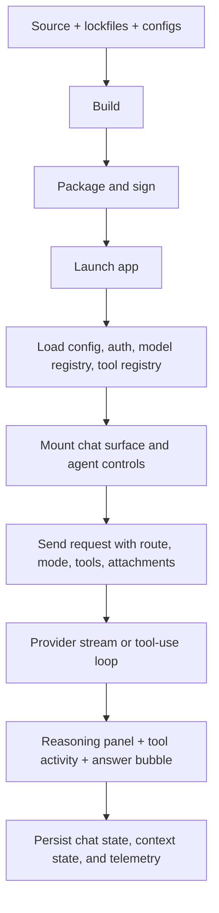
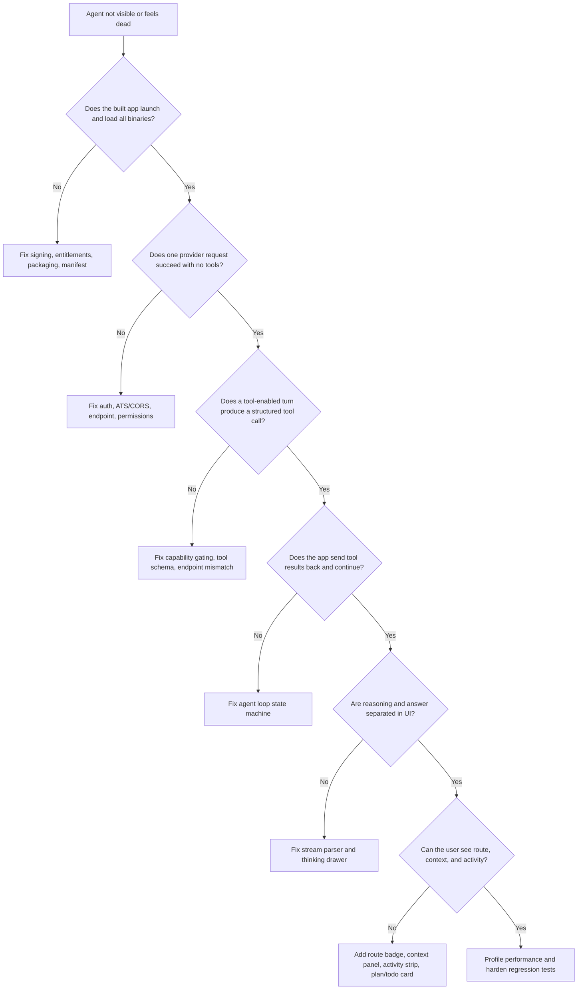

# Agent Build, Runtime, and Visibility Stabilization Report

## Executive summary

Your original brief asked for a platform-agnostic playbook, but your uploaded handoff strongly suggests the live problem is currently a macOS desktop app built with SwiftUI plus Rust/FFI, with routing, tool-use, context, and “black box” UI regressions layered on top of model/provider issues. This report therefore starts broad, then prioritizes the Apple-desktop path first because that is the likeliest active failure surface in your case. fileciteturn0file0

The common failures that keep an “agent” from building correctly or appearing correctly are not one bug class. They usually come from three stacked layers: **artifact integrity** problems such as signing, entitlements, manifests, build scripts, and dependency drift; **runtime contract** problems such as wrong endpoint, unsupported tools, broken tool loops, missing permissions, attachment/context mishandling, or bad auth; and **visibility** problems where the agent technically runs but the UI does not expose reasoning, tool state, context provenance, or route choice, so it feels dead or frozen. Official guidance from entity["company","Apple","technology company"], entity["company","OpenAI","ai company"], entity["company","Anthropic","ai company"], entity["company","Google","technology company"], and entity["company","GitHub","developer platform"] all point to those same boundaries: code signing and runtime protections on Apple platforms, manifest/permission and log inspection on Android, and explicit tool/reasoning streaming contracts for the major model providers. citeturn0search0turn0search1turn3search0turn1search5turn9view0turn11view1turn11view0turn12search13

The fastest path to “it just works” is **not** adding more model choices first. It is enforcing a narrow sequence: build one reproducible artifact, verify that the app can load everything it ships, verify that the selected model/provider actually supports the requested reasoning and tools, verify that attachments are really in context, then make the route, thinking, tool calls, and context visible in the UI. If you skip any of those, the app can look like it is “thinking forever,” “stopping,” or “not reading the note,” even when the deeper problem is that no valid tool loop or reasoning stream was ever wired. citeturn0search4turn0search8turn9view0turn11view1turn9view5turn9view6

The design implication is blunt: **stop treating the agent as a hidden implementation detail**. The UI needs a persistent context panel, a visible route badge, a thinking drawer, a live tool-activity strip, and a turn-level plan/todo surface. Provider docs make clear that reasoning and tool use are already structured events, not magic. If the UI does not consume those events, the product will feel like a black box even when the backend is healthy. citeturn11view3turn9view5turn11view1turn9view6

## Environment inventory and critical questions

Because your original prompt left the platform unspecified, the first task is to identify which environment you are actually shipping. The table below is the quickest way to classify it and gather the right evidence.

| Likely environment | Telltale files and tools | First logs to inspect | First commands to run | Why it matters |
|---|---|---|---|---|
| Apple native desktop or mobile | `.xcodeproj` / `.xcworkspace`, `Info.plist`, entitlements, Signing & Capabilities | Xcode build log, Console app, `.xcresult` bundle | `xcodebuild ... -resultBundlePath build/TestResults.xcresult test`, `xcrun xcresulttool get test-results summary --path build/TestResults.xcresult`, `codesign --verify --strict --verbose=4 MyApp.app` | ATS, usage strings, App Sandbox, and Hardened Runtime can block network, mic/camera, or dynamic library loading; Xcode produces result bundles for postmortem inspection. citeturn3search0turn3search24turn0search0turn0search4turn5search0 |
| Android native | `AndroidManifest.xml`, `app/build.gradle(.kts)`, signing config, `network_security_config.xml` | Android Studio Logcat, `adb logcat`, exception stack traces | `./gradlew :app:assembleDebug`, `./gradlew :app:dependencies`, `./gradlew signingReport`, `adb logcat` | Missing permissions, bad manifest wiring, dependency drift, or network-security config frequently prevent agent/network/tool code from ever running. citeturn1search13turn1search5turn9view11turn9view19 |
| React Native | `package.json`, `ios/`, `android/`, Metro config | Metro terminal, Xcode logs, Logcat | `npx react-native doctor`, `npx react-native run-ios`, `npx react-native run-android` | Cross-platform JS + native bridge failures often present as “feature missing in app” when the real issue is native setup drift. citeturn9view15 |
| Flutter | `pubspec.yaml`, `ios/Runner`, `android/app` | Flutter console, Xcode/Logcat, DevTools | `flutter doctor -v`, `flutter run`, `flutter build apk`, `flutter build ios` | Build mode, signing, and platform embedding configuration can make agents work in debug but disappear in release. citeturn2search6turn9view14turn7search3 |
| Web SPA or PWA | `package.json`, `.env`, bundler config, backend CORS config | Browser console, network tab, server logs | `npm ci`, `npm run build`, inspect Chrome DevTools Network/Console or Safari Web Inspector | CORS, auth redirects, and env injection failures commonly make the agent UI mount while every provider call silently fails. citeturn9view18turn9view12turn10search4turn10search5turn11view4 |
| Electron desktop | `package.json`, Forge or Builder config, `entitlements.plist`, preload script | DevTools console/network, signed app launch logs | `npm ci`, `npx electron-forge make`, `codesign --verify --strict`, inspect preload/IPС errors | Packaging and code signing are mandatory for distribution, especially on macOS. Preload and IPC allowlists can also make tools appear unavailable. citeturn9view13turn2search1turn13search12 |

The minimum fact-finding questionnaire should be filled before touching code. If any answer is unknown, log it as **unknown**, not “probably.” Unknowns are how agent bugs stay alive.

| Question cluster | Exact questions to collect |
|---|---|
| Platform and runtime | Is the app web, iOS, Android, macOS, Windows, Linux, React Native, Flutter, Electron, or mixed? Does the agent run on-device, in a sidecar process, or only via cloud APIs? |
| Build system | Is the source of truth Xcode, Gradle, npm, pnpm, Yarn, Flutter, Cargo, Docker, or CI-generated artifacts? Are native and Rust/Node builds chained? |
| Packaging and signing | Is the failure in Debug only, Release only, or both? Is code signing required for local runs? Are there adhoc-signed binaries or embedded frameworks/dylibs? |
| Provider layer | Which provider and endpoint is used per mode: OpenAI Responses, OpenAI Chat Completions, Anthropic Messages, Gemini `generateContent` / `streamGenerateContent`, or custom proxy? |
| Tooling | Are tools implemented as client-side function calls, server-side built-ins, or both? Which tools are enabled per mode? Which provider/model combinations actually support them? |
| Context and attachments | Are notes/files attached as raw text, handles, vector-store references, or “resolved content”? Does the token meter count them? Can the model distinguish already-attached content from content it still needs to fetch? |
| UI and routing | Which mode names are exposed to users? What is the invariant for each mode? Does Fast forbid reasoning? Does Pro allow tools? Does Agent show plan/todo/tool state? |
| Failure evidence | Exact error strings, console output, request/response payload samples, screenshots of frozen runs, and whether the bug reproduces on a fresh chat and a fresh launch |

## Root causes and diagnostics

The easiest way to miss the real issue is to debug a symptom instead of the layer that creates it. The matrix below maps the most common classes of failure to the fastest diagnostics.

| Root cause | User-facing symptom | What to inspect first | Commands and log locations | Primary docs |
|---|---|---|---|---|
| Build script sandboxing | Build passes locally in one shell but fails in CI or a tool-driven shell; generators/lints get “permission denied” | Xcode build settings and script phase logs | In Xcode, inspect `ENABLE_USER_SCRIPT_SANDBOXING`; on CI, compare the environment and script inputs/outputs; rerun with `xcodebuild -resultBundlePath` so the failure is preserved | Xcode added user-script sandboxing as a build setting; undeclared file access can fail script phases. citeturn0search1turn4search19turn5search0 |
| Apple signing or Hardened Runtime | App launches in Xcode but embedded helper, dylib, or Rust binary is killed or fails to load | Signing identities, entitlements, nested code signatures | `codesign -dvvv MyApp.app`, `codesign --verify --strict --verbose=4 MyApp.app`, inspect embedded binaries with `otool -L`; check Console logs for launch/runtime denial | Hardened Runtime and Disable Library Validation govern whether arbitrary plug-ins/frameworks can load. citeturn0search0turn0search4turn13search0turn13search19 |
| ATS / transport policy | API calls fail only on Apple builds, often with HTTP or weak TLS backends | `Info.plist` and runtime networking errors | Review `NSAppTransportSecurity`; temporarily remove exceptions and rerun tests to surface insecure endpoints | ATS is enabled by default and can block network traffic unless explicitly configured. citeturn3search0turn3search4turn3search8 |
| Missing privacy strings or protected-resource permission | Voice input, camera, file/media access never appears or crashes on access | `Info.plist` usage strings or Android manifest permissions | Apple: inspect `Info.plist` for `NSMicrophoneUsageDescription` and peers. Android: inspect `<uses-permission>` and runtime permission flow | Apple protected resources require usage-description keys; Android requires manifest declarations and the correct runtime flow. citeturn3search1turn3search24turn1search5 |
| Dependency drift | Agent builds on one machine but not another; release and debug behave differently | lockfiles, Gradle verification, package manager output | `npm ci`, `npm ls --depth=0`, `./gradlew --write-verification-metadata sha256 help`, `./gradlew :app:dependencies` | `npm ci` fails when lockfile and manifest drift; Gradle dependency verification enforces checksums/signatures. citeturn9view18turn9view19turn4search6 |
| Unsupported tool on selected endpoint/model | Agent “stops,” 400s, or emits hallucinated JSON/function text instead of invoking a real tool | Exact request body and provider response | Log the full `tools` array and endpoint path; compare by provider/model; gate unsupported tools by provider capability | OpenAI tools are part of Responses; Anthropic distinguishes client vs server tools; Gemini requires declared functions and function responses. citeturn8search9turn9view3turn11view1turn11view0 |
| Broken tool loop | Model asks to read/search but never gets final answer | Tool-call handling and loop state machine | OpenAI: inspect function-call items in Responses stream. Anthropic: inspect `stop_reason: "tool_use"` and whether `tool_result` is sent back. Gemini: confirm matching `id` in `functionResponse` | All three providers require the application to continue the loop after tool calls; if the app stops there, the agent appears frozen. citeturn11view2turn11view1turn11view0 |
| Reasoning stream not routed to the right UI | Model “thinks” in the main answer, then deletes or replaces text; no stable thinking panel | Stream event parser and conversation renderer | OpenAI: enable reasoning summaries and process reasoning items/events. Anthropic: handle `thinking_delta` plus signatures. Gemini: set `includeThoughts: true` and route `thought == true` parts to a drawer, not the main bubble | Provider reasoning streams are structured; if you treat them as answer text, the UX will look broken. citeturn9view0turn9view5turn9view6 |
| Attachment/context mismatch | “Read my essay” fails even though it was attached; token meter does not move | Attachment pipeline, token estimator, system prompt, and retrieval UI | Log exactly what content is sent, whether attachments are inlined or referenced, and whether usage accounting includes them | OpenAI reasoning tokens consume context; Anthropic tool-use tokens and system prompts consume input budget; Gemini thinking/function state is stateless and must be passed back correctly. citeturn9view0turn11view1turn11view0 |
| Web CORS or auth | Agent UI loads but provider requests fail in browser or Electron renderer | Browser Network/Console, server response headers, auth redirects | Inspect Chrome DevTools Network/Console or Safari Web Inspector; validate `Access-Control-Allow-Origin`, preflight responses, and token refresh flow | CORS is browser-enforced and relies on response headers plus preflights. Safari and Chrome both expose the needed inspection tools. citeturn9view12turn10search4turn10search5turn11view4 |
| Android packaging / manifest mismatch | Service, activity, shortcut, or provider does not appear in the installed app | `AndroidManifest.xml`, merged manifest, and Gradle output | `./gradlew :app:assembleDebug`, inspect merged manifest, `adb logcat`, `adb shell dumpsys package your.package` | The manifest defines components, permissions, and device compatibility; Logcat remains the primary runtime view. citeturn1search13turn9view11turn10search3 |
| Release-only performance or crash regressions | Idle RAM spikes, scroll jank, startup pauses, app hangs | profiler traces and crash grouping, not guesses | Apple: Instruments Time Profiler, Memory, Hangs. Android: Android Studio Profiler/System Trace. Also wire Crashlytics or Sentry for field evidence | Apple and Android both recommend profiling responsiveness, CPU, memory, graphics, and hangs with platform profilers. Crashlytics groups and prioritizes production crashes. citeturn7search2turn7search6turn9view17turn7search7turn11view6turn7search5 |

The single most important diagnostic principle is this: **capture the failing build/test/run as an artifact, not a screenshot-only event**. On Apple targets, always generate a `.xcresult` bundle and inspect it with `xcresulttool`; on Android, always preserve Logcat output; on browser/Electron targets, preserve Network + Console logs; on CI, upload artifacts so failures become reproducible rather than anecdotal. citeturn5search0turn5search1turn12search1turn12search5

## Fix sequence and verification

The build-to-runtime chain below is the order in which the system has to be made trustworthy. If a step above is broken, everything below can look broken too.

The flow is derived from Apple build/runtime protections, GitHub Actions artifact handling, and the provider-specific tool/reasoning loops documented by OpenAI, Anthropic, and Google. citeturn12search13turn12search1turn9view0turn11view1turn11view0



### Stabilization order

| Priority | Goal | Concrete actions | Verification test |
|---|---|---|---|
| Immediate | Freeze one reproducible environment | Record OS, Xcode/Android Studio/Node/Flutter/Gradle versions; switch Node installs to `npm ci`; enable Gradle dependency verification if applicable; archive the exact failing `.xcresult` / Logcat / Network traces | A second machine or clean CI runner reproduces the same build/test result without editing lockfiles. citeturn9view18turn9view19turn5search0 |
| Immediate | Validate packaged artifact integrity | On Apple builds, verify signatures and entitlements for the app and nested binaries; on Electron/macOS, verify app signing; on Android, verify manifest merge and signing report | App launches from a packaged artifact, not just from IDE attach-run; no nested-binary load failures or signing denials appear in logs. citeturn0search0turn0search4turn13search0turn9view13turn2search3 |
| Immediate | Enforce provider capability gating | Build a capability table keyed by provider + endpoint + model + tool support + reasoning support; block invalid combinations in the picker and at request-build time | Invalid combinations are impossible to send; if a user picks a model that cannot do a tool or thinking mode, the UI explains why instead of sending a doomed request. citeturn9view0turn11view1turn11view0turn9view3 |
| Immediate | Repair the tool loop | Ensure client-side tool calls are executed and results returned to the model; ensure server-side tools are only added where supported; persist any state the provider requires across turns | A note-search request emits a tool card, runs the tool, returns `tool_result` or function response, and continues to a final answer in the same turn. citeturn11view1turn11view2turn11view0 |
| Near-term | Repair reasoning separation | Fast mode should send no reasoning budget and show no thinking drawer; Thinking/Pro/Agent should route reasoning summaries/thoughts to a collapsible panel and keep visible answer text separate | No provider writes scratchpad text into the main answer stream; users can reopen the thinking drawer after the turn completes. citeturn9view0turn9view5turn9view6 |
| Near-term | Repair attachments and context accounting | Log every note/file attachment as either inline text, provider file reference, or retrieval hit; count it in context usage; tell the model when content is already resolved | Attaching a note or essay visibly changes context usage and shows up in the context panel; the model stops asking for a path to content that is already attached. citeturn9view0turn11view1turn11view0 |
| Near-term | Make route and state legible | Show mode, model, reasoning tier, active tools, retrieved notes/chunks, last tool event, and current plan per turn; persist that per chat, not per session only | Leaving and reopening a chat preserves the context panel, tool history, and reasoning drawer state. This kills the “it reset, I cannot tell what it did” problem. |
| Follow-on | Profile and de-jank | Use Instruments or Android Studio Profiler before guessing; target startup, idle memory, scroll, and hangs | Startup peak, idle footprint, and long-scroll performance improve measurably, not just subjectively. citeturn7search2turn7search6turn9view17turn7search7 |

### Verification decision flow



### Sample troubleshooting commands

For the Apple-desktop path most relevant to your current handoff, start here. These commands line up with Apple’s build-result and code-signing guidance. citeturn5search0turn13search0turn13search19

```bash
set -euo pipefail

APP="build/Release/MyApp.app"
RESULTS="build/TestResults.xcresult"

xcodebuild \
  -project MyApp.xcodeproj \
  -scheme MyApp \
  -destination 'platform=macOS,arch=arm64' \
  -resultBundlePath "$RESULTS" \
  test

xcrun xcresulttool get test-results summary --path "$RESULTS"

codesign -dvvv "$APP" || true
codesign --verify --strict --verbose=4 "$APP"

find "$APP" \( -name "*.dylib" -o -name "*.framework" \) -print
```

For Android or React Native on Android, use the build and runtime tools the Android docs expect. citeturn9view11turn10search3turn9view19

```bash
./gradlew :app:assembleDebug
./gradlew :app:dependencies
./gradlew signingReport
adb logcat
```

For web or Electron, the build should be deterministic before you debug the browser. Then inspect the network/console surfaces that actually reveal CORS/auth failures. citeturn9view18turn9view13turn10search4turn10search5

```bash
npm ci
npm ls --depth=0
npm run build
npx electron-forge make
```

## Making the agent visible and trustworthy

Your newest complaint is the right one: the biggest problem is not merely “build failure.” It is that **the app feels dead**. That usually means the product is hiding state transitions the providers already expose.

Provider behavior is explicit enough to design around. OpenAI reasoning models use the Responses API, support model-specific `reasoning.effort` values, and only include reasoning summaries if you explicitly opt in; they also warn that if `max_output_tokens` is too low, you can consume reasoning tokens and still get an incomplete response before any visible answer. Anthropic tool use is an explicit loop: if the model returns `stop_reason: "tool_use"`, your app must execute the tool and send a `tool_result` back. Anthropic also streams `thinking_delta` events during extended thinking and expects thinking blocks to be preserved across tool use. Gemini thinking models expose `thought` parts only if `includeThoughts` is set, and Gemini function calling expects the application to return a matching function response, including the function-call `id` for Gemini 3 if you are constructing the turn manually. citeturn9view0turn11view3turn11view1turn9view1turn9view5turn11view0turn9view6

That implies five UI surfaces are not “nice to have.” They are core runtime instrumentation.

| Surface | What the user should see | Why it matters |
|---|---|---|
| Route badge | `Fast · local`, `Thinking · local`, `Pro · GPT-5.4`, `Agent · Claude Opus`, plus provider and reasoning tier | Kills the “which model am I actually using?” problem and makes routing debuggable. |
| Thinking drawer | Provider-specific reasoning summary or thought stream, collapsible, persisted per turn | Prevents scratchpad text from leaking into the main answer and gives users a stable place to inspect reasoning after the turn. citeturn9view0turn9view5turn9view6 |
| Activity strip | “Searching notes…”, “Calling web search…”, “Running tool…”, “Waiting on tool result…”, “Writing answer…” | Prevents the dead-spinner feeling during long/tool-heavy runs. The provider APIs already expose these transitions indirectly through stream events or tool-use states. citeturn11view1turn11view2turn11view0 |
| Plan or todo card | A minimal per-turn checklist with current step highlighted | Turns agent execution into progress, not mystery. For research/note tasks, this is often more valuable than exposing raw reasoning. |
| Context panel | Attached notes/files, retrieved chunks, tool list, last tool result, token budget, model/provider, chat-specific persistence | Fixes the black-box complaint directly by showing what the model could actually see. |

The **mode model** should also be simplified. The simplest stable end state is:

| Mode | User promise | Backend invariant |
|---|---|---|
| Fast | Lowest latency, no visible thinking | No reasoning budget, no thinking drawer, minimal tools, concise answer |
| Thinking | Better reasoning, still single-turn oriented | Reasoning enabled, thinking drawer on, limited tools if needed |
| Pro | Best single-turn answer with attachments and selected tools | Cloud model, reasoning moderate/high, tools permitted, concise visible answer |
| Agent | Multi-step plan, todo, and tool loop | Full tool loop, plan card, persistent activity strip, explicit confirmation when writes/destructive actions occur |

That mode contract matters because the provider controls are **not identical**. OpenAI reasoning models support model-dependent effort values including `none`, `minimal`, `low`, `medium`, `high`, and `xhigh`; older defaults are different from GPT-5.4 defaults. Anthropic thinking behavior is different again and must preserve thinking blocks across tool use. Gemini uses thinking levels or budgets plus `includeThoughts`. The UI should therefore normalize these differences into a small app-level contract instead of exposing every provider quirk directly in the main picker. Advanced provider-specific controls can live behind a disclosure or settings sheet. citeturn9view0turn9view5turn9view6

A concrete provider wiring table helps avoid black-box mistakes:

| Provider path | The app must do | Do not do |
|---|---|---|
| OpenAI Responses | Use Responses for reasoning/tool workflows; request reasoning summaries if you want a thinking drawer; parse stream events and final usage; enforce enough `max_output_tokens` so reasoning does not consume the whole budget before visible text appears | Do not dump reasoning events or inline `<think>`-style scratchpad text into the visible answer. Do not assume all tools are available on every endpoint/account/model. citeturn9view0turn11view3turn11view2turn8search9 |
| Anthropic Messages | If `stop_reason` is `tool_use`, execute the call and send `tool_result`; if using extended thinking, route `thinking_delta` to the drawer and preserve thinking blocks across tool use | Do not treat tool-use as a terminal answer. Do not drop thinking blocks between tool steps. citeturn11view1turn9view1turn9view5 |
| Gemini | Enable `includeThoughts` if you want a thought drawer; route `thought == true` parts separately; when the model calls functions, return the matching response with the correct function-call `id` for Gemini 3 | Do not assume stateless calls will “remember” prior tool calls or thought signatures unless you explicitly pass back what the API expects. citeturn11view0turn9view6 |

## CI, monitoring, and regression prevention

The build needs to become self-policing. CI should build the exact app, run smoke tests in all intended modes, preserve artifacts, and fail fast on invalid provider/mode/tool combinations. GitHub Actions supports workflow matrices and artifact storage, and Apple’s `xcodebuild` plus `.xcresult` bundle flow fits that model well. citeturn12search13turn12search2turn12search1turn5search0

A minimal CI layout looks like this:

```yaml
name: validate-agent-app

on:
  pull_request:
  push:
    branches: [main]

jobs:
  macos-tests:
    runs-on: macos-latest
    steps:
      - uses: actions/checkout@v4
      - name: Install Apple signing assets
        if: github.ref == 'refs/heads/main'
        uses: actions/checkout@v4
      - name: Run Xcode tests
        run: |
          xcodebuild \
            -project MyApp.xcodeproj \
            -scheme MyApp \
            -destination 'platform=macOS,arch=arm64' \
            -resultBundlePath build/TestResults.xcresult \
            test
      - name: Upload xcresult
        uses: actions/upload-artifact@v4
        with:
          name: macos-xcresult
          path: build/TestResults.xcresult

  js-build:
    runs-on: ubuntu-latest
    steps:
      - uses: actions/checkout@v4
      - name: Clean install
        run: npm ci
      - name: Build
        run: npm run build
```

This is not enough by itself. The agent/runtime layer also needs **contract tests** that assert the exact request shape per provider and mode. The highest-value tests are the ones that prevent silent black-box regressions:

| Test type | Must assert |
|---|---|
| Provider contract tests | Fast mode sends no reasoning; Thinking mode sends provider-appropriate reasoning config; unsupported tool + provider combinations are blocked before request dispatch |
| Stream-parser tests | Reasoning deltas go to the thinking drawer, not the visible answer; final answer is preserved when reasoning is present |
| Tool-loop tests | A provider tool call results in app execution plus a returned `tool_result` / `functionResponse`, and the turn continues to a final answer |
| Context accounting tests | Attachments and retrieved chunks visibly increase counted context and appear in the context panel |
| Persistence tests | Route badge, reasoning drawer visibility, context panel state, and plan/todo state persist per chat |
| UI smoke tests | A simple “search my note,” “read attached essay,” and “web search latest” turn each show route, activity strip, and final answer |

Monitoring must cover both dev and production. On Apple platforms, use unified logging with `Logger` / `os_log`, then profile responsiveness, memory, and hangs with Instruments. On Android, use Logcat plus Android Studio Profiler/System Trace. For production crash visibility, Crashlytics provides grouped and prioritized crash reporting with contextual data, and Sentry’s Apple SDK can also capture crashes, app hangs, and performance traces on Apple platforms. citeturn3search3turn3search15turn7search2turn7search6turn9view17turn7search7turn11view6turn7search5

A pragmatic logging schema for every turn is:

| Event | Required fields |
|---|---|
| `route_selected` | chat_id, mode, provider, model, reasoning_tier, toolset_version |
| `context_built` | token_estimate, attachment_count, retrieval_chunk_count, vector_store_ids or note_ids |
| `tool_requested` | provider, tool_name, schema_version, request_id |
| `tool_executed` | duration_ms, success/failure, truncated args hash, result_size |
| `stream_phase` | started / reasoning / tool / answer / completed / failed / idle_timeout |
| `turn_completed` | total_tokens, reasoning_tokens if available, cache hit if available, latency_ms, final_status |

### Example configuration snippets

For Apple-native builds, keep ATS strict by default and declare the protected resources you actually use. Apple documents both ATS and usage-description requirement keys. citeturn3search0turn3search4turn3search1turn3search24

```xml
<!-- Info.plist -->
<key>NSAppTransportSecurity</key>
<dict>
  <key>NSAllowsArbitraryLoads</key>
  <false/>
</dict>

<key>NSMicrophoneUsageDescription</key>
<string>Voice input for agent prompts.</string>
```

If a debug build loads unsigned or adhoc-signed helper code, only the debug entitlement should disable library validation; release builds should be signed properly instead of normalizing lax settings forever. citeturn0search0turn0search4

```xml
<!-- Debug.entitlements -->
<key>com.apple.security.app-sandbox</key>
<true/>
<key>com.apple.security.cs.disable-library-validation</key>
<true/>
```

For Android, declare only the permissions you actually need and keep cleartext traffic off unless you have a real exception. citeturn1search5turn1search13

```xml
<!-- AndroidManifest.xml -->
<manifest ...>
    <uses-permission android:name="android.permission.INTERNET" />
    <uses-permission android:name="android.permission.RECORD_AUDIO" />

    <application
        android:usesCleartextTraffic="false"
        android:networkSecurityConfig="@xml/network_security_config" />
</manifest>
```

```xml
<!-- res/xml/network_security_config.xml -->
<network-security-config>
    <base-config cleartextTrafficPermitted="false" />
</network-security-config>
```

For Node-based surfaces, use `npm ci` in CI and keep build/test scripts explicit. For Android/Gradle, check dependency verification into source control. citeturn9view18turn9view19

```json
{
  "scripts": {
    "clean": "rimraf dist node_modules/.cache",
    "doctor": "npm ci && npm ls --depth=0",
    "build": "vite build",
    "package:desktop": "electron-forge make",
    "test:e2e": "playwright test"
  }
}
```

```xml
<!-- gradle/verification-metadata.xml -->
<verification-metadata>
  <configuration>
    <verify-metadata>true</verify-metadata>
    <verify-signatures>true</verify-signatures>
  </configuration>
</verification-metadata>
```

## Checklist and timeline

The implementation plan below is intentionally front-loaded toward the failures that create the “black box” feeling.

| Time box | Workstream | Output |
|---|---|---|
| Half day | Environment freeze and evidence capture | Exact versions, failing artifacts, provider matrix, one reproducible failing chat per major symptom |
| Half day | Apple/desktop artifact integrity or equivalent platform packaging check | Signed/launchable artifact, no nested-binary load failures, reproducible result bundles |
| One day | Provider capability gating and tool-loop repair | Invalid mode/tool/provider combos blocked; simple note search and web search complete end-to-end |
| One day | Reasoning separation and UI transparency | Thinking drawer, route badge, activity strip, plan/todo card, persistent context panel |
| One day | Attachment/context accounting | Attachments visible in context panel and token meter; no more “I attached it but the model cannot see it” failures |
| Half day | Profiling and dead-run watchdogs | Idle-timeout classification, startup/scroll/idle traces, one measured performance target per platform |
| Half day | CI and monitoring hardening | Matrix build, preserved artifacts, contract tests, Crashlytics/Sentry or equivalent enabled |

A release-readiness checklist should look like this:

| Check | Done when |
|---|---|
| Build reproducibility | CI uses lockfiles or verification metadata and reproduces local build/test results |
| Packaging integrity | Installed or packaged app launches outside the IDE and loads every helper/binary it ships |
| Provider capability matrix | Every visible mode/model combination is either supported or disabled with explanation |
| Tool loop | Search/read/write tools execute and return final answers instead of stopping mid-turn |
| Reasoning routing | Thinking is never rendered as the main answer; a persistent drawer exists for supported providers |
| Context visibility | Attached files, retrieved notes, and token budget are visible to the user per chat |
| Mode invariants | Fast never thinks; Thinking always has a drawer; Pro/Agent expose only the controls they actually honor |
| Error transparency | Unsupported tool, auth failure, idle stream timeout, and missing permission each have a distinct user-facing state |
| Performance | Startup, idle memory, and long-scroll sessions have profile traces and target budgets |
| Regression alarms | CI blocks merges that break provider contracts, stream parsing, or tool-loop completion |

### TL;DR

The hard failures are usually **signing/config/runtime-contract** bugs. The painful product failures are usually **visibility** bugs. Fix the artifact first, then the provider/tool loop, then the UI surfaces that show route, context, thinking, and activity. If the app still feels dead after that, profile performance with Instruments or Android Studio instead of guessing. citeturn0search0turn5search0turn11view1turn9view0turn7search2turn9view17