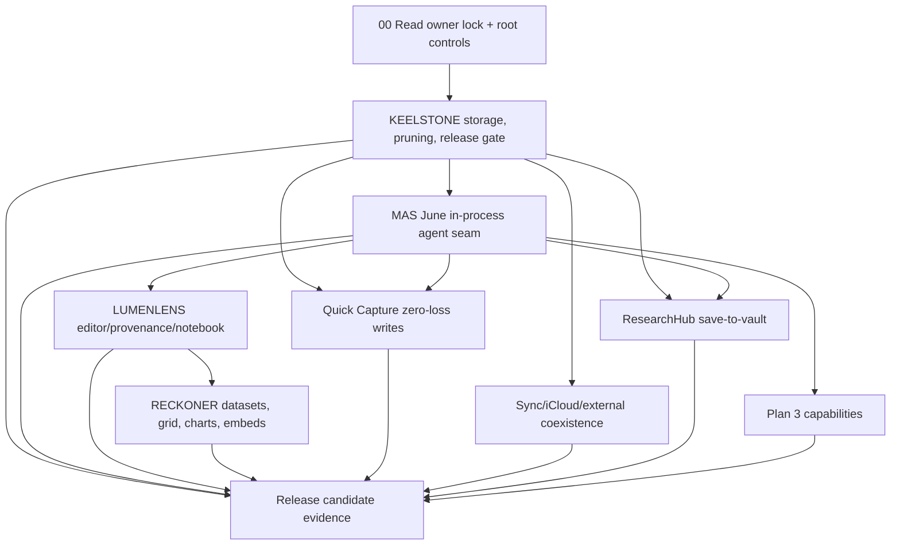

# 02 - Master Build Order and Dependency Graph

The build order is not a vibe. It follows dependency risk: storage and release safety first; one agent seam second; editor/data fabric third; capability ring last.

## Phase 0 - Canon intake and verification ledger

Goal: prevent a build agent from working from stale prompts.

Done bar:

- Owner Intent Checkpoint exists.
- `REQUIRES LOCAL VERIFICATION` ledger exists.
- `rg` contradiction sweep has run.
- Build agent explicitly states which active doc it is operating from.

## Phase 1 - KEELSTONE storage, release, and pruning

KEELSTONE is the keel. It decides storage truth, file access, external edits, atomic writes, conflict handling, MAS target truth, and parked-lane removal.

Must land before LUMENLENS minimal-diff writeback or RECKONER artifact writes rely on it:

1. Deletion/pruning inventory.
2. MAS target/flag verification.
3. AtomicVaultWriter + coordinated writes.
4. FSEvents/reconcile + deterministic rebuild equivalence.
5. Dirty-open-note conflict path.
6. Body-truth collapse to vault `.md` only.
7. Derived index self-heal.
8. App Store archive leak/entitlement/privacy gates.

## Phase 2 - MAS June agent seam

MAS June is the one active agent surface and authority.

Must prove:

- June frontend loads as bundled assets, not server/Tauri/Node.
- Bridge invokes in-process `agent_core`, not direct fake chat only.
- Cloud lane uses receipt/proxy if monetized and Keychain secrets.
- Local lane is honestly gated.
- Tool calls go through one registry and one approval/provenance path.
- No terminal, stdio MCP, subprocess, browser-use, or sidecar tools appear in the MAS archive.

## Phase 3 - LUMENLENS editor/provenance/notebook

LUMENLENS owns editor correctness, not storage truth or data internals.

Must prove:

- loadEpoch/suppression/filterTransaction guards distinguish load from edit.
- serializer tiers preserve markdown and make degraded/invisible content visible through fidelity disclosure.
- minimal-diff writeback splices in memory, then writes full buffer via KEELSTONE.
- suggestion/provenance shape is payload-agnostic enough for RECKONER.
- Epdoc Notebook manifests store references, not blobs.

## Phase 4 - RECKONER data fabric

RECKONER owns data artifacts, grid behavior, calc authority, data tools, charts, and embeds. It does not own a new room or new chat.

Must prove:

- vault artifacts are truth; GRDB is derived.
- IronCalc is sole calc authority.
- Univer is renderer only and silent.
- agent changes stage as TabularSuggestions and require approval.
- dataset embeds/tabs register with LUMENLENS lens-fidelity disclosure.
- Swift Charts are primary.

## Phase 5 - Capability ring

Capability ring ships only after the core seams exist:

- ResearchHub official APIs/OA/BYO only.
- Quick Capture zero-loss writes through KEELSTONE.
- Sync remains subordinate to KEELSTONE, not a parallel sync layer.
- PDF/Vision/Speech/Browser/arXiv/skills use MAS-safe native or WebKit paths.
- Kindred/status/mascot ideas become MAS-safe June state/provenance only.

## Phase 6 - Release candidate evidence

No feature is release-ready until archive-level evidence exists:

- App Store scheme builds and archives.
- entitlements match approved matrix.
- PrivacyInfo manifests exist and match required-reason APIs.
- strings/nm scans show no parked runtime residue.
- storage soak passes.
- App Review notes explain agent behavior, file access, network/proxy, recording, ResearchHub retention/source rules, and non-obvious features.
