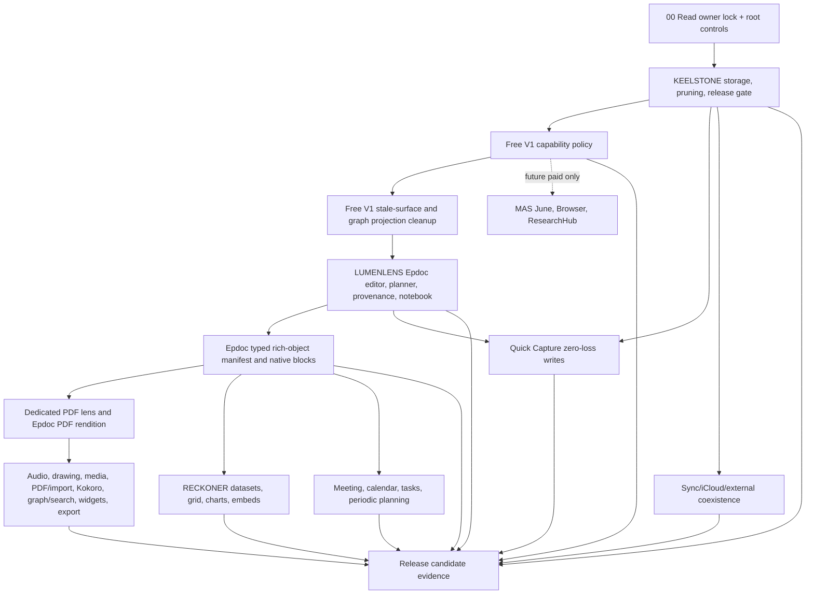

# 02 - Master Build Order and Dependency Graph

## July 15 governing override

Read `14_OWNER_SCOPE_REDUCTION_AND_PAUSE_CHECKPOINT_2026_07_15.md` before using
the historical phases below. The current executable sequence is:

1. scope/canon/handoff reconciliation and owner review pause;
2. KEELSTONE plus the Free V1 no-AI/no-Reckoner compile, runtime, query, and
   presentation boundary;
3. retained non-AI Editor Core correctness and one current evidence build;
4. finite runtime/manual editor/navigation/graph evidence and KEELSTONE close;
5. retained non-AI capability families admitted serially; and
6. final Release archive and distribution evidence.

Historical Phase 3 is not an active LumenLens phase: only its non-AI editor
correctness ideas survive under the JSON `.epdoc` and Markdown editor contracts.
Phase 4 Reckoner is parked. Phase 7's AI/June work is canceled; Browser and
ResearchHub remain deterministic future paid possibilities only. The old graph
and phase text remain below solely to map provenance and surviving obligations.

The build order follows dependency risk and the July 13 free-V1 boundary:
storage and release safety first; centralized product visibility second;
editor/planner/data fabric third; the free capability ring next. June, Browser,
and ResearchHub are retained as future paid work and do not block free V1.

## Phase 0 - Canon intake and verification ledger

Goal: prevent a build agent from working from stale prompts.

Done bar:

- Owner Intent Checkpoint exists.
- `REQUIRES LOCAL VERIFICATION` ledger exists.
- `rg` contradiction sweep has run.
- Build agent explicitly states which active doc it is operating from.

## Phase 1 - KEELSTONE storage, release, and pruning

KEELSTONE is the keel. It decides storage truth, file access, external edits, atomic writes, conflict handling, MAS target truth, and parked-lane removal.

Must land before LUMENLENS minimal-diff writeback or RECKONER artifact writes rely on it:

1. Deletion/pruning inventory.
2. MAS target/flag verification.
3. AtomicVaultWriter + coordinated writes.
4. FSEvents/reconcile + deterministic rebuild equivalence.
5. Dirty-open-note conflict path.
6. Body-truth collapse to vault `.md` only.
7. Derived index self-heal.
8. App Store archive leak/entitlement/privacy gates.

## Phase 2 - Free-V1 capability boundary

Free V1 has no active agent. One centralized capability policy must hide and
disable June, Epdoc Assist/MiniChat, Browser, ResearchHub, chat/local models,
generative actions, agent tools, and AI-only automatic work while preserving
Kokoro and deterministic workspace capabilities.

Must prove:

- Landing/navigation, settings, Epdoc chrome, shortcuts, deep links, state
  restoration, provider startup, and background jobs all use the same policy.
- Kokoro read-aloud remains visible/usable without exposing a general model or
  agent surface.
- Meeting, Sync, Quick Capture, calendar/tasks, PDF/import, RECKONER,
  graph/search, workspace, and export remain available.
- Paid-only source is preserved, not deleted or accidentally initialized.
- No payment, StoreKit, signing, subscription, or receipt work is required for
  the free-source boundary.

## Phase 3 - LUMENLENS editor/provenance/notebook

LUMENLENS owns editor correctness, not storage truth or data internals.

Must prove:

- loadEpoch/suppression/filterTransaction guards distinguish load from edit.
- serializer tiers preserve markdown and make degraded/invisible content visible through fidelity disclosure.
- minimal-diff writeback splices in memory, then writes full buffer via KEELSTONE.
- suggestion/provenance shape is payload-agnostic enough for RECKONER.
- Epdoc Notebook manifests store references, not blobs.

### Phase 3A - Free-V1 stale-surface, Source, and graph correction

Before expanding notebook or RECKONER controls: exclude chat/agent/model/run/
raw-thought/tool-trace records from graph rebuild/query/default/filter/
restoration; hide paid/stub notebook tabs without deleting manifest
compatibility; remove stale paid settings/navigation/shortcut state; and make
the actual MarkEdit bridge use readable non-destructive defaults plus one
coherent editor/gutter/right-strip field. Add source guards and take fresh 4k/
20k typing/scroll measurements before claiming visual or performance success.

### Phase 3B - Native rich Epdoc and cross-lens object truth

After the active KEELSTONE blockers and restricted-host MarkEdit seam are
proved, Epdoc becomes the default full-fidelity rich-document lens. Start with
a typed derived object manifest rebuilt from Markdown and portable referenced
artifacts. Epdoc consumes it for inline native rendering/editing; Prose and
Source consume the same manifest through one accessible information popover and
may render an object inline only after byte-fidelity and large-document evidence.

Admit object families serially: native lists/checklists/projects, calendar and
reminder references, voice notes/audio and explicit dictation, drawings,
images/attachments, meetings, PDFs, and RECKONER dataset/chart references.
Epdoc may switch dynamically among document, structured outline/project,
timeline/agenda/calendar, and object/attachment-sidebar presentations, but all
are projections over the same Markdown and referenced artifacts.
Each family must prove round-trip truth, unknown-object retention, KEELSTONE
writes, permission denial, accessibility, performance, crash recovery,
portable export, and no hidden June/provider/model startup. Do not create a
second note/task/calendar/media/transcript/sync authority.

### Phase 3C - Dedicated PDF lens and Epdoc PDF rendition

PDF becomes the fifth canonical editor lens after the Phase 3B object manifest
exists. It is a full-size native PDFKit workspace, not a thumbnail or detached
preview: page navigation, fit/zoom, thumbnails/outline, search, selection,
keyboard and VoiceOver access, and a source/object inspector must all be
available without shrinking the document into a card.

An Epdoc-generated PDF is a derived rendition of Markdown plus referenced
artifacts. It uses an explicit Epistemos export style that preserves the
owner-approved palette, registered fonts, hierarchy, images, and supported
rich objects. A cancellable/debounced live rendition may be cached for viewing,
but it never becomes document truth and it must not render synchronously on the
typing or scrolling path. Structural text edits return to Epdoc/Source and
regenerate the rendition while retaining the page/source anchor.

Imported PDFs remain byte-faithful user artifacts. Epistemos chrome and new
annotation defaults may use the Epistemos palette/fonts, but the app must not
silently recolor, reflow, or replace the PDF's original content. In-lens editing
means public PDFKit annotations, form fields, and explicitly supported page
operations; arbitrary underlying body-text rewrite is not claimed. Imported
documents save through KEELSTONE and security-scoped access, with Save a Copy
as the default mutation path until in-place atomic-write and conflict evidence
passes.

Acceptance requires generated-PDF snapshot/render checks, page-count/text/font/
color/image checks, annotation/form save-reopen tests, original-byte protection,
large-document memory/scroll evidence, missing-font and missing-artifact states,
cancel/recovery tests, and PNG inspection of the final rendered pages before a
visual or completion claim.

## Phase 4 - RECKONER data fabric

RECKONER owns data artifacts, grid behavior, calc authority, data tools, charts, and embeds. It does not own a new room or new chat.

Must prove:

- vault artifacts are truth; GRDB is derived.
- IronCalc is sole calc authority.
- Univer is a required bounded supporting source; no active rendering or
  calculation role is selected for it, and it cannot displace IronCalc.
- Free V1 makes direct deterministic, user-initiated edits only.
  `TabularSuggestions` is future paid-June work and requires separate approval
  when that lane is explicitly reactivated.
- dataset embeds/tabs register with LUMENLENS lens-fidelity disclosure.
- Swift Charts are primary.

Before R0, review the already recovered, pinned IronCalc/Univer source set in
the ignored research checkout. The owner's IronCalc-front-end correction
controls product direction: IronCalc is the future visible grid and sole
formula authority. Exact source ref/digest/license review and an isolated MAS
WebView/package spike must still precede any dependency installation or wiring.
Read `13_EXECUTIVE_CONTINUITY_AND_FREE_V1_REMEDIATION_2026_07_13.md`.

## Phase 5 - Free capability ring

Free capability-ring work ships only after the relevant core seams exist:

- Quick Capture zero-loss writes through KEELSTONE.
- Sync remains subordinate to KEELSTONE, not a parallel sync layer.
- Epdoc tasks/planner, Meeting, and calendar references share vault truth,
  provenance, graph/search, and the event bus.
- Audio/voice notes, explicit dictation, drawings, images/attachments, and
  optional WidgetKit projections share the Phase 3B object manifest and remain
  portable, permission-gated, accessible, and source-reachable.
- The dedicated PDF lens and PDF/import/export use public PDFKit paths, retain
  imported content fidelity, and keep any live rendition derived and off the
  editor hot path. Vision/OCR, Kokoro/local speech, graph/search, and export use
  MAS-safe native paths and explicit consent where required.
- Browser and ResearchHub are not part of the free capability ring.

## Phase 6 - Release candidate evidence

No feature is release-ready until archive-level evidence exists:

- App Store scheme builds and archives.
- entitlements match approved matrix.
- PrivacyInfo manifests exist and match required-reason APIs.
- strings/nm scans show no parked runtime residue.
- storage soak passes.
- App Review notes explain agent behavior, file access, network/proxy, recording, ResearchHub retention/source rules, and non-obvious features.

For free V1, App Review notes and archive scans must also prove June, Browser,
and ResearchHub are unavailable and inert while Kokoro and the deterministic
workspace remain honest.

## Phase 7 - Future paid MAS capabilities (deferred)

Only after an explicit later owner activation:

- MAS June remains the sole agent, in-process through `agent_core`.
- Epdoc Assist/MiniChat shares June's transcript, tool, approval, and
  provenance authority.
- Browser remains bundled WebKit browser-lite only.
- ResearchHub remains official API/RSS/OA/BYO only.
- Paid status never authorizes Chromium/browser-use, scraping, sidecars,
  subprocesses, local servers, terminal/code-exec, stdio MCP, illegal content,
  or a second runtime/data authority.
