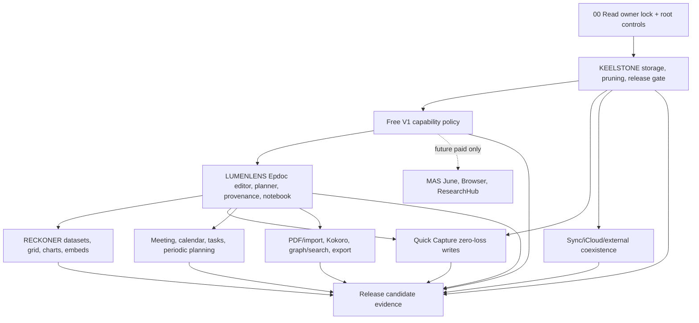

# 02 - Master Build Order and Dependency Graph

The build order follows dependency risk and the July 13 free-V1 boundary:
storage and release safety first; centralized product visibility second;
editor/planner/data fabric third; the free capability ring next. June, Browser,
and ResearchHub are retained as future paid work and do not block free V1.

## Phase 0 - Canon intake and verification ledger

Goal: prevent a build agent from working from stale prompts.

Done bar:

- Owner Intent Checkpoint exists.
- `REQUIRES LOCAL VERIFICATION` ledger exists.
- `rg` contradiction sweep has run.
- Build agent explicitly states which active doc it is operating from.

## Phase 1 - KEELSTONE storage, release, and pruning

KEELSTONE is the keel. It decides storage truth, file access, external edits, atomic writes, conflict handling, MAS target truth, and parked-lane removal.

Must land before LUMENLENS minimal-diff writeback or RECKONER artifact writes rely on it:

1. Deletion/pruning inventory.
2. MAS target/flag verification.
3. AtomicVaultWriter + coordinated writes.
4. FSEvents/reconcile + deterministic rebuild equivalence.
5. Dirty-open-note conflict path.
6. Body-truth collapse to vault `.md` only.
7. Derived index self-heal.
8. App Store archive leak/entitlement/privacy gates.

## Phase 2 - Free-V1 capability boundary

Free V1 has no active agent. One centralized capability policy must hide and
disable June, Epdoc Assist/MiniChat, Browser, ResearchHub, chat/local models,
generative actions, agent tools, and AI-only automatic work while preserving
Kokoro and deterministic workspace capabilities.

Must prove:

- Landing/navigation, settings, Epdoc chrome, shortcuts, deep links, state
  restoration, provider startup, and background jobs all use the same policy.
- Kokoro read-aloud remains visible/usable without exposing a general model or
  agent surface.
- Meeting, Sync, Quick Capture, calendar/tasks, PDF/import, RECKONER,
  graph/search, workspace, and export remain available.
- Paid-only source is preserved, not deleted or accidentally initialized.
- No payment, StoreKit, signing, subscription, or receipt work is required for
  the free-source boundary.

## Phase 3 - LUMENLENS editor/provenance/notebook

LUMENLENS owns editor correctness, not storage truth or data internals.

Must prove:

- loadEpoch/suppression/filterTransaction guards distinguish load from edit.
- serializer tiers preserve markdown and make degraded/invisible content visible through fidelity disclosure.
- minimal-diff writeback splices in memory, then writes full buffer via KEELSTONE.
- suggestion/provenance shape is payload-agnostic enough for RECKONER.
- Epdoc Notebook manifests store references, not blobs.

## Phase 4 - RECKONER data fabric

RECKONER owns data artifacts, grid behavior, calc authority, data tools, charts, and embeds. It does not own a new room or new chat.

Must prove:

- vault artifacts are truth; GRDB is derived.
- IronCalc is sole calc authority.
- Univer is renderer only and silent.
- agent changes stage as TabularSuggestions and require approval.
- dataset embeds/tabs register with LUMENLENS lens-fidelity disclosure.
- Swift Charts are primary.

## Phase 5 - Free capability ring

Free capability-ring work ships only after the relevant core seams exist:

- Quick Capture zero-loss writes through KEELSTONE.
- Sync remains subordinate to KEELSTONE, not a parallel sync layer.
- Epdoc tasks/planner, Meeting, and calendar references share vault truth,
  provenance, graph/search, and the event bus.
- PDF/import, Vision/OCR, Kokoro/local speech, graph/search, and export use
  MAS-safe native paths and explicit consent where required.
- Browser and ResearchHub are not part of the free capability ring.

## Phase 6 - Release candidate evidence

No feature is release-ready until archive-level evidence exists:

- App Store scheme builds and archives.
- entitlements match approved matrix.
- PrivacyInfo manifests exist and match required-reason APIs.
- strings/nm scans show no parked runtime residue.
- storage soak passes.
- App Review notes explain agent behavior, file access, network/proxy, recording, ResearchHub retention/source rules, and non-obvious features.

For free V1, App Review notes and archive scans must also prove June, Browser,
and ResearchHub are unavailable and inert while Kokoro and the deterministic
workspace remain honest.

## Phase 7 - Future paid MAS capabilities (deferred)

Only after an explicit later owner activation:

- MAS June remains the sole agent, in-process through `agent_core`.
- Epdoc Assist/MiniChat shares June's transcript, tool, approval, and
  provenance authority.
- Browser remains bundled WebKit browser-lite only.
- ResearchHub remains official API/RSS/OA/BYO only.
- Paid status never authorizes Chromium/browser-use, scraping, sidecars,
  subprocesses, local servers, terminal/code-exec, stdio MCP, illegal content,
  or a second runtime/data authority.
