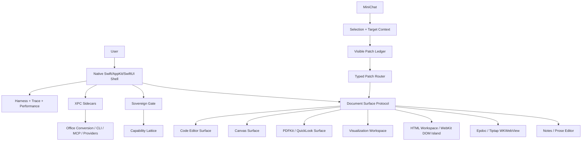

# No-Compromise Document Workspace Implementation Plan

> **2026-06-01 current canon bridge (JUNE1-PATTERNBOOST-LOCK):** This file is preserved as a legacy, planning, research, or witness artifact. For active architecture, route Helios/UAS/ACS/mmap/KV-Direct/70B/NeuralImportance claims through `docs/fusion/RESIDENCY_PATTERNBOOST_DISCOVERY_2026_06_01.md`, `docs/falsifiers/F-RESIDENCY-PATTERNBOOST-BUNDLE_2026_06_01.md`, `docs/fusion/SEMANTIC_WORKING_SET_COMPILER_2026_06_01.md`, and `docs/fusion/COLDSTREAM_RESIDENCY_TRANSPORT_2026_06_01.md`. Legacy claims remain historical until promoted by falsifiers, AnswerPacket evidence, LatticeAbstentionGate, ComputeResumeLease, rollback, and the intentional-copy/zero-copy caveat.

Date: 2026-05-25
Status: implementation plan for terminal-agent verification
Scope: HTML Workspace, Epdoc, MiniChat document control, PDF, Office-local interoperability, visualization workspace, infinite canvas, code-editor strategy, security, performance, and anti-drift gates.

This document is a build plan and audit rubric. It is intentionally not a feature patch. Use it to keep the terminal agent aligned while the current build is in progress.

## Canon Sources To Read First

Before changing implementation, read these in order:

1. `AGENTS.md`
2. `docs/fusion/MASTER_RESEARCH_INDEX_2026_05_02.md`
3. `docs/_consolidated/00_canonical_authority/_INDEX.md`
4. `docs/_consolidated/00_canonical_authority/WAVE_9_POLISH_AND_NATIVE.md`
5. `docs/HELIOS_V6_1_NEW_RESEARCH_INTEGRATION_2026_05_16.md`
6. `docs/CLI_CONFIG_COMPILATION_RESEARCH.md`
7. `Epistemos/Sovereign/SovereignGate.swift`
8. `Epistemos/Engine/HTMLWorkspaceDocument.swift`
9. `Epistemos/Models/HTMLWorkspacePackage.swift`
10. `Epistemos/Views/HTMLWorkspace/HTMLWorkspaceEditorView.swift`
11. `Epistemos/Views/HTMLWorkspace/HTMLWorkspacePreviewView.swift`
12. `Epistemos/Engine/HTMLWorkspacePatchRouter.swift`
13. `Epistemos/Views/Graph/GraphWorkspaceContainer.swift`
14. `Epistemos/Harness/HarnessIntegration.swift`
15. `Epistemos/Bridge/ChunkedMCPFraming.swift`
16. `Epistemos/XPC/`

If any of these contradict this plan, local canon wins unless the contradiction is caused by stale implementation rather than architecture.

## North Star

Epistemos remains a native-first macOS product shell.

SwiftUI, AppKit, PDFKit, QuickLook, Metal, and Rust own the parts that must feel instant, native, private, and durable. WebKit owns bounded document/workspace islands where HTML, CSS, JavaScript, rich DOM, charting, and generated visual artifacts are the right tool. XPC owns untrusted, crash-prone, external, plugin-like, provider, CLI, conversion, or long-running execution boundaries. MiniChat becomes a universal target-aware controller that can inspect and propose edits to notes, Epdoc, HTML Workspace, visualization packages, PDFs, canvases, and code without silently executing privileged native actions.

The app must feel like:

- a native writing app
- a local PKM graph
- a small visual lab
- a code-capable workspace
- a private agent cockpit

It must not become:

- Electron
- a VS Code fork
- a browser app wearing a native frame
- a chain of wrappers around wrappers
- a document editor that hides patches after applying them
- a playground that loses theme, state, or performance under real use

## External Research Anchors

Use these as validation sources, not as product identity:

- PDFKit `PDFView`: native macOS PDF display, navigation, annotation foundation.
  Source: https://developer.apple.com/documentation/pdfkit/pdfview
- QuickLook UI: local preview surface for Office-like and file artifacts.
  Source: https://developer.apple.com/documentation/quicklookui/
- CodeEditSourceEditor: native Swift editor foundation already closer to app goals than a full web editor for app-wide code surfaces.
  Source: https://github.com/CodeEditApp/CodeEditSourceEditor
- CodeMirror 6: best WebKit-island editor for HTML Workspace source panes because it is modular, themable, extensible, and lighter than Monaco.
  Source: https://codemirror.net/
- Monaco Editor: powerful but heavy; keep as research or advanced optional island only.
  Source: https://github.com/microsoft/monaco-editor
- Tiptap/ProseMirror: keep for Epdoc structured prose when already present; do not replace with raw HTML editing.
  Sources: https://github.com/ueberdosis/tiptap and https://github.com/ProseMirror/prosemirror
- Vega-Lite: declarative grammar for generated charts and stats.
  Source: https://github.com/vega/vega-lite
- Observable Plot: concise generated plots with a friendly authoring model.
  Source: https://github.com/observablehq/plot
- Apache ECharts: dashboard-grade charts and interactive visualizations.
  Source: https://github.com/apache/echarts
- D3: low-level custom visualization substrate.
  Source: https://github.com/d3/d3
- PixiJS: high-performance 2D canvas/WebGL island when WebKit visuals need sprites or animation.
  Source: https://github.com/pixijs/pixijs
- Excalidraw/tldraw: useful references for infinite canvas interaction, but not automatic dependencies. Confirm licensing, bundle size, sandboxing, and product fit before use.
  Sources: https://github.com/excalidraw/excalidraw and https://github.com/tldraw/tldraw
- CoreXLSX: native Swift XLSX read path.
  Source: https://github.com/CoreOffice/CoreXLSX
- docx.js: useful in a WebKit/JS export island, not the app-wide document truth.
  Source: https://github.com/dolanmiu/docx
- LibreOffice core/CLI: local Office conversion candidate for Pro/Developer ID XPC sidecar, not Core MAS hot path.
  Sources: https://github.com/LibreOffice/core and https://help.libreoffice.org/latest/ne/text/shared/guide/pdf_params.html
- ONLYOFFICE DocumentServer: research-tier only unless a very deliberate non-Core architecture decision is made.
  Source: https://github.com/ONLYOFFICE/DocumentServer

## Non-Negotiable Invariants

1. Native shell owns chrome, identity, permissions, persistence, command routing, theme, and window lifecycle.
2. HTML is a document/workspace island, not the root app architecture.
3. Epdoc remains a structured prose/knowledge document, not a generic HTML page.
4. MiniChat can propose structured patches and target actions. It cannot silently execute privileged native actions.
5. Every editable surface exposes selection, content identity, allowed operations, and patch application through a typed contract.
6. WebKit bridge is off by default, named, typed, permission-gated, and minimal.
7. Network is off by default in HTML preview/workspaces unless a user capability explicitly enables it.
8. No Node/Electron runtime in Core.
9. No hot-path XPC.
10. No per-frame SwiftUI state mutation.
11. No `repeatForever` animations.
12. All async UI publishing returns to `MainActor`.
13. Secrets go through Keychain.
14. Sensitive/destructive/sovereign actions go through Sovereign Gate with TTL-bound approval.
15. Existing code is called or shared before new abstractions are invented.
16. Every touched bug gets a focused test or a diagnostic guard.
17. Agent output must remain inspectable after an edit is applied.
18. Theme changes must propagate live without closing and reopening windows.
19. The app must survive rapid theme switching, settings navigation, frequency audio start/stop, graph note open/close, and WKWebView preview updates.
20. Done means build, tests, runtime/manual checks, and red-team audit all pass.

## Forbidden Moves

Do not:

- replace Epistemos with a VS Code fork
- embed Electron
- migrate the app shell to TypeScript
- add broad architecture while build blockers or theme/audio crashes exist
- put WebKit into graph render loops or physics hot paths
- use XPC for native hot UI, graph render, note editing, audio DSP, or local model inner loops without measured need
- hide original code/patch blocks after MiniChat applies an edit
- make one-off MiniChat editing code per document type
- allow arbitrary JavaScript-to-native calls
- let HTML preview perform unrestricted network fetches
- make Office support cloud-dependent
- introduce a large editor dependency for a small missing affordance
- ship a feature with buttons that only look wired
- claim readiness without repeated zero-fail verification

## Architecture Shape



## Core Capability Lattice

Every document/workspace action must declare capabilities:

- `offline-preview`
- `local-assets`
- `network-fetch`
- `native-read`
- `native-write`
- `vault-query`
- `graph-query`
- `export`
- `automation`
- `external-process`
- `office-convert`
- `provider-cloud`
- `dom-patch`
- `native-patch`

Default for HTML Workspace:

- enabled: `offline-preview`, `local-assets`, `export`, `dom-patch`
- disabled: `network-fetch`, `native-read`, `native-write`, `vault-query`, `graph-query`, `automation`, `external-process`, `provider-cloud`

Capability grants must be explicit, visible, revocable, auditable, and traceable.

## Phase 0: Stabilize Current Build Before New Architecture

Goal: make the current state trustworthy.

Tasks:

1. Finish the active terminal-agent build/test run.
2. Do not stack broad architecture changes on top of a failing build.
3. Fix reproducible build blockers only.
4. Fix all reproducible `Publishing changes from background threads` warnings.
5. Validate package artifacts and dependencies after disk cleanup.
6. Stress-test:
   - rapid dark/light theme switching
   - frequency playback while opening settings and switching views
   - note editor preview/editor mode
   - graph note open/close
   - HTML Workspace preview update
   - MiniChat edit apply path
7. Add a focused test or source guard for each touched issue.

Acceptance:

- `xcodebuild -project Epistemos.xcodeproj -scheme Epistemos -destination 'platform=macOS' build` succeeds.
- Focused Swift Testing targets for touched areas pass.
- No new warnings related to background-thread UI publishing.
- No code changes are made outside touched surfaces.

## Phase 1: Define Document Surface Capability Protocol

Problem: MiniChat, graph notes, Epdoc, HTML Workspace, PDFs, canvases, and code need one mental model. Without a shared contract, each surface drifts.

Create or identify one native contract with these concepts:

- `DocumentSurfaceID`
- `DocumentSurfaceKind`
- `DocumentContentSnapshot`
- `DocumentSelectionSnapshot`
- `DocumentPatch`
- `DocumentPatchResult`
- `DocumentAllowedOperation`
- `DocumentCapabilitySet`
- `DocumentThemeSnapshot`
- `DocumentExportTarget`
- `DocumentTraceContext`

Required surface kinds:

- `note`
- `epdoc`
- `htmlWorkspace`
- `visualizationWorkspace`
- `pdf`
- `canvas`
- `code`
- `graphNote`

Required operations:

- get current text/source
- get selection
- get symbol/section anchors if available
- propose patch
- preview patch
- apply patch
- revert applied patch
- save
- export
- open in primary window
- open in graph surface
- attach to MiniChat

Rules:

- The protocol must be typed and small.
- A surface may say an operation is unsupported.
- Unsupported operations should fail visibly and safely.
- Patch application must preserve a visible before/after ledger.
- Long operations must be cancellable.
- UI updates must be `MainActor`.

Tests:

- note surface returns stable content hash
- HTML workspace surface returns stable package hash
- unsupported operation returns typed error
- patch result preserves original request, proposed patch, applied patch, and status
- cancellation does not mutate content

## Phase 2: MiniChat Universal Editing And Visible Patch Ledger

Problem: user reports that when MiniChat writes code, the code disappears after the answer is done. That is a trust failure.

Implement a visible patch ledger shared by all chats:

- original assistant text remains visible
- extracted patch/code block remains visible
- applied status is appended, not substituted
- changed files/surfaces are listed
- user can reopen:
  - original patch
  - normalized patch
  - applied diff
  - failure reason
  - revert action when supported

MiniChat must support the same core targeting affordances as main chat:

- selected text
- selected DOM element
- selected note section
- selected Epdoc node
- selected chart/spec
- selected PDF page/annotation
- selected canvas card
- current workspace/package

Implementation rules:

- Do not build separate MiniChat patch systems per surface.
- Route through `DocumentSurface` plus existing patch routers.
- Preserve tool/event trace through `HarnessIntegration`.
- If a patch is applied automatically, show exactly what was applied.
- If a patch is not applied, show why and keep the proposal.

Tests:

- HTML Workspace patch stays visible after apply.
- Failed patch stays visible after failure.
- Applied patch has content hash before and after.
- MiniChat targeting works for HTML Workspace attachment.
- Same ledger behavior applies to main chat and MiniChat where they share message rendering.

Red-team checks:

- Ask MiniChat to change CSS, then reopen the exact patch.
- Ask MiniChat to change HTML and JS in one response, then verify each applied chunk is visible.
- Ask MiniChat for invalid patch, verify it does not mutate content and still displays the code.

## Phase 3: HTML Workspace Pro Editor

Goal: make HTML Workspace feel like a serious, minimal, native-feeling code workspace without turning Epistemos into VS Code.

Decision:

- Use CodeMirror 6 inside the HTML Workspace WebKit island for HTML/CSS/JS/JSON source panes.
- Keep CodeEditSourceEditor/native editor for app-wide code editor unless measured evidence proves it cannot meet requirements.
- Do not use Monaco for Core. Monaco is heavier and closer to VS Code architecture.

Required editor features:

- line numbers
- active line highlight
- fold gutter
- changed-line markers
- search match markers
- diagnostics gutter
- bracket matching
- selection match highlights
- HTML/CSS/JS syntax highlighting
- JSON validation for `data.json`
- command palette scoped to workspace
- find/replace
- go to line
- panel split controls
- source tab persistence
- read-only preview-safe mode
- keyboard shortcuts that do not fight native app shortcuts

Salient visual anchors inspired by mature editors:

- breadcrumbs: `index.html > section.hero > button.primary`
- symbol outline:
  - HTML ids/classes/landmarks
  - CSS selectors
  - JS functions
  - JSON top-level keys
- minimap or compact overview only if performance remains smooth
- sticky current section header if cheap
- inline color swatches for CSS colors
- inline asset badges for local assets
- hover docs for known DOM/CSS constructs
- small inline warnings, not noisy panels
- collapsible help per pane
- collapsible generated-patch history

Source-preview linking:

- clicking a preview element can reveal:
  - DOM path
  - source location if known
  - styles applied
  - MiniChat target button
- clicking a source symbol can highlight corresponding preview element.
- DOM inspection must not expose arbitrary native bridge.
- Preview selection events cross bridge only as typed, minimal messages:
  - `elementSelected`
  - `sourceAnchorRequested`
  - `diagnosticClicked`

Implementation rule:

- If source maps are unavailable for generated HTML, build a best-effort anchor system:
  - add stable `data-ep-anchor` ids during rendering/generation
  - preserve anchors in package model
  - map MiniChat edits to anchors where possible

Tests:

- source panes show line numbers
- line wrap and horizontal scroll behavior are intentional and tested
- theme tokens apply to CodeMirror
- selection event from preview creates typed target context
- bridge disabled means preview cannot call native APIs
- invalid JS does not crash the workspace

## Phase 4: Live Theme Coherence

Problems reported:

- HTML Workspace did not update theme until closed/reopened.
- Classic note editor had two theme layers.
- Preview/editor theme could drift from app theme.

Rules:

- App theme is the single source of truth.
- Every workspace receives a `DocumentThemeSnapshot`.
- Every WebKit island receives theme tokens.
- Theme changes update live.
- Theme changes do not recreate heavy views unless necessary.
- Dark/light toggles do not start long animations or repeated reload storms.

HTML Workspace theme tokens:

- background
- surface
- elevated surface
- text
- secondary text
- accent
- border
- code font
- display font
- body font
- selection
- focus ring

Implementation pattern:

- Native host computes theme snapshot.
- Preview/editor receive snapshot identity.
- WKWebView applies a small CSS custom-property patch when possible.
- Full reload only when package content changes, CSP changes, or source mode requires it.

Tests:

- dark to light toggles update existing HTML Workspace preview.
- light to dark toggles update existing preview.
- font token changes apply to default workspace title.
- graph embedded HTML preview follows app theme.
- note editor preview/editor background stays single-layer consistent.

Red-team checks:

- Toggle themes 20 times while HTML Workspace is open.
- Toggle while MiniChat is applying a patch.
- Toggle while graph note is open.
- Toggle while settings is open.

## Phase 5: Save, Open, Export, And Snapshot

Required formats:

- `.htmlworkspace`: full package with manifest, index HTML, CSS, JS, data JSON, local assets, metadata, version.
- `.html`: flattened export with CSP-safe inline or bundled local assets depending export mode.
- `.pdf`: rendered export through existing preview/PDF export path.
- `.png` or `.jpeg` snapshot optional after PDF is stable.

Open/import rules:

- Opening `.htmlworkspace` restores package.
- Opening `.html` imports as a new HTML Workspace with source preserved.
- Imported HTML must be sandboxed and network-disabled by default.
- Unsupported external resources are blocked with visible diagnostics.
- Imports must not silently enable native bridge.

Toolbar actions that must actually work:

- new workspace
- open workspace
- save
- save as
- export HTML
- export PDF
- attach/open MiniChat
- refresh preview
- toggle source/preview/split
- reveal package/file
- copy/share export path

Tests:

- `.htmlworkspace` roundtrip preserves manifest and sources.
- `.html` export contains expected content and theme-safe defaults.
- PDF export returns a real file or typed failure.
- toolbar buttons produce state change or visible typed error.
- no placeholder-only buttons remain.

## Phase 6: Native PDF Layer

Goal: local, native, reliable PDF power.

Core path:

- Use PDFKit/PDFView for viewing, navigation, search, selection, thumbnails, page controls, annotations where appropriate.
- Use QuickLook for fast preview of supported local files where editing is not needed.
- Keep PDF surface in the `DocumentSurface` contract.

Capabilities:

- open PDF
- page navigation
- zoom
- search
- text selection
- copy citation/context
- attach selected page or selection to MiniChat
- export/snapshot
- annotations if stable

Do not:

- build a custom PDF renderer before PDFKit is exhausted
- send PDF content to cloud without explicit provider/cloud approval
- block UI while extracting text

Tests:

- open local PDF
- selected page context attaches to MiniChat
- search does not block UI on large document
- theme/chrome changes do not corrupt PDF rendering

## Phase 7: Microsoft Office Local Power

Target: access Microsoft Office-like power locally without making the Core app heavy or cloud-dependent.

Layer 1: Core/MAS safe

- QuickLook preview for DOCX/PPTX/XLSX when available.
- Import metadata and attachments.
- Native Swift parsers where sensible:
  - CoreXLSX for XLSX reading
  - lightweight DOCX/PPTX package inspection for metadata/text extraction if already safe
- Export from Epistemos documents to:
  - PDF
  - HTML
  - Markdown
  - maybe DOCX/PPTX/XLSX through controlled libraries only after tests

Layer 2: Pro/Developer ID local sidecar

- XPC sidecar wrapping LibreOffice CLI conversion.
- Conversion process is isolated, cancellable, timeout-bound, and not on UI hot path.
- Inputs/outputs use temp directories with explicit capability.
- No private vault data sent without user approval.
- Conversion errors are surfaced clearly.

Layer 3: Research only

- LibreOfficeKit direct embedding.
- ONLYOFFICE local document server.
- Full Office editing parity.

Decision:

- Do not pull ONLYOFFICE into Core.
- Do not rely on cloud Office APIs for the core promise.
- Do not make Office conversion a blocker for HTML Workspace.

Tests:

- QuickLook preview path does not crash if plugin unavailable.
- Pro sidecar conversion has timeout/cancel.
- failed conversion leaves no partial state as current document truth.
- export provenance is logged.

## Phase 8: Visualization Workspace

Goal: a first-class local visualization workspace that can be generated and edited by user and MiniChat.

Package model:

- manifest
- data sources
- chart spec
- view code
- theme tokens
- provenance
- local assets

Libraries by use:

- Vega-Lite for declarative charts that agents can generate reliably.
- Observable Plot for concise exploratory plots.
- ECharts for dashboard-like interactive charts.
- D3 for custom visualizations when necessary.
- PixiJS for high-performance animated 2D visuals where DOM/SVG is insufficient.

Rules:

- Use declarative specs first.
- Keep raw custom JS behind explicit workspace capabilities.
- No network by default.
- No arbitrary native bridge.
- MiniChat edits chart specs before writing custom JS.
- User can inspect generated spec/code.

Features:

- chart gallery presets
- data table preview
- schema inference
- chart inspector
- theme preview
- export PNG/PDF/HTML
- attach chart or selected data range to MiniChat

Tests:

- Vega-Lite spec renders offline.
- malformed spec shows diagnostic, not blank crash.
- theme tokens update live.
- export succeeds for simple chart.
- MiniChat patch to spec remains visible.

## Phase 9: Infinite Canvas / Freeform Parity

Short-term:

- Use a bounded WebKit canvas island only if it accelerates UX exploration.
- Consider Excalidraw/tldraw as references or optional prototypes after licensing/performance review.
- Store semantic objects in Epistemos model, not just opaque canvas JSON.

Long-term:

- Native Rust/Metal canvas/graph substrate for high-performance semantic spatial workspace.
- Notes, Epdocs, HTML workspaces, visualizations, PDFs, and code snippets appear as cards.
- Links are graph edges.
- Layout/provenance can roundtrip through graph/event logs.

Required interactions:

- add card
- link card
- drag/select/multi-select
- zoom/pan
- attach selection to MiniChat
- generate canvas summary
- jump card to source document

Performance:

- no per-frame SwiftUI allocation
- viewport culling
- stable ids
- cached thumbnails
- incremental layout

Tests:

- large canvas pan stays responsive
- card selection attaches to MiniChat
- graph links are preserved
- theme toggles do not recreate all cards

## Phase 10: Code Editor Strategy

Current desire:

- User likes the HTML Workspace editor feel.
- Current app code editor has horizontal scroll issues.

Decision:

- Do not replace the app-wide code editor yet.
- Harden existing native CodeEditSourceEditor path first.
- Use CodeMirror 6 for HTML Workspace source panes.
- Revisit global editor replacement only after measured evidence.

Harden native code editor:

- horizontal scroll behavior explicit
- line wrapping explicit
- gutter stable
- font/theme tokens consistent
- performance measured on large files
- selection and MiniChat targeting supported

When to consider WebKit editor for more surfaces:

- native editor cannot meet horizontal scroll/folding/diagnostics needs after focused fixes
- CodeMirror island performs better in measured tests
- bridge remains safe and typed
- user-facing editor still feels native

Tests:

- long-line horizontal scroll
- line-wrap toggle
- large file scroll
- theme toggle
- MiniChat target selection

## Phase 11: Security, Sovereign Gate, Biometrics, And XPC

Use Sovereign Gate as the single entrypoint for sensitive approvals.

Action classes:

- trivial/reversible: local UI preference, non-destructive preview.
- sensitive: reveal secret, enable provider, enable network fetch, attach private document to provider, enable external bridge.
- destructive: delete vault data, overwrite export target, purge workspace, delete API key.
- sovereign: policy-grade prompt changes, external automation, broad vault export, MCP/CLI bridge enablement, native bridge expansion.

Biometric rules:

- sensitive actions require TTL-bound approval.
- destructive actions require fresh authentication.
- sovereign actions require explicit higher-friction approval.
- LocalAuthentication logic is centralized.
- Keychain is the only secret store.

XPC use:

Use XPC for:

- Office conversion sidecar
- CLI agents
- MCP bridge
- shell execution
- provider processes if crash-prone
- untrusted plugin-like work
- long-running external tasks

Do not use XPC for:

- note editing hot path
- graph rendering/physics hot path
- audio DSP hot path
- local model inner loops unless isolation is required and measured overhead is acceptable
- theme updates
- routine HTML preview reload

XPC requirements:

- invalidation handlers
- timeout
- cancellation
- message size/chunking
- no vault leakage without explicit capability
- MAS/Pro separation
- trace events

Tests:

- sensitive action classification
- TTL behavior
- destructive fresh-auth requirement
- XPC timeout
- XPC cancellation
- denied capability blocks operation

## Phase 12: Performance And ProMotion Harness

Performance targets:

- native scrolling feels smooth
- theme toggle does not hang or crash
- HTML preview update is debounced
- graph note open/close does not curtain-glitch or reflow storm
- landing command hover has no stray artifacts
- frequency audio start/stop does not block UI
- settings navigation does not stop audio unless user does it

Instrument:

- long note scroll
- Epdoc preview scroll
- HTML Workspace source scroll
- HTML Workspace preview reload
- graph note open/close
- theme dark/light toggle
- landing command hover
- frequency audio start/stop
- settings navigation

Rules:

- `os_signpost` or existing logging pattern for measured flows.
- no per-frame SwiftUI state mutation.
- no `repeatForever`.
- debounce expensive updates.
- gate animations by reduce motion and window occlusion.
- avoid allocating in render loops.
- use cached hashes for preview identity.

Tests/diagnostics:

- developer diagnostics report for the above flows.
- source guards for banned patterns in touched files.
- manual trace capture before claiming fixed.

## Phase 13: User-Facing Design Rules

Tone:

- minimal
- native
- pixel/retro where it strengthens identity
- Apple-like restraint where users are doing serious work
- no noisy bubbles unless explicitly useful

Command UI:

- command label font can be shared across themes if user likes it.
- hover should be restrained and theme-aware.
- remove stray left-line artifacts.
- no bubble hover if latest user direction says label animation only.
- popover/action boxes must use current theme palette, not Ember colors everywhere.

HTML Workspace:

- source editor feels serious and compact.
- preview inherits app theme but does not look like a random webpage.
- default "Untitled Workspace" title uses theme display/greeting font token.
- controls must work or be removed.

Notes/Epdoc:

- no two-layer theme split.
- preview/editor modes share one theme source.
- toolbar must be actual/realistic native chrome where appropriate, not a fake squared pill.

## Implementation Verification Matrix

| User requirement | Implementation evidence | Test/manual evidence |
| --- | --- | --- |
| MiniChat code remains inspectable | visible patch ledger preserves original and applied patch | apply HTML patch, reopen patch after completion |
| HTML Workspace live theme | theme snapshot drives preview/editor CSS tokens | toggle dark/light with workspace open |
| Graph note access to workspace | graph route exposes dock/attachment without graph hot-path WebKit | open graph note, create/open workspace |
| Line numbers and editor anchors | CodeMirror source panes with gutters/outline/breadcrumbs | open long HTML/CSS/JS files |
| Visual element chat | preview element selection produces typed target context | click element, MiniChat targets it |
| Save/open/export HTML | toolbar actions call real document/export APIs | save/open `.htmlworkspace`, export `.html` |
| PDF export | PDF exporter returns file or typed visible failure | export simple workspace to PDF |
| Local Office power | QuickLook/PDF/CoreXLSX now, LibreOffice XPC later | preview/import local docs, sidecar tests when built |
| Visualization workspace | declarative spec package with offline render | render Vega-Lite sample offline |
| Infinite canvas | semantic canvas cards, not opaque-only blobs | cards link to notes/workspaces |
| Security | Sovereign Gate classifications and capability lattice | tests for sensitive/destructive/sovereign actions |
| Performance | signposts and no hot-path allocations | trace scroll/theme/audio flows |

## Terminal-Agent Work Queue

Run these in order. Do not skip gates.

### Queue A: Current Stability

1. Finish active build/test.
2. Fix build blockers only.
3. Fix background-thread publishing warnings.
4. Stabilize theme switching.
5. Stabilize frequency playback during navigation.
6. Stabilize note preview/editor theme consistency.
7. Stabilize HTML Workspace toolbar actions.
8. Stabilize MiniChat patch visibility.

Gate:

- build succeeds
- focused tests pass
- no reproducible crash/hang on the flows above

### Queue B: Shared Document Contract

1. Add or identify `DocumentSurface` protocol.
2. Implement HTML Workspace surface adapter.
3. Implement Note/Epdoc adapter only as small bridge, not full rewrite.
4. Add target context for selection and anchors.
5. Route MiniChat through this contract.

Gate:

- one MiniChat path can target HTML Workspace and at least one native note surface.
- unsupported operations fail safely.

### Queue C: HTML Workspace Editor Upgrade

1. Add CodeMirror 6 source panes inside HTML Workspace only.
2. Add line numbers, gutters, folding, search, diagnostics placeholders.
3. Add breadcrumbs/outline.
4. Add theme token integration.
5. Add typed preview selection bridge.
6. Add tests/source guards.

Gate:

- source panes remain performant.
- bridge disabled test passes.
- theme toggle test passes.

### Queue D: Export/Import And PDF

1. Verify `.htmlworkspace` save/open.
2. Add `.html` import/export if incomplete.
3. Harden PDF export.
4. Add native PDFKit preview surface if not already present.

Gate:

- roundtrip tests pass.
- exports have visible errors on failure.

### Queue E: Visualization And Office

1. Add Visualization Workspace package proposal or minimal package skeleton only after A-D are stable.
2. Start with Vega-Lite/Observable Plot offline rendering.
3. Add QuickLook/CoreXLSX Office preview/import slice.
4. Defer LibreOffice XPC sidecar until Pro boundary and security tests are ready.

Gate:

- no Core app dependency explosion.
- no cloud dependency.

### Queue F: Canvas

1. Decide short-term WebKit prototype or native canvas extension.
2. Keep semantic model native.
3. Add MiniChat target support.
4. Measure pan/zoom.

Gate:

- performance trace acceptable.
- object model is not opaque-only.

## Red-Team Audit Loop

Repeat until there are three clean passes.

Pass 1: build and focused tests

- build app
- run touched tests
- run source guards
- inspect warnings

Pass 2: manual/runtime flow

- open app
- switch themes rapidly
- open HTML Workspace
- edit HTML/CSS/JS
- apply MiniChat patch
- reopen visible patch
- export HTML
- export PDF
- open graph note and graph embedded workspace access
- open notes preview/editor
- play frequency audio, open settings, switch views

Pass 3: adversarial flow

- invalid HTML/CSS/JS
- invalid JSON
- huge source file
- very long line
- blocked external resource
- disabled bridge trying to call native
- denied capability
- cancelled patch
- failed export
- closed window during async operation
- theme toggle during patch/export/preview reload

A pass is clean only if:

- no crash
- no hang
- no hidden mutation
- no stale theme
- no invisible applied patch
- no background-thread publishing warning
- no UI that looks clickable but does nothing
- no unrestricted native bridge
- no network fetch without capability

## Terminal-Agent Self-Check Prompt

Use this exact prompt after implementation:

```text
You are in /Users/jojo/Downloads/Epistemos.

Use docs/fusion/NO_COMPROMISE_DOCUMENT_WORKSPACE_IMPLEMENTATION_PLAN_2026_05_25.md as the acceptance contract.

Do not add new feature scope until current build stability is proven.
Do not touch unrelated dirty files.
Do not use destructive git commands.
Do not rewrite Epdoc or the app shell.
Do not add Electron, Node runtime in Core, or a VS Code fork.

Audit your current work against every section:

1. Current build stability
2. Shared DocumentSurface contract
3. MiniChat visible patch ledger
4. HTML Workspace editor anchors and line numbers
5. Live theme coherence
6. Save/open/export/PDF
7. PDFKit/QuickLook native layer
8. Office-local ladder
9. Visualization workspace
10. Infinite canvas direction
11. Code editor strategy
12. Sovereign Gate, biometrics, and XPC boundaries
13. Performance/ProMotion harness
14. User-facing design rules

For each section, report:
- implemented
- partially implemented
- not implemented
- files touched
- tests run
- manual checks run
- remaining risk
- next safest patch

Then run focused verification for only the files you touched.
Finish with exact commands, exact failures if any, and the next smallest safe task.
```

## Done Means

The work is not done when it looks good once.

It is done when:

1. The app builds.
2. Focused tests pass.
3. Manual flows pass.
4. MiniChat edits are inspectable after apply.
5. Theme changes propagate live.
6. HTML Workspace source and preview stay in sync.
7. Graph surfaces can access workspace functionality without hurting graph hot paths.
8. PDF and export actions are real or visibly disabled with typed reason.
9. No toolbar button lies.
10. No arbitrary native bridge exists.
11. Network is off by default for HTML islands.
12. Sensitive/destructive actions are capability-gated.
13. Office-local work is layered, not shoved into Core.
14. Visualization/canvas work preserves semantic native truth.
15. Performance traces show no obvious regressions.
16. Three red-team passes are clean.

Only after that should the agent move from stabilization into the larger architecture additions.
