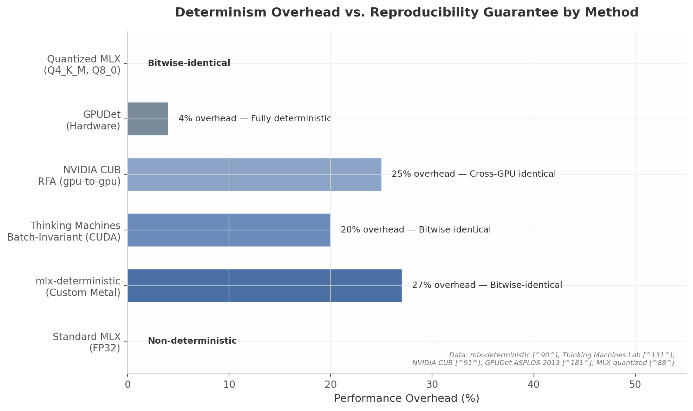

## 1. The Deterministic Runtime: Seeds, Reproducibility, and Trust

### 1.1 Why Determinism Matters for Superintelligence

Every current-generation large language model (LLM) inference pipeline is structurally non-deterministic. This is not a bug to be patched; it is a property baked into the architecture of cloud serving systems. Multi-tenant scheduling, variable network latency, hardware-level thread scheduling, and the non-associativity of floating-point arithmetic combine to guarantee that the same prompt, submitted twice, will follow different execution paths and may produce different outputs [^175^]. The fundamental reason is that floating-point addition is non-associative: $(a+b)+c \neq a+(b+c)$. GPU kernels consume numbers in different orders across runs due to continuous batching, Split-K versus Non-Split-K matrix multiplication, variable block-size hyperparameters, collective AllReduce operations in tensor-parallel deployments, and non-deterministic atomic operations [^175^][^151^]. Even greedy decoding—where the model always selects the most probable next token—can yield divergent results across runs on identical hardware [^75^]. DeepSeek-R1-Distill-Qwen-7B, for example, shows up to 9% accuracy variation on the AIME dataset under identical greedy decoding, driven solely by system configuration changes such as batch size and tensor-parallelism size [^175^].

For a system aspiring to superintelligence—defined here as reliable, general, and auditable reasoning—this non-determinism is catastrophic. It prevents regression testing (did the model get worse after the update?), scientific reproducibility (can another researcher replicate this result?), and forensic audit (what exactly happened during that run?). Deterministic execution is the substrate upon which trust is built. Without it, every output is a one-off event, never fully inspectable or accountable.

The implications extend beyond engineering convenience. In safety-critical domains—medical diagnosis, legal reasoning, financial modeling, autonomous control—the ability to reproduce a reasoning chain exactly is not optional. When an AI agent recommends a treatment plan, executes a trade, or commits code, the operator must be able to replay the exact sequence of states that led to that decision. Cloud inference APIs offer, at best, probabilistic reproducibility. OpenAI exposes a `seed` parameter, but the same seed plus the same input plus the same `system_fingerprint` produces identical output only "most of the time"; backend updates change the `system_fingerprint` and break reproducibility [^73^]. Anthropic does not expose a stable seed parameter as of early 2026 [^73^]. True determinism requires control over the entire execution stack, from scheduler to kernel to floating-point accumulation order.

**Table 1.1: Sources of Non-Determinism in LLM Inference**

| Layer | Source | Impact | Mitigation |
|-------|--------|--------|------------|
| Hardware | GPU warp scheduling variance, atomic operation ordering [^151^] | Bit-level output differences | Fixed scheduling, deterministic atomics |
| Framework | Batch-sensitive kernels (RMSNorm, matmul, attention) [^131^] | Logit drift across batch sizes | Batch-invariant kernel variants |
| Numerical | FP non-associativity, reduction order variation [^175^] | Cumulative rounding error | Reproducible Floating-point Accumulator (RFA) [^91^] |
| Scheduling | Continuous batching, multi-tenant preemption [^20^] | Variable computation graph | Deterministic batching, single-tenant runtime |
| Network | Variable latency in distributed AllReduce [^175^] | Timing-dependent synchronization | Local execution, deterministic network simulation |
| RNG | Uncontrolled entropy sources (time, hardware counters) [^86^] | Divergent sampling paths | Seeded ChaCha20, virtual clock |

The table above catalogs the six primary layers where non-determinism enters the inference pipeline. Each layer requires a distinct mitigation strategy, and no single fix addresses all of them. The hardware layer demands control over GPU thread scheduling; the framework layer requires custom kernels that are invariant to batch composition; the numerical layer needs controlled reduction order; the scheduling layer needs deterministic batching policies; the network layer is best addressed by eliminating distributed execution entirely; and the RNG layer requires centralized seed management. This is why cloud inference cannot, by its nature, guarantee byte-identical replays: the cloud operator controls some layers, the framework controls others, and the user controls none.

**Deterministic execution enables three foundational capabilities.** First, **audit trails**: every state transition is logged, hashed, and linked into a cryptographic chain. Second, **regression testing**: a change to the model, kernel, or constraint engine can be evaluated against the exact same prompts with byte-identical comparison. Third, **scientific reproducibility**: a reasoning result published by the system can be replicated by any party with the same seed, model weights, and runtime version. These are not quality-of-life features; they are the preconditions for treating AI outputs as evidence rather than opinion.

The practical path to deterministic execution in a modern systems language is demonstrated by **MadSim**, a Rust async runtime that replaces `tokio` with a deterministic simulator. MadSim intercepts libc symbols—`getrandom`, `getentropy`, `clock_gettime`, `gettimeofday`—and replaces them with seeded pseudo-random number generators and virtual clocks [^86^]. The runtime runs all async tasks in a single thread, eliminating OS scheduler non-determinism [^92^]. When built with `RUSTFLAGS="--cfg madsim"`, the code compiles against `madsim-tokio`, `madsim-tonic`, and other patched crates, enabling deterministic replay of complex distributed behaviors [^92^]. RisingWave, a distributed SQL database, uses MadSim in production for deterministic simulation testing (DST), following the pattern pioneered by FoundationDB [^87^][^146^]. FoundationDB's approach—running the real database software (not mocks) in a discrete-event simulator alongside randomized workloads and aggressive fault injection—has accumulated roughly one trillion CPU-hours of simulation testing [^146^]. The core insight of DST is simple: instead of building a model of your code, take your real code and make it the model [^147^]. This is the architectural template for the Rex deterministic runtime.

### 1.2 GPU Determinism on Apple Silicon

Apple Silicon presents a uniquely favorable substrate for deterministic AI execution because its Unified Memory Architecture (UMA) eliminates an entire class of non-determinism that plagues discrete GPU systems. On a conventional NVIDIA or AMD setup, CPU-to-GPU transfers traverse PCIe, introducing timing variance from bus contention, driver scheduling, and DMA queue depth. The transfer itself is deterministic in outcome but non-deterministic in timing, and when the inference pipeline includes synchronous waits for tensor movement, the cumulative scheduling effect can alter batch composition and kernel launch order. On Apple Silicon, the CPU, GPU, and Neural Engine (ANE) share the same physical memory pool; a tensor allocated by the Rust kernel via `MTLStorageModeShared` is directly readable by Metal compute shaders and ANE programs without copy, serialization, or address translation [^55^][^56^]. This zero-copy property is not merely a performance optimization—it is a determinism enabler, because it removes a timing-variable boundary from the execution path. The M4 Max provides 546 GB/s of shared memory bandwidth, and independent benchmarks show 28 tok/s on 70B-parameter Q4-quantized models versus 10 tok/s on an RTX 4090, demonstrating that UMA's elimination of PCIe transfers is simultaneously a performance and determinism advantage.

The research dimension on deterministic execution identified multiple proven paths to GPU determinism, each with distinct overhead profiles. The `mlx-deterministic` project implements custom Metal kernels for MLX that achieve bitwise-identical (0.0 tolerance) inference on Apple Silicon with approximately 27–31% overhead for large matrix multiplications compared to standard MLX [^90^]. The technique uses a fixed SIMD reduction order and avoids batch-dependent kernel configurations. Quantized integer models (Q4_K_M, Q8_0) on MLX achieve perfect reproducibility with zero overhead because integer operations are associative, unlike floating-point [^88^]. On the CUDA side, Thinking Machines Lab identified the true root cause of LLM inference non-determinism as lack of batch invariance in inference kernels—standard RMSNorm, matmul, and attention kernels change their internal reduction strategy based on batch shape, producing different rounding accumulations [^131^]. Their batch-invariant variants achieve 100% bitwise-identical outputs across 1,000 runs under dynamic batching with approximately 10–40% performance cost depending on operation and hardware [^125^]. NVIDIA CUB provides explicit `gpu_to_gpu` determinism using Reproducible Floating-point Accumulators (RFA) that group values into fixed exponent-range bins, at 20–30% overhead [^91^]. At the hardware level, GPUDet—a deterministic GPU architecture proposed at ASPLOS 2013—achieves full determinism with as little as 4% overhead for compute-bound applications by leveraging inherent SIMD determinism and introducing a Z-Buffer Unit for ordered memory writes [^181^][^182^].



*Figure 1.1: Performance overhead versus reproducibility guarantee across deterministic inference methods. Quantized models achieve bitwise identity at zero cost; custom kernels incur 20–30% overhead; hardware-level solutions (GPUDet) approach 4% for compute-bound workloads. Sources: mlx-deterministic [^90^], Thinking Machines Lab [^131^], NVIDIA CUB [^91^], GPUDet [^181^], MLX quantized [^88^].*

**Table 1.2: Determinism Methods and Their Overhead on Apple Silicon vs. Discrete GPU**

| Method | Platform | Overhead | Guarantee | Production Status |
|--------|----------|----------|-----------|-------------------|
| Standard MLX FP32 | Apple Silicon | 0% | None (batch-sensitive) [^88^] | Production |
| Quantized MLX (Q4_K_M, Q8_0) | Apple Silicon | 0% | Bitwise-identical [^88^] | Production |
| `mlx-deterministic` custom Metal | Apple Silicon | ~27% [^90^] | Bitwise-identical | Community project |
| Thinking Machines batch-invariant | CUDA (NVIDIA) | ~20% [^131^] | Bitwise-identical | Adopted by SGLang [^94^] |
| NVIDIA CUB RFA | CUDA (NVIDIA) | ~25% [^91^] | Cross-GPU identical | Production (CCCL) |
| GPUDet (hardware) | Theoretical GPU | ~4% [^181^] | Fully deterministic | Research prototype |

The table makes clear that Apple Silicon enjoys two advantages unavailable to discrete GPU systems. First, UMA eliminates PCIe transfer non-determinism entirely. Second, the integer quantization path—Q4_K_M and Q8_0 models running on MLX—provides perfect reproducibility at zero performance cost [^88^]. On discrete GPUs, even with batch-invariant kernels, the PCIe boundary and multi-GPU AllReduce collectives introduce additional non-determinism that batch invariance alone cannot address [^175^]. For the Rex substrate, this means Apple Silicon is the optimal target for deterministic inference: the combination of UMA zero-copy, quantized model reproducibility, and custom Metal kernels for cases requiring floating-point creates a determinism stack that is structurally impossible to replicate on cloud GPU clusters.

The practical implementation within Rex follows a tiered approach. For standard inference, quantized models (Q4_K_M or Q8_0) provide deterministic outputs with no overhead. For verification runs—where exact reproducibility is mandatory—Rex can fall back to custom deterministic Metal kernels or batch-invariant configurations at approximately 27% overhead. The scheduler records which tier was used for each RunEvent, so downstream auditing can weight the verification result accordingly. This tiered design resolves the tension between throughput and determinism identified in cross-verification: deterministic scheduling plus seeded random number generation (RNG) operates at low cost; byte-identical kernels are reserved for verification and testing runs [^128^][^131^]. The key insight is that not every inference needs the same guarantee. A casual conversation benefits from speed; a medical diagnosis or financial calculation benefits from proof. Tiered determinism matches the verification budget to the criticality of the decision.

### 1.3 The Run Ledger: Cryptographic Attestation of Every Thought

Deterministic execution without structured recording is a wasted guarantee. The Run Ledger is Rex's append-only log of every agent execution step, designed to make the system's reasoning process as auditable as a blockchain transaction. Each step in an agent's lifecycle—model inference, tool call, retrieval lookup, constraint validation, repair iteration—is recorded as a `RunEvent` and incorporated into a Merkle tree that produces a single root hash attesting to the entire computation.

**Table 1.3: RunEvent Structure and Hash Coverage**

| Field | Size | Purpose | Hash Coverage |
|-------|------|---------|---------------|
| `run_id` | 16 bytes | Unique execution identifier | Links to session root |
| `step` | 8 bytes | Sequential step index within run | Enables ordering verification |
| `model_hash` | 32 bytes | SHA-256 of model weights/config | Guarantees model provenance |
| `prompt_hash` | 32 bytes | SHA-256 of full prompt text | Guarantees input provenance |
| `retrieval_hash` | 32 bytes | SHA-256 of retrieved documents | Attests knowledge source |
| `tool_call_hash` | 32 bytes | SHA-256 of tool I/O | Attests external computation |
| `seed` | 8 bytes | Deterministic RNG seed | Enables exact replay |
| `output_hash` | 32 bytes | SHA-256 of generated output | Attests result provenance |
| `verifier_result` | variable | Constraint engine verdict | Attests validation status |
| `prev_hash` | 32 bytes | SHA-256 of previous event | Chains events tamper-evidently |

The `RunEvent` structure is derived from the proof-carrying AI execution chain concept (Insight 2) [^170^][^167^]. Each event chains to its predecessor via `prev_hash`, creating a linear hash chain. Multiple events within a single agent step (model output, claim extraction, constraint check, repair prompt) are organized into a Merkle tree whose root is published to the Run Ledger [^167^]. Altering any field in any event changes its hash, which cascades through the chain and the Merkle root, making tamper detection immediate and external. OpenFang, a Rust-based agent operating system, implements an equivalent pattern: a `Merkle Hash-Chain Audit Trail` where each entry is chained to the previous via SHA-256, making retroactive modification impossible without breaking the chain [^170^]. The Merkle structure is particularly efficient for agent execution because it enables logarithmic verification: an external auditor can verify that a specific event belongs to a legitimate run by checking only $O(\log n)$ hash siblings, rather than replaying the entire chain. This property scales to millions of events without linear cost growth.

The ledger enables **time-travel debugging** for AI agents. When a user reports an anomalous output, the operator can replay the exact sequence: load the model identified by `model_hash`, initialize the RNG with `seed`, feed the prompt reconstructed from `prompt_hash`, substitute recorded tool responses from `tool_call_hash`, and execute deterministically. This transforms failure investigation from probabilistic sampling—"run it again and see if it breaks"—into deterministic diagnosis: "the bug is at step 47, when the retrieval returned document hash 0x3a7f... and the constraint engine passed a claim that should have failed." The replay fidelity ladder defined in agent engineering practice identifies five levels: Level 0 (log-only), Level 1 (tool-response recording), Level 2 (state snapshots), Level 3 (deterministic branching), and Level 4 (diff-based experiments) [^169^]. Level 2—state snapshots at each agent handoff—is the threshold where teams begin shipping agents with confidence [^169^]. Rex targets Level 3: deterministic branching, where the operator can modify a single variable mid-replay and observe how the reasoning chain diverges. This is the "diff-based experiment" capability that transforms debugging from archaeology into science.

The minimum event set for deterministic replay includes every LLM request with full prompt and response, every tool call with inputs and outputs, every agent-to-agent message, and the state snapshot at each handoff point [^166^]. Structured execution traces must record model parameters, tool versions, timestamps, and sampling parameters alongside the raw I/O [^171^]. Rex extends this minimum set with cryptographic hashes of all inputs—model weights, prompt text, retrieved documents, tool definitions—so that replay integrity can be verified without trusting the replay environment.

### 1.4 Formal Verification of the Runtime

Deterministic execution provides reproducibility; formal verification provides proof. The Rex runtime is designed for staged verification, matching the constraint that no single verification method can cover all components at all time scales. The architecture distinguishes three paths: a fast path for every agent step, a medium path for critical modules, and a slow path for offline correctness arguments.

**Kani** is an open-source bit-precise model checker for Rust, built on CBMC (C Bounded Model Checker). It verifies Rust programs through symbolic execution over Rust MIR (Mid-Level IR) [^1^]. Kani automatically checks for undefined behavior in `unsafe` blocks and supports function contracts (`#[kani::requires]`, `#[kani::ensures]`, `#[kani::modifies]`) and loop contracts (`#[kani::loop_invariant]`) as of version 0.64.0 [^6^]. Performance is highly variable and depends on harness design: simple properties verify in milliseconds (0.035 s for `panic_or_zero`, 0.28 s for `i64_abs` overflow detection) [^5^], while data structure harnesses with `BTreeSet` can exceed 1,000 s [^3^]. SAT solver selection matters enormously—Kissat reduced `random::tests::gen_range_biased_test` from 1,460 s to 5.5 s, a 200× speedup [^4^]. Kani currently lacks support for multithreading, atomic operations, and async runtimes (though async syntax is supported), and loops or deep recursion cause state-space explosion [^2^]. For Rex, Kani is applied to bounded harnesses for core data structures—hash chains, Merkle tree builders, seed derivation functions—where the input space can be constrained to symbolic sizes that verify in seconds.

**Creusot** is a deductive verifier for Rust that translates annotated Rust into Why3's MLCFG intermediate language, enabling SMT-based verification [^7^][^8^]. It provides a specification language called Pearlite with `requires`/`ensures` contracts, loop invariants, ghost code, and `variant` clauses for termination [^8^]. Creusot's encoding through Why3 is lighter-weight than Prusti's Viper separation logic for safe Rust, though recently added linear ghost types enable verification of `unsafe` low-level pointer code [^7^][^9^]. Creusot is experimental but maturing; its verification time depends on SMT solver performance (Z3, CVC4/5, Alt-Ergo). For Rex, Creusot proves functional correctness of the constraint engine's core algorithms—dimensional analysis, bound checking, Merkle tree construction—against WhyML specifications that encode the physical invariants as formal predicates.

**Lean 4** provides interactive theorem proving for the slow path. The mathlib4 build (exceeding 60,000 declarations) completes in approximately 2,300 s, roughly 2.3× faster than Lean 3 and more than 4× faster than Coq [^10^]. Lean 4 supports certified code extraction—compiling verified definitions into efficient C while eliminating proof overhead [^12^]—and metaprogramming via the `MetaM` monad for custom tactics [^11^]. For Rex, Lean is not used for per-step verification; it is used offline for verifying protocol properties (e.g., "the Merkle chain is tamper-evident," "the seed derivation function is collision-resistant") and mathematical claims extracted by the constraint engine.

```rust
/// Staged verification coordinator for the Rex runtime.
/// Fast path: <10ms per step. Medium path: seconds. Slow path: offline.
pub enum VerificationTier {
    /// Property-based test + refinement type check (<10ms)
    Fast,
    /// Kani model check on bounded harness (0.03s–5s)
    Medium,
    /// Creusot/Lean theorem proving (seconds–minutes, batched)
    Slow,
}

pub struct StagedVerifier {
    pub fast: PropertyBasedTester,
    pub medium: KaniHarnessRunner,
    pub slow: OfflineProverPool,
}

impl StagedVerifier {
    /// Every agent step triggers the fast path.
    /// Critical steps (e.g., first tool call in a chain) also trigger medium.
    /// End-of-session summary triggers slow path for the full trace.
    pub fn verify(&self, event: &RunEvent, tier: VerificationTier) -> VerifierResult {
        match tier {
            VerificationTier::Fast => self.fast.check(event),
            VerificationTier::Medium => self.medium.check_bounded(event),
            VerificationTier::Slow => self.slow.enqueue(event),
        }
    }
}
```

The staged verification model resolves the real-time feasibility tension identified in cross-verification [^143^]. Full formal verification is not real-time feasible for production LLMs—no complete verifier exists for transformer-scale networks, and alpha-beta-CROWN (the state-of-the-art neural network verifier) scales to millions of parameters but not to production-scale transformers [^22^]. SMT solvers handle small linear constraints in milliseconds; XGrammar claim extraction operates at 30–80 µs per token [^143^]. The staged approach assigns each technique to the time scale where it is viable: fast path for every token, medium path for critical reasoning chains, slow path for session-level audit. This is not a compromise—it is an architectural partition that respects the computational complexity of each verification class. The fast path provides statistical confidence through property-based testing; the medium path provides bounded proof through model checking; the slow path provides unconditional proof through theorem proving. Each tier addresses a different threat model: property-based testing catches common bugs, model checking catches edge cases within bounded input spaces, and theorem proving catches logical errors in the specification itself.

The Rust type system itself contributes to the fast path. Rust's ownership model prevents data races at compile time without runtime overhead. `const fn` and `const generics` enforce invariants at compile time: the `uom` crate and similar patterns achieve zero-cost dimensional analysis by encoding physical dimensions in the type system [^48^][^56^]. The dimensional analysis code sketched in the revised architecture—`Dimension { exponents: [i8; 7] }` for M, L, T, I, Θ, N, J—can be extended with `const` evaluation to reject `Length + Time` at compile time, not runtime. This is the "compiler-constrained cognition" principle: physical law becomes type error.

The integration of deterministic execution, cryptographic attestation, and staged formal verification creates what cross-dimensional analysis calls the **Proof-Carrying AI Execution Chain** [^170^][^167^]. Model generates output within deterministic runtime (hashed state); claim graph extraction produces structured claims (hashed claims); constraint engine validates claims (hashed validation result); repair steps are logged (hashed repair trace); final response includes Merkle root of entire computation. Users can verify: this response was generated by model hash X, from prompt hash Y, with verifier result Z, and the computation can be replayed with seed W. This is not a theoretical protocol; it is a construction from existing, proven components: MadSim for deterministic scheduling [^92^], Merkle trees for tamper-evident logging [^167^], Kani for bounded property verification [^1^], and Apple Silicon UMA for zero-copy deterministic memory access [^55^].

The local-first nature of the substrate is what makes this chain possible. Cloud inference cannot replicate the determinism-privacy-locality triad because cloud scheduling is inherently non-deterministic (multi-tenant), cloud requires data transmission (privacy loss), and cloud cannot provide user-owned persistent memory (locality loss). The "deterministic substrate as moat" is structural: cloud architectures are physically incapable of providing the properties that Rex guarantees by design. This is not a marketing claim—it is a consequence of where the non-determinism enters the stack. Remove the cloud, and you remove the non-determinism at its source.
