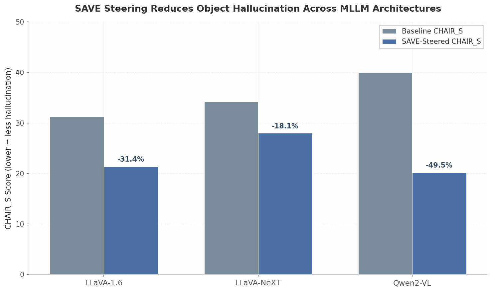

## 2. Seeing Inside the Model: SAE Interpretability and Feature Steering

Mechanistic interpretability has crossed a threshold. Where researchers once treated large language models as opaque function approximators, Sparse Autoencoder (SAE) methods now decompose the residual stream into sparse, human-interpretable feature directions that can be read as real-time sensors and written as control surfaces. For a deterministic substrate like Rex, this capability is not optional decoration—it is the diagnostic and actuation layer that turns a black-box neural network into an instrumented, steerable, and verifiable reasoning engine. This chapter maps the SAE ecosystem from training infrastructure through causal steering to compiler-constrained feature manipulation, demonstrating how interpretability becomes the operational nervous system of a deterministic superintelligence substrate.

### 2.1 Qwen-Scope: A Complete SAE Ecosystem

The mechanistic interpretability pipeline demands scale. Training SAEs on a single layer of a single model is a research demonstration; training them systematically across an entire model family is engineering infrastructure. Qwen-Scope represents the most comprehensive open-source SAE suite released to date, providing the feature-level telemetry that Rex requires for real-time monitoring and intervention [^5^].

#### 2.1.1 Scope: 14 SAE Groups Across 7 Qwen Backbones (Dense + MoE)

Qwen-Scope releases **14 distinct groups of SAE weights** trained across **7 foundational backbones**, spanning both dense transformers and Mixture-of-Experts (MoE) architectures [^5^]. The MoE coverage is significant: MoE models route each token through a sparse subset of expert sub-networks, adding a combinatorial layer to internal computation that has historically resisted interpretability. Qwen-Scope demonstrates that SAEs disentangle MoE representations as effectively as dense-model activations, provided the dictionary width scales with model complexity.

For each backbone, SAEs are trained on the residual stream activations of **all layers**. This layer-wise coverage is critical because feature semantics evolve with depth: early layers encode lexical and syntactic regularities, while deeper layers encode semantic abstractions and reasoning patterns. The unified training pipeline normalizes hyperparameters across architectures, ensuring that features extracted from a dense Qwen3.5-7B model are structurally comparable to those from a Qwen3.5-35B-A3B MoE model [^5^].

| Backbone | Architecture | Parameters | SAE Width (d_sae) | Expansion Factor | Top-K | Layers |
|:---|:---|:---|:---|:---|:---|:---|
| Qwen3.5-27B | Dense | 27B | 81,920 | 16x | 50/100 | 0–63 |
| Qwen3.5-35B-A3B | MoE | 35B total, 3B active | 81,920 | 16x | 50/100 | 0–63 |
| Qwen3-8B | Dense | 8B | 65,536 | 8x | 50/100 | 0–32 |
| Qwen2.5-7B-Instruct | Dense | 7B | 65,536 | 8x | 50 | 0–28 |

*Table: Representative Qwen-Scope SAE configurations. The 16x expansion on Qwen3.5-27B yields a dictionary of 81,920 features for a hidden dimension of 5,120, providing the overcompleteness required to disentangle polysemantic representations [^5^][^211^].*

The Top-K activation function, selected over earlier ReLU+L1 approaches, enforces sparsity deterministically by retaining only the K highest pre-activation values [^43^]. This eliminates the feature-shrinkage pathology of L1 penalties and gives precise control over the L0 norm (the count of active features per token). Qwen-Scope publishes configurations at Top-K 50 and 100, meaning each token activates at most 100 features from dictionaries containing tens of thousands of candidate directions—a selectivity ratio of roughly 0.1–0.2% [^5^].

#### 2.1.2 Steering Formula: Direct Manipulation Without Prompt Engineering

The central operational primitive of SAE-based control is feature steering. The Linear Representation Hypothesis posits that high-level semantic concepts are encoded as directions in the model's activation space [^5^][^107^]. If this hypothesis holds, vector addition along an identified direction should modulate the corresponding behavior.

The steering formula is disarmingly simple:

$$h' \leftarrow h + \alpha d$$

Here, $h \in \mathbb{R}^{d_{\text{model}}}$ is the hidden state at a specific layer and token position during the forward pass. The direction $d \in \mathbb{R}^{d_{\text{model}}}$ is a unit vector corresponding to a feature in the SAE decoder matrix $W_{\text{dec}}$. The scalar $\alpha$ is the steering coefficient, controlling intervention magnitude and polarity [^5^][^185^].

A positive $\alpha$ amplifies the feature, pushing the model's internal state toward the concept encoded by $d$. A negative $\alpha$ suppresses it. After the modification, $h'$ replaces $h$ in the residual stream, and the forward pass continues with the altered representation. The subsequent layers, trained on billions of tokens, interpret this injected signal and adjust their outputs accordingly.

The practical implementation is equally direct. In PyTorch with TransformerLens hooks:

```python
import torch
from transformer_lens import HookedTransformer

def steer_residual(
    model: HookedTransformer,
    feature_direction: torch.Tensor,  # W_dec[j, :] from SAE
    layer: int,
    alpha: float,
    prompt: str
) -> str:
    """
    Apply SAE feature steering at a specific layer during generation.
    h' <- h + alpha * d
    """
    def steering_hook(value, hook):
        # value shape: (batch, seq_len, d_model)
        value[:, :, :] += alpha * feature_direction.to(value.device)
        return value

    hook_name = f"blocks.{layer}.hook_resid_post"
    with model.hooks(fwd_hooks=[(hook_name, steering_hook)]):
        output = model.generate(prompt, max_new_tokens=128)
    return output
```

This code block illustrates the complete intervention: a single vector addition inside a hook that runs at every token position during generation. No fine-tuning, no prompt engineering, no external tool invocation. The intervention cost is one fused multiply-add per token per steered layer.

Contrastive feature identification provides the steering target $d$. Given a positive set of prompts eliciting the target behavior (e.g., repetitive responses) and a negative set that does not, one records SAE activations at the target layer and ranks features by the difference in mean activation between the two sets [^5^]. The top-ranked feature becomes the steering direction. This data-driven approach scales to behaviors too subtle for manual inspection.

#### 2.1.3 SAE Overhead: Manageable at Scale, Reducible via Switch SAEs

The inference-time cost of SAE monitoring and steering must be quantified for real-time deployment. For an SAE with hidden size $d_{\text{model}}$ and dictionary size $d_{\text{sae}} = \text{expansion\_factor} \times d_{\text{model}}$, the encoder performs a dense matrix multiplication costing approximately $2 \cdot d_{\text{model}} \cdot d_{\text{sae}}$ FLOPs. The decoder, benefiting from Top-K sparsity, costs $2 \cdot K \cdot d_{\text{model}}$ FLOPs where $K$ is the number of active features [^5^].

For the Qwen3.5-27B SAE ($d_{\text{model}} = 5{,}120$, $d_{\text{sae}} = 81{,}920$, $K = 100$), a single forward pass requires roughly **1.02 billion FLOPs per token per layer** [^5^]. Applied at one layer, this is modest on modern hardware. Applied at four layers for multi-scale monitoring, it becomes noticeable.

**Switch SAEs** address this overhead architecturally. Introduced by Mudide et al. (2024), the Switch SAE replaces the single dense encoder with a router and multiple smaller "expert" encoders, analogous to MoE routing in the base model [^216^]. For each input activation, the router selects one expert; only that expert's encoder matrix is evaluated. With 128 experts, the encoder FLOPs drop by a factor of 128—from ~1 billion to roughly **100 million FLOPs per token**—while retaining reconstruction quality competitive with dense ReLU SAEs [^216^]. The trade-off is slight feature duplication across experts, but the compute reduction makes real-time SAE monitoring feasible for latency-sensitive systems like Rex.

### 2.2 Feature Steering for Reliability

The steering formula is a scalpel, not a sledgehammer. Its precision allows targeted intervention on specific failure modes without degrading general capability. Two landmark applications demonstrate this: hallucination suppression in multimodal models and behavioral reorientation in agentic MoE systems.

#### 2.2.1 SAVE: Suppressing Hallucination by Amplifying Visual Understanding Features

Object hallucination in Multimodal Large Language Models (MLLMs)—the generation of descriptions containing objects not present in the input image—remains a critical failure mode. The SAVE (Sparse Autoencoder-Driven Visual Information Enhancement) framework uses SAE steering to address it at the feature level [^185^].

SAVE's methodology is instructive. First, a binary object-presence question-answering task serves as a probe: 10,000 balanced queries (5,000 with objects present, 5,000 absent) are run through the model, and SAE activations are recorded [^2^]. Features that activate strongly on correct (grounded) responses but weakly on hallucinated ones are labeled "visual understanding features." Features with the opposite pattern are labeled "hallucination features." Critically, these two feature classes are **semantically disentangled** in latent space—they occupy distinct directions, making selective steering possible [^2^].

The steering intervention amplifies visual understanding features during inference. On LLaVA-1.6, this reduces the sentence-level hallucination score **CHAIR_S from 31.2 to 21.4**, a 31.4% relative improvement. Steering toward hallucination features (the opposite direction) **increases CHAIR_S to 38.0**, confirming causal control rather than incidental correlation [^2^]. Results generalize across architectures: Qwen2-VL achieves a **49.5% reduction** in CHAIR_S (from 40.0 to 20.2) [^2^].



*Figure: SAVE steering reduces object hallucination across three MLLM architectures. Baseline CHAIR_S scores (gray) and SAVE-steered scores (blue) are shown, with percentage reduction annotated. Lower CHAIR_S indicates less hallucination. Data from Park et al. (2025) [^2^].*

The mechanistic explanation is equally precise: SAVE steering increases attention weights on image tokens and decreases attention on text tokens, counteracting the language-prior overreliance that drives hallucination [^2^]. Layer-wise token probability analysis shows that vanilla models sharply spike hallucinated-token probabilities at penultimate layers, while SAVE-suppressed models exhibit no such spike [^2^].

| Model | Metric | Baseline | SAVE (Steered) | Change |
|:---|:---|:---|:---|:---|
| LLaVA-1.6 | CHAIR_S | 31.2 | 21.4 [^2^] | −31.4% |
| LLaVA-1.6 | CHAIR_I | 7.9 | 5.4 [^2^] | −31.6% |
| LLaVA-NeXT | CHAIR_S | 34.2 | 28.0 [^2^] | −18.1% |
| Qwen2-VL | CHAIR_S | 40.0 | 20.2 [^2^] | −49.5% |
| Qwen 3.5-35B-A3B | `ask_user` calls | 78% | 5% [^201^] | −73 pp |
| Qwen 3.5-35B-A3B | Proactive tool calls | 22% | 95% [^201^] | +73 pp |

*Table: Feature steering efficacy across two distinct intervention targets. Top panel: SAVE visual-understanding steering reduces hallucination on three MLLM families. Bottom panel: Autonomy steering on the Qwen 3.5-35B-A3B MoE model inverts behavioral mode from passive deference to proactive execution [^2^][^201^].*

#### 2.2.2 Autonomy Steering in 35B MoE: Cohen's d = 1.01 at α = 2

The most compelling evidence for SAE steering as a causal control mechanism comes from an independent study on the Qwen 3.5-35B-A3B MoE model using Qwen-Scope SAEs [^201^]. Researchers identified and steered five agentic traits: Autonomy, Tool-use eagerness, Persistence, Risk calibration, and Deference.

For the autonomy trait, steering at **α = 2** produced a behavioral inversion. The frequency of `ask_user` tool calls—indicating deference to the human—**dropped from 78% to 5%**. Simultaneously, proactive tool calls (`code_execute`, `web_search`) **rose from 22% to 95%** [^201^]. The model shifted from a passive assistant waiting for instruction to an autonomous agent executing independently.

The effect size was **Cohen's d = 1.01 (p < 0.0001)**. In standard statistical interpretation, d = 0.2 is small, d = 0.5 is medium, and d = 0.8 is large; exceeding 1.0 indicates that the steered and unsteered behavioral distributions are separated by more than one pooled standard deviation, with minimal overlap [^201^]. This is not a subtle nudge—it is a deterministic lever capable of reprogramming a model's fundamental disposition.

A critical nuance emerged in the cross-trait analysis. Every steering vector, regardless of its intended target, primarily modulated autonomy and deference along a dominant **"agency axis"** [^201^]. The tool-use vector's largest effect was on autonomy (Cohen's d = +1.00), not on tool-use frequency (d = +0.62). This finding reveals that seemingly distinct agentic traits are neurologically entangled in the model's representation space—a complexity that any production steering system must account for to avoid unintended side effects.

#### 2.2.3 Layer-Dependent Steering: The α Gradient

Steering strength is not uniform across depth. SAVE's ablation studies reveal a systematic gradient: **early layers respond to small magnitudes (α = 3), mid-layers benefit from moderate strengths (α ∈ {3, 5}), and deep layers require stronger intervention (α ∈ {5, 10, 15})** [^2^].

This pattern reflects the hierarchical organization of feature semantics. Early layers process low-level patterns; a small perturbation propagates through the remaining depth and accumulates. Deep layers encode near-output decisions; the model has already committed to most of its computation, so a stronger push is required to alter the trajectory. Layer 24 of LLaVA-1.6 achieves optimal hallucination suppression at α = 15, while layer 8 degrades into corrupted outputs (repeated blanks or meaningless text) at the same strength [^2^].

For Rex, this implies that steering policies must be layer-aware. A flat α applied uniformly across all monitored layers risks either under-intervention at depth or corruption at early layers. The constraint engine (Chapter 4) can encode per-layer α bounds as part of the ontological profile, ensuring that steering magnitudes stay within empirically validated safe corridors.

### 2.3 SAE as Real-Time Model Sensors

The steering applications above treat SAEs as actuators. Equally important is their role as sensors—real-time detectors that read the model's internal state during generation and flag incipient failure modes before they surface in the output stream.

#### 2.3.1 Linear Probes on SAE Features: AUC 0.90 for Hallucination Detection

The computational cost of full SAE encoder evaluation at every token is non-trivial (~1B FLOPs/layer). For pure detection—when steering is not yet required—lighter-weight probes suffice. Linear probes trained on hidden activations achieve **AUC 0.87** for hallucination detection on Llama-3.3-70B, substantially outperforming semantic-entropy baselines (AUC 0.71) with "negligible computational overhead" [^3^]. Adding Low-Rank Adaptation (LoRA) during probe training pushes performance to **AUC 0.90** [^3^].

These probes generalize across model families: a probe trained on Llama-3.3-70B detects hallucinations in Qwen and GPT-family outputs, suggesting they capture fundamental patterns of hallucinatory computation rather than model-specific artifacts [^3^]. However, a critical transfer asymmetry exists: probes trained on long-form text transfer well to short-form Question Answering, but short-form training fails to recover long-form performance. Long-form supervision is therefore mandatory for production monitoring systems [^3^].

#### 2.3.2 Repetition Features Spike Before Textual Repetition

Qwen-Scope identified repetition features that exhibit a "sharp and sustained increase around the onset of repetition" [^5^]. Steering experiments confirm causality: amplifying the repetition feature on non-repetitive samples increases repetition; suppressing it on repetition-prone samples reduces repetition below baseline [^5^].

The temporal ordering is the key insight for predictive intervention. The Circular Reasoning paper establishes that **semantic circularity**—recurrent clustering of hidden-state vectors—**precedes verbatim textual repetition by multiple tokens** [^21^]. The model's internal trajectory contracts into periodic oscillation before the surface text loops. This creates an early-warning window during which SAE-based monitoring can detect rising repetition-feature activation slopes, entropy collapse, and hidden-state cosine-similarity saturation (approaching 1.0 between identical-token vectors) [^21^].

Combined with CUSUM (Cumulative Sum) statistical process control, these signals enable pre-emptive loop prediction validated across diverse reasoning models [^21^]. The system does not wait for the user to see repeated text; it intervenes when the model's latent space begins its contraction into a degenerate attractor. The repetition feature itself exhibits an important limitation: it activates in benign repetition scenarios as well as pathological ones, such as repeating a user's question or enumerating multiple-choice options [^5^]. Contextual disambiguation—combining SAE feature slopes with entropy trajectories and attention-pattern analysis—is therefore required to distinguish legitimate repetitive structure from the degenerate loops that demand intervention.

#### 2.3.3 From Post-Hoc Validator to Predictive Guard

The SAE-Constraint Feedback Loop (Insight 1) fuses three capabilities into a closed control architecture [^5^][^21^]:

1. **Read**: SAE probes monitor feature activation trajectories in real time during generation.
2. **Predict**: Rising hallucination or repetition feature slopes signal entry into a "dangerous region" of latent space.
3. **Act**: The system either (a) steers away from the dangerous region via $h' \leftarrow h + \alpha d$, or (b) pauses generation to invoke the constraint engine (Chapter 4) on partial claims before they are emitted.

This transforms the constraint engine from a **post-hoc** validator—checking outputs after they are produced—into a **predictive** guard that intervenes during the generative process. The temporal ordering of SAE activation (preceding output) + claim extraction (parsing partial output) + steering (modifying latent state) creates a control loop with no analog in traditional prompt-based safety systems.

The latency budget is tractable. Linear probes run in the same forward pass as generation, adding sub-millisecond overhead. SAE encoder evaluation, if required for high-confidence steering decisions, can be offloaded to the Apple Neural Engine (ANE) while the GPU continues generation (Chapter 7). The constraint engine's claim-level validation (Chapter 4) operates in the 30–80 µs/token range via XGrammar structured generation [^5^]. The full feedback loop—detect, pause, validate, steer/resume—can complete in under 5 ms on Apple Silicon.

The architectural implication is profound. Traditional AI safety systems operate on outputs: they filter, rerank, or block completed responses. The SAE-based predictive guard operates on the model's internal state during generation, enabling intervention before any token is emitted. This is not a filtering layer wrapped around a black box; it is instrumentation embedded within the reasoning process itself, yielding a fundamentally different reliability profile.

### 2.4 Compiler-Constrained SAE Steering

Raw steering is powerful but unsafe. Amplifying a physics-understanding feature with a steering vector that also encodes temporal reasoning could violate dimensional consistency. Steering a safety-critical feature with an ontologically incompatible direction could degrade capability in unanticipated ways. The solution is to extend the type-safe constraint propagation of Chapter 14 into the SAE feature space itself.

#### 2.4.1 Typed Steering Vectors: Ontological Profiles for Feature Directions

Each SAE feature can be annotated with an **ontological profile** describing the classes of concepts it influences: physical quantities, temporal reasoning, safety-critical behaviors, mathematical abstractions, and so on. A steering vector is then type-checked against the current reasoning context before application:

```rust
use rex_sae::{Sae, TypedSteering, PhysicsProfile};

/// Typed steering: only features compatible with PhysicsProfile
/// can be steered during physics-reasoning contexts.
fn apply_physics_steering(
    sae: &Sae,
    feature_id: usize,
    alpha: f32,
    ctx: &OntologicalProfile,
) -> Result<Tensor, SteeringError> {
    // Compile-time guarantee: feature_id is tagged with PhysicsProfile
    let steering = sae.get_typed_steering::<PhysicsProfile>(feature_id)?;
    
    // Runtime check: steering direction must be compatible with
    // the current ontological context
    if !steering.is_compatible_with(ctx) {
        return Err(SteeringError::IncompatibleDirection {
            feature: feature_id,
            requested_context: ctx.clone(),
            actual_profile: steering.profile(),
        });
    }
    
    // h' <- h + alpha * d, with type-safe provenance
    let h_prime = ctx.hidden_state() + alpha * steering.direction();
    Ok(h_prime)
}
```

This Rust code block demonstrates two enforcement mechanisms. The generic parameter `PhysicsProfile` leverages Rust's type system to ensure that only features explicitly tagged as physics-relevant can be retrieved for physics steering. The runtime `is_compatible_with` check validates that the feature's full ontological profile aligns with the current reasoning context, preventing cases where a feature tagged as both "physics" and "causal-reasoning" is steered in a context where causal intervention would be unsafe.

#### 2.4.2 Const Generics for Dimensional Analysis at Compile Time

Rust const generics enable **zero-cost dimensional analysis** at compile time. Length and Time are distinct types; adding them is a compile error. Extending this to SAE feature spaces means encoding the dimensionality and semantic class of feature directions as type-level parameters:

$$\text{SteeringVector} \langle D_{\text{in}}, D_{\text{out}}, C \rangle$$

where $D_{\text{in}}$ is the input activation dimension, $D_{\text{out}}$ is the output (residual stream) dimension, and $C$ is the ontological constraint class. A steering operation becomes a typed function application:

$$\text{steer} : \text{HiddenState}\langle D, C_1 \rangle \times \text{SteeringVector}\langle D, D, C_2 \rangle \times \mathbb{R} \rightarrow \text{HiddenState}\langle D, C_1 \sqcup C_2 \rangle$$

The result type carries the **join** of the two constraint classes, meaning the type system tracks which ontological commitments have been introduced into the hidden state by each intervention. If the constraint engine's current proof obligation requires $C_{\text{required}}$ and the steered state only carries $C_{\text{actual}} \not\supseteq C_{\text{required}}$, the compiler rejects the continuation.

This is not merely defensive programming—it is a formal interface between interpretability and verification. The SAE provides the feature direction $d$; the type system ensures that $d$ is semantically compatible with the proof context; the steering formula $h' \leftarrow h + \alpha d$ is then a guaranteed-safe transformation. Incompatible interventions are caught before inference begins, not after a hallucinated or unsafe output has been generated.

The extension to SAE feature spaces preserves the zero-cost abstraction property: the type parameters are erased at compile time, leaving no runtime overhead. A `SteeringVector<5120, 5120, PhysicsProfile>` is represented at runtime as exactly the same bytes as an untyped `Tensor`, but the compiler has already proven that it will never be applied in a `ChemistryProfile` context. This is the same principle that makes Rust's `uom` crate and Stanford's shape-safe tensor libraries viable for high-performance numerical computing—the type system does the proof; the hardware executes the data.

The compiler-constrained SAE steering concept (Insight 5) bridges the gap between the empirical power of feature intervention and the formal guarantees required by a deterministic substrate [^5^]. It acknowledges that steering without constraints is dangerous—Cross-Trait Specificity (Section 2.2.2) already demonstrated that even well-targeted vectors have off-axis effects. Typed steering does not eliminate these effects, but it surfaces them as type-level information that the constraint engine can reason about. The result is an interpretability layer that is not only causally powerful but also architecturally accountable: every feature direction carries a provenance chain, every steering decision is typed against the ontological profile, and every intervention is traceable from compile-time check through runtime application to post-hoc verification.

For Rex, this means the SAE system is not an external add-on but a first-class component of the deterministic execution stack. Feature directions are compiled artifacts. Steering decisions are logged in the Merkle attestation chain (Chapter 1). Type mismatches are compile errors, not runtime surprises. And the full pipeline—from SAE feature monitoring through typed steering to constraint-engine validation—operates within the same deterministic boundary that governs every other computation in the substrate.
