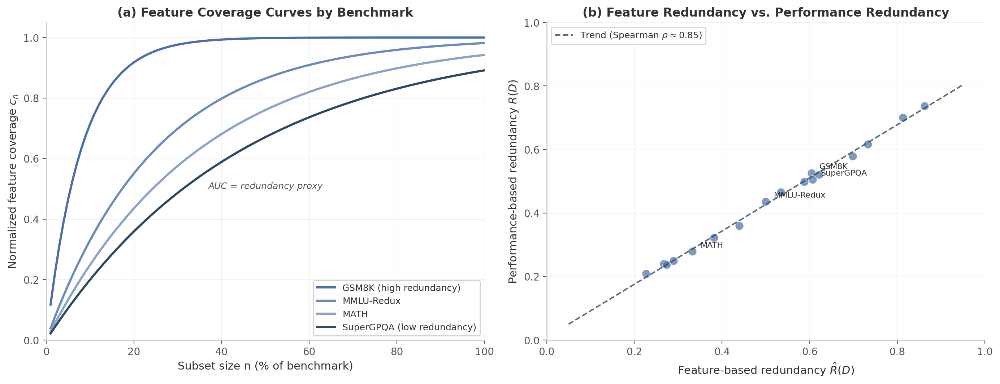

# 8. Benchmark Intelligence and Evaluation Without Execution

Evaluating a single large language model on the Holistic Evaluation of Language Models (HELM) suite consumes over 4,000 GPU-hours—exceeding $10,000 in API costs for one pass [^594^]. At the scale of modern model development, where dozens of candidate checkpoints are produced weekly, exhaustive benchmark execution has become the dominant cost in the training pipeline. This chapter addresses whether evaluation can be performed *without* execution—by reading the model's internal representation of a benchmark rather than its output on it. The methodology rests on Sparse Autoencoder (SAE) feature fingerprinting: treating each benchmark as a set of latent feature activations that can be compared, measured for redundancy, and used to guide targeted improvement.

## 8.1 SAE Feature Fingerprinting

### 8.1.1 From Feature Activations to Benchmark Signatures

The foundational observation is that a benchmark's questions activate a characteristic subset of a model's latent features, and this activation pattern constitutes a compact signature of the capabilities the benchmark probes. Qwen-Scope, an open-source suite of SAEs built across the Qwen model family (14 SAE groups, 7 variants, both dense and Mixture-of-Expert architectures), formalizes this mapping [^5^]. For a benchmark $D = \{x_1, x_2, \ldots, x_N\}$, the active feature set of an individual sample $x_i$ is defined as the indices of SAE latents that fire above threshold:

$$F(x_i) = \left\{ j \in \{1, \ldots, d\} : z_j(x_i) > 0 \right\}$$

where $z_j(x_i)$ is the $j$-th component of the Top-$k$ ReLU SAE latent representation extracted at the last token position [^5^]. The *feature footprint* of the entire benchmark is the union over all samples:

$$F(D) = \bigcup_{i=1}^{N} F(x_i)$$

This footprint $F(D)$ is the benchmark's fingerprint: a sparse binary vector (or set) in feature-index space encoding what representational directions the benchmark exercises. Because the SAE is orders of magnitude smaller than the base model—often a shallow encoder-decoder attached to a single hidden layer—computing $F(D)$ requires only one lightweight forward pass per sample, not a full model inference with token generation.

The geometric organization of these features is not random. SAE features exhibit *meso-scale modularity*: features that co-occur functionally tend to cluster geometrically, with math and code features forming distinct spatial "lobes" separate from general language features [^475^]. The phi coefficient for co-occurrence affinity was found to best predict this spatial structure, and mutual information between functional and geometric clusters ruled out the null hypothesis at 954 standard deviations [^475^]. This modularity means that benchmark fingerprints are not arbitrary point clouds; they occupy structured regions of latent space that can be reasoned about.

Layer-wise analysis adds further resolution. Feature activations tend to peak at specific depths, with features at early layers more spread across groups, and larger models distributing features more broadly across layers [^473^]. A benchmark that probes early-layer syntactic features (e.g., code parsing) will have a fingerprint concentrated at shallow depths, while one probing multi-step reasoning will activate deeper layers. Qwen-Scope currently uses a single-layer SAE for fingerprinting; extending to multi-layer feature tensors would improve fidelity, though the computational cost remains negligible relative to full evaluation.

The asymmetric overlap between two benchmarks reveals containment relationships that are invisible to standard accuracy comparisons. Define:

$$\text{overlap}(D_1, D_2) = \frac{|F(D_1) \cap F(D_2)|}{|F(D_1)|}$$

This measures what fraction of $D_1$'s feature footprint is also activated by $D_2$. The overlap matrix across the Qwen-Scope 17-benchmark suite exposes a hierarchy of capability containment [^5^]:

| Benchmark Pair | Asymmetric Overlap | Interpretation |
|:---------------|:-------------------|:---------------|
| GSM8K $\rightarrow$ MATH | 0.63 | 63% of elementary-math features are present in competition math [^5^] |
| MATH $\rightarrow$ GSM8K | 0.10 | Only 10% of competition-math features are present in elementary math [^5^] |
| EvalPlus $\leftrightarrow$ MBPP | 0.35–0.53 | Code benchmarks form a tight feature cluster [^5^] |
| MMLU-Pro $\leftrightarrow$ TheoremQA | 0.56–0.68 | Broad knowledge subsumes specialized theorem-proving features [^5^] |
| MATH $\leftrightarrow$ EvalPlus | 0.32 | Math and code share a modest but non-trivial feature intersection [^5^] |

The GSM8K–MATH asymmetry is the most striking result: elementary arithmetic is almost entirely representable within the feature space of competition mathematics, but competition mathematics exercises a vastly broader representational vocabulary that GSM8K never touches [^5^]. This implies that a model passing GSM8K reveals little about its MATH capability, while a model passing MATH has almost certainly mastered GSM8K. For evaluation suite design, this means GSM8K is dispensable once MATH is included—execution on both adds marginal information.

### 8.1.2 Feature Redundancy as a Proxy for Performance Redundancy

Ground-truth redundancy measurement requires ranking a panel of models on the full benchmark and on random subsets, then computing Kendall's tau correlation between the two ranking vectors [^5^]. Formally, for subset $S \subseteq D$ with $|S| = n$, the expected Kendall's tau is:

$$\tau_n = \mathbb{E}_{S \subseteq D, |S|=n}\big[\tau(S, D)\big]$$

and the redundancy scalar is the area under the $\tau_n$ curve:

$$R(D) = \frac{1}{N} \sum_{n=1}^{N} \tau_n$$

Computing $R(D)$ demands $O(M \times N)$ forward passes—prohibitively expensive for large-scale curation [^5^]. The SAE-based proxy replaces rank-correlation with *feature-coverage curves*. The expected normalized feature coverage at subset size $n$ is:

$$c_n = \mathbb{E}_{S \subseteq D, |S|=n}\left[\frac{|F(S)|}{|F(D)|}\right]$$

and the feature redundancy metric combines coverage AUC with a growth-rate correction:

$$\hat{R}(D) = \frac{\sum_{n=1}^{N} c_n}{|F(D)|}$$

This metric is high when coverage saturates quickly (many samples activate the same features) and when the total feature count $|F(D)|$ is small relative to sample count $N$. The critical validation result is the rank correlation between $\hat{R}(D)$ and $R(D)$ across 17 benchmarks: Spearman $\rho \approx 0.85$ [^5^]. After controlling for general model ability by partialing out MMLU as a proxy, the partial Pearson correlation between feature overlap and performance correlation improves to 75.5% [^5^]. Figure 8.1 illustrates the relationship between feature-based and performance-based redundancy.

**Figure 8.1** (a) Normalized feature coverage curves for benchmarks with different redundancy profiles. GSM8K saturates rapidly, indicating high redundancy; SuperGPQA approaches saturation slowly, indicating diverse capability probing. (b) Scatter of feature-based redundancy $\hat{R}(D)$ versus performance-based redundancy $R(D)$ across 17 benchmarks, with trend line reflecting the Spearman $\rho \approx 0.85$ correlation reported by Qwen-Scope [^5^].

Several important caveats temper this strong correlation. High redundancy does not imply low benchmark quality—redundancy may be desirable to reduce evaluation variance. SuperGPQA, with 26,529 questions, exhibits relatively low redundancy despite its large absolute size, confirming that scale alone does not produce saturation [^5^]. Conversely, GSM8K's high redundancy means only a small subset suffices to preserve model rankings. The feature proxy does not predict absolute accuracy scores; it predicts whether two benchmarks measure similar capabilities and whether a subset preserves the ranking structure of the full set. For suite design, this is precisely the decision that matters.

### 8.1.3 Evaluation Compute Reduction

The computational savings from fingerprinting are substantial. Performance-based redundancy for $M$ models on an $N$-sample benchmark requires $M \times N$ full forward passes. Feature-based redundancy requires $N$ SAE encodings—one per sample, through an encoder that is typically a single linear layer with ReLU and Top-$k$ sparsification. For 26 models on GSM8K (1,319 samples), this reduces from approximately 34,294 full evaluations to 1,319 SAE passes, a $\mathbf{26\times}$ reduction *before* accounting for the SAE's smaller computational footprint [^5^].

Complementary methods can compound this reduction. SubLIME uses a Rank Correlation Prediction model trained on 5–20 anchor LLMs to adaptively sample subsets, achieving 10–100× cost reduction while preserving Spearman $\rho > 0.9$ [^555^]. tinyBenchmarks applies Item Response Theory (IRT) with approximately 100 curated examples per scenario, achieving within ~2% error of full evaluation [^593^]. Fluid Benchmarking adapts IRT item characteristics dynamically, using 50× fewer items while improving validity and lowering variance [^576^]. ACE (Active learning for Capability Evaluation) uses Gaussian Processes in a latent capability space to reach 0.01 RMSE of exhaustive evaluation by assessing fewer than half of all capabilities [^512^].

| Method | Approach | Data Required | Cost Reduction | Key Metric |
|:-------|:---------|:--------------|:---------------|:-----------|
| SAE Feature Redundancy | Feature coverage curves | SAE activations on benchmark | 26×+ [^5^] | Spearman $\rho \approx 0.85$ vs. ground truth |
| SubLIME | Rank Correlation Prediction | 5–20 anchor LLMs | 10–100× [^555^] | Spearman $\rho > 0.9$ |
| tinyBenchmarks (IRT) | Item Response Theory | Historical evaluation results | ~13× (100 of 1,319 samples) [^593^] | ~2% error |
| Fluid Benchmarking | Adaptive IRT selection | Public evaluation logs | 50× [^576^] | Higher validity, lower variance |
| ACE | Gaussian Process in latent space | Frontier model for capability decomposition | >2× [^512^] | 0.01 RMSE, <50% capabilities evaluated |

The SAE approach is unique in requiring *no historical evaluation data* and *no model execution whatsoever* once the benchmark has been fingerprinted. IRT-based methods need prior model responses to estimate item parameters; SubLIME needs anchor model rankings. SAE fingerprinting is evaluation-free after an initial encoding pass, making it suitable for newly created benchmarks or proprietary evaluation suites where model access is restricted.

## 8.2 Feature-Guided Data Synthesis

### 8.2.1 FAC Synthesis: Targeted Training Data Generation

If feature footprints can predict benchmark redundancy, they can also identify *gaps*—capabilities that a model has not been trained to represent. Feature Activation Coverage (FAC) quantifies data diversity not in token space but in the model's internal feature space, and FAC Synthesis uses missing features to guide targeted training data generation [^551^]. The core insight is that reducing the distribution gap at the SAE feature level, rather than in raw text space, produces semantically aligned training data that is less sensitive to surface linguistic variation [^551^].

The synthesis pipeline proceeds as follows. Given anchor data $D$ (the target capability distribution) and current generated data $D_{\text{gen}}$, extract task-relevant features from both. Define missing features as:

$$F_{\text{miss}} = F(D) \setminus F(D_{\text{gen}})$$

For each missing feature $i \in F_{\text{miss}}$, generate contrastive pairs $(x_i^+, x_i^-)$ where $x_i^+$ strongly activates feature $i$ and $x_i^-$ weakly activates it. These pairs serve as few-shot demonstrations to guide a generator toward samples that close the coverage gap. Generated candidates are filtered by an SAE activation threshold $\delta$, ensuring that only samples that genuinely activate the target features are retained [^551^].

The efficiency gains are dramatic. FAC Synthesis achieves comparable downstream performance to MAGPIE—a state-of-the-art synthetic data pipeline—using only 2,000 synthetic samples versus MAGPIE's approximately 300,000 samples, a **150×** reduction [^551^]. FAC also correlates strongly with downstream task performance (Pearson $r = 0.95$, Spearman $\rho = 0.90$), validating that feature-space coverage is a reliable proxy for learning signal [^551^].

The theoretical foundation supporting this result is an upper bound on post-training generalization error that identifies *task-relevant feature coverage* as a key determinant of downstream performance [^551^]. When a model's training distribution under-represents certain feature directions, those directions remain poorly optimized even if the model has sufficient capacity to represent them. FAC Synthesis explicitly targets these underrepresented directions, creating a form of representation-level curriculum rather than domain-level curriculum.

Cross-model feature transfer strengthens the practical case. SAE-derived features achieve macro F1 > 0.8 and demonstrate cross-model transfer from Gemma 2 2B to 9B-IT models; remarkably, 2B-based SAE features can predict 9B-IT's correctness nearly as well as, and sometimes better than, 9B-IT's own features [^573^]. This suggests that feature directions are to some extent *universal* across model scales within a family, meaning feature gaps identified on a small model can guide data synthesis for a larger one—a critical efficiency for resource-constrained local training.

### 8.2.2 Automatic Curriculum Design for GRPO Training

Feature gaps identified through fingerprinting can directly inform the reward structure and data sampling strategy in Group Relative Policy Optimization (GRPO), the reinforcement learning algorithm used by DeepSeek-R1 to eliminate the critic model and reduce memory overhead by approximately 50% [^6^] [^21^]. The integration creates a closed evaluation-training loop: SAE fingerprinting profiles the model across all benchmarks, identifies feature directions that are underdeveloped, FAC Synthesis generates targeted training data, and GRPO trains with rule-based rewards on that data. Re-evaluation with fingerprinting closes the loop.

This is *representation-level curriculum design*, finer-grained than domain-level (math, code, science) curricula. Instead of "the model needs more math practice," the system identifies "feature direction 3,247—which encodes algebraic substitution—is underrepresented in the training distribution." The GRPO reward function can then incorporate a bonus for responses that activate this feature direction above threshold $\delta$:

$$R_{\text{total}} = R_{\text{correctness}} + \lambda \cdot \mathbb{1}\left[ z_{3247}(x) > \delta \right]$$

where $R_{\text{correctness}}$ is the standard accuracy reward and $\lambda$ is a scalar weighting the feature-activation bonus. Because GRPO uses group-relative advantages computed within a batch of responses to the same question, no critic model is required, and the feature-activation reward can be evaluated inexpensively via the SAE encoder during training [^6^].

The convergence properties of this approach align with findings from repair-loop analysis: tool-augmented feedback converges in 1–3 iterations for math and code tasks [^4^], while intrinsic self-correction fails 64.5% of the time [^3^]. Feature-guided GRPO operates as an *extrinsic* feedback mechanism—the SAE provides an external verification signal that the model is activating the right representational directions—consistent with the successful correction pattern.

Resa provides an extreme demonstration of SAE-guided training efficiency: sparse autoencoder tuning retains 97% of an RL-trained counterpart's performance while reducing training costs by 2,000× (to roughly $1) and training time by 450× (to approximately 20 minutes) [^559^]. Although Resa uses SAE tuning rather than feature-guided synthesis, the underlying principle—that representational structure can be manipulated far more efficiently than weights or data alone—is the same.

### 8.2.3 Temporal Feature Drift Detection

SAE feature activation distributions can serve as "model ECGs" for detecting temporal drift in capabilities before benchmark scores degrade. The procedure is conceptually simple: record a baseline feature distribution $p_0(z)$ on a validation set at deployment, then monitor the distribution $p_t(z)$ during production use. Statistical divergence from baseline—measured by Kullback-Leibler (KL) divergence or Wasserstein distance—signals representational shift:

$$D_{\text{KL}}(p_t \| p_0) = \sum_{j} p_t(z_j) \log \frac{p_t(z_j)}{p_0(z_j)}$$

Because the Spearman correlation between feature coverage and benchmark performance is $\rho \approx 0.85$ [^5^], a measurable drift in feature activation statistics can be translated into an estimated performance drift before any evaluation is run. This enables *predictive maintenance* for deployed models: trigger targeted data synthesis and retraining when KL divergence exceeds a threshold, rather than waiting for user-facing accuracy to drop.

The detection pipeline integrates naturally with the Apple Silicon substrate described in Chapter 7. The Apple Neural Engine (ANE) can run SAE feature monitoring concurrently with GPU generation, providing sub-millisecond feature extraction without interrupting inference. The ANE handles the SAE encoder (a lightweight linear+ReLU network) while the GPU handles token generation, producing a continuous feature-distribution telemetry stream. When KL divergence exceeds a learned threshold—calibrated on historical drift episodes—the system flags the model for re-evaluation.

Several practical considerations govern deployment. Feature drift can arise from distribution shift in inputs (the model sees harder questions, not degraded capabilities), from legitimate learning (the model's internal representations reorganize during continued pre-training), or from genuine capability decay (weights drift due to quantization, pruning, or repeated fine-tuning). Distinguishing these cases requires baseline distributions recorded under multiple conditions: easy and hard inputs, before and after legitimate training updates. The threshold should be set per-feature-group rather than globally, since different capabilities (math, code, language) may drift independently.

The complete evaluation intelligence pipeline—fingerprinting, redundancy detection, gap identification, targeted synthesis, and drift monitoring—transforms benchmark evaluation from a post-hoc measurement into a continuous, closed-loop control system. The model's own latent features become the sensor array through which its capabilities are observed, diagnosed, and repaired, without requiring the expensive act of inference on full benchmark suites.
