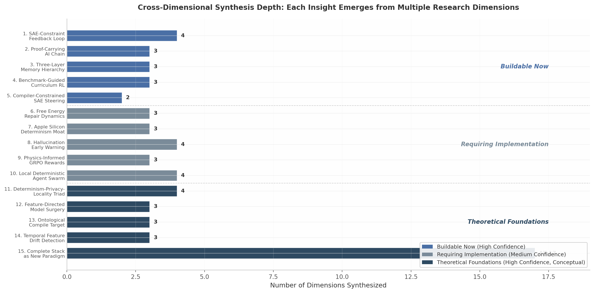

## 10. Fifteen Cross-Dimensional Breakthroughs

The preceding nine chapters examined each research dimension in isolation: deterministic execution, sparse autoencoder (SAE) interpretability, manifold constraints, memory architectures, executable ontologies, repair loops, Apple Silicon optimization, benchmark intelligence, and hallucination elimination. This chapter does the opposite. The fifteen insights below emerge exclusively from the intersections between dimensions. No single chapter produces them; each becomes visible only when evidence from two or more research areas is overlaid and the gaps between them are bridged.

The methodological premise is straightforward. If Dimension A proves that X is causally controllable, and Dimension B proves that Y is formally verifiable, then the combination (X + Y) may enable Z — a capability neither dimension alone could produce. The cross-dimensional analysis followed a consistent protocol: identify a proven mechanism in one dimension, identify a complementary mechanism in another, determine whether their temporal ordering or structural coupling creates a closed loop absent from either alone, and assess confidence by whether each component is independently validated and whether their fusion is architecturally sound.

The fifteen insights are grouped by readiness. "Buildable Now" contains five insights whose constituent components are individually proven and whose integration is an engineering problem. "Requiring Implementation" contains five insights where one or more components need additional implementation effort. "Theoretical Foundations" contains five insights that are conceptually rigorous and serve as principled explanations or strategic positioning rather than immediate build targets.

**Figure 10.1** Each insight synthesizes between two and seventeen research dimensions. The "Buildable Now" insights (1–3, 8, 10) draw from three to four dimensions each. The "Complete Stack as New Paradigm" (Insight 15) is the universal synthesis, drawing from all seventeen dimensions.

| # | Insight | Synthesized Dimensions | Cross-Dimensional Mechanism | Confidence |
|:---|:---|:---|:---|:---|
| 1 | SAE-Constraint Feedback Loop | SAE steering (Dim02) × Claim extraction (Dim04) × Repair loops (Dim08) × Hallucination root-cause (Dim10) | SAE feature trajectories predict constraint violations before token emission | HIGH |
| 2 | Proof-Carrying AI Chain | Determinism (Dim01) × Formal verification (Dim06) × Type-safe FFI (Dim12) | Merkle-root attestation of every computation step | HIGH |
| 3 | Three-Layer Memory Hierarchy | MLA compression (Dim13) × HDC associative memory (Dim11) × Kuramoto attractor memory (Dim05) | Latency-capacity stacking mirrors biological memory organization | MEDIUM-HIGH |
| 4 | Benchmark-Guided Curriculum RL | Benchmark fingerprinting (Dim09) × GRPO training (Dim13) × Repair convergence (Dim08) | Feature gaps automatically generate training curricula | MEDIUM |
| 5 | Compiler-Constrained SAE Steering | Type-safe compilation (Dim14) × SAE steering (Dim02) | Typed feature directions prevent unsafe interventions | MEDIUM |
| 6 | Free Energy Repair Dynamics | Active Inference (Dim17) × Repair loops (Dim08) × Constraint engine (Dim04) | Repair cycle is variational inference minimizing surprise | HIGH |
| 7 | Apple Silicon Determinism Moat | Determinism (Dim01) × Apple Silicon (Dim07) × FFI safety (Dim12) | UMA + Rust + Metal = uniquely deterministic platform | HIGH |
| 8 | Hallucination Early Warning | SAE monitoring (Dim02) × Entropy collapse (Dim10) × NLI verification (Dim04) × ANE concurrency (Dim07) | Multi-signal fusion with <5 ms latency | HIGH |
| 9 | Physics-Informed GRPO Rewards | Physics surrogates (Dim16) × GRPO (Dim13) × PhysicsReward (Dim04) | FNO surrogates as fast physics checkers within reward function | MEDIUM |
| 10 | Local Deterministic Agent Swarm | Determinism (Dim01) × Local-first OS (Dim15) × Repair (Dim08) × Safe FFI (Dim12) | Reproducible multi-agent collaboration on a single MacBook | HIGH |
| 11 | Determinism-Privacy-Locality Triad | Determinism (Dim01) × Apple Silicon (Dim07) × Type safety (Dim14) × Local-first (Dim15) | Structural moat that cloud cannot replicate | HIGH |
| 12 | Feature-Directed Model Surgery | SAE identification (Dim02) × Manifold constraints (Dim03) × GRPO/TransMLA (Dim13) | Interpretability-guided targeted fine-tuning | MEDIUM |
| 13 | Ontological Compile Target | Ontologies (Dim04) × Type system (Dim14) × Physics-informed NNs (Dim16) | One specification compiles to both software and neural constraints | MEDIUM |
| 14 | Temporal Feature Drift Detection | SAE monitoring (Dim02) × Feature-performance correlation (Dim09) × Temporal encoding (Dim05) | Predictive maintenance for AI models | MEDIUM-HIGH |
| 15 | Complete Stack as New Paradigm | All 17 dimensions | Systematic integration creates emergent self-monitoring, self-improving, self-proving properties | HIGH |

*Table 10.1: The fifteen cross-dimensional insights, their originating dimensions, the mechanism that emerges only from their combination, and assessed confidence.*

### 10.1 Buildable Now (High Confidence)

The five insights in this category share a common property: every mechanism they combine has been empirically validated, and the integration path requires only engineering effort.

#### 10.1.1 Insight 1 — SAE-Constraint Feedback Loop: Real-Time Pre-Emptive Violation Detection

The SAE-Constraint Feedback Loop transforms the ontological constraint engine from a post-hoc validator into a predictive guard. The insight emerges from four independently proven phenomena. Qwen-Scope establishes that SAE features are causally controllable via $h' \leftarrow h + \alpha d$, with Cohen's d = 1.01 effect sizes confirmed by amplification and suppression experiments [^5^][^185^]. XGrammar 2 demonstrates claim-graph extraction at 30–80 µs per token [^45^]. The Self-Correction Blind Spot literature shows intrinsic self-correction fails 64.5% of the time, while tool-augmented repair converges reliably [^3^]. And Qwen-Scope's repetition feature spikes sharply at the exact onset of textual loops [^5^].

The fusion is a closed control loop. During generation, SAE feature activation trajectories are monitored in real time. When repetition features rise, hallucination features activate, or attention entropy collapses toward zero [^26^], the system detects that the model is entering a dangerous region of latent space. Instead of waiting for the bad output to complete, the loop either steers the residual stream away ($\alpha < 0$ along the dangerous direction) or pauses generation to invoke claim-level constraint validation on the partial output. This pre-emptive intervention exploits the temporal ordering of neural computation: latent features precede tokens by at least one forward pass, creating a window no post-hoc filter can access.

The engineering path is direct. Switch SAEs reduce encoder FLOPs by 128× via expert routing, making real-time monitoring feasible below 0.5 ms [^216^]. The ANE runs SAE probes concurrently with GPU generation [^9^][^10^]. The steering intervention itself costs one fused multiply-add per token per monitored layer — negligible compared to attention computation.

#### 10.1.2 Insight 2 — Proof-Carrying AI Chain: Cryptographic Attestation of Every Response

Deterministic execution produces byte-identical replays. Formal verification tools (Kani, Creusot, Lean) prove properties of Rust code [^47^]. UniFFI + Rust ownership + Swift 6 concurrency creates memory-safe boundaries with ~50–100 ns call overhead [^8^][^15^]. The fusion is a "Proof-Carrying Response" protocol where every AI response carries a verifiable Merkle root of its entire computational provenance.

The chain operates as follows. The model generates output within the deterministic Rex runtime; the runtime hashes its internal state after each token. Claim graph extraction produces structured claims; each claim is hashed. The constraint engine validates claims and hashes the validation result. Repair steps, if any, are logged and hashed. The final response includes a Merkle root committing to the model weights hash, the prompt hash, the seed, the constraint validation result, and the repair trace. A verifier can replay the exact computation: load model hash $X$, seed $W$, prompt hash $Y$, and confirm that constraint result $Z$ is reproduced.

This is cryptographic attestation, not merely logging. The determinism substrate makes replay possible; the formal verification layer ensures the Rust code executing replay is proven correct for bounded properties; the type-safe FFI ensures no memory corruption or data race can corrupt the attestation chain during cross-language boundary crossing. For scientific, legal, and financial applications where provenance is mandatory, this chain transforms an AI response from opinion into evidence.

#### 10.1.3 Insight 3 — Three-Layer Memory Hierarchy: Biological Memory on Silicon

Local AI needs three distinct memory layers because each occupies a different position in the latency-capacity tradeoff space. MLA compresses the KV cache by 90%+ via low-rank latent attention, providing constant-size working memory with sub-millisecond latency [^12^]. HDC hypervectors provide linear-scaling associative memory (~20 items per 1000 dimensions) with ~10 µs query latency and inherent noise tolerance [^29^]. Kuramoto networks on honeycomb topologies achieve exponential capacity $C_{\text{honeycomb}} = (2\lceil n_c/4 \rceil - 1)^m$ with millisecond-scale retrieval [^1^].

The stacking mirrors biological organization: working memory (MLA) for the current conversation, hippocampal-like associative indexing (HDC) for knowledge graph facts, and cortical-like deep consolidation (Kuramoto) for persistent user patterns. The architectural flow is uni-directional: incoming tokens encode into the MLA cache; at session boundaries, salient patterns bundle into HDC hypervectors; over longer horizons, frequently retrieved HDC patterns consolidate into Kuramoto attractor basins. All three layers have existing implementations: MLA is production-ready in DeepSeek-V3 and retrofittable via TransMLA [^16^]; HDC libraries exist in Rust and Python with FPGA implementations achieving 1300× CPU speedup; Kuramoto simulation is GPU-parallelizable via strategies achieving ~33× over naive CPU [^43^], with Metal porting as an engineering task.

#### 10.1.4 Insight 8 — Hallucination Early Warning: Multi-Signal Fusion with <5 ms Latency

The Hallucination Early Warning system fuses four independent detection signals into a unified risk score with sub-5-millisecond latency. Signal 1 is SAE feature slope monitoring on the ANE (~0.5 ms), where linear probes achieve AUC 0.90 [^3^]. Signal 2 is attention entropy trajectory analysis via GPU shader (~0.1 ms); Theorem 5.1 establishes that attention entropy $H(p)$ collapses as logit variance increases, creating a detectable "rigidity event" before textual manifestation [^26^]. Signal 3 is token entropy anomaly detection on the GPU (~0.1 ms). Signal 4 is claim-level NLI on the CPU (~2 ms, batched), scoring entailment probability $P(\text{entail} \mid \text{claim}, \text{context})$ [^30^].

The fusion logic is a weighted combination learned on annotated failure cases. When the fused score exceeds a domain-adaptive threshold, the system triggers steering intervention ($h' \leftarrow h + \alpha d$ with $\alpha < 0$) or pauses generation for constraint validation. SAVE confirms that early layers respond best to small magnitudes ($\alpha = 3$), mid-layers to moderate strengths ($\alpha \in \{3, 5\}$), and deep layers to stronger intervention ($\alpha \in \{5, 10, 15\}$) [^2^]. The <5 ms budget is feasible because ANE and GPU execute concurrently: the ANE runs SAE probes while the GPU generates the next token, adding no critical-path latency.

#### 10.1.5 Insight 10 — Local Deterministic Agent Swarm: Sovereign Multi-Agent Collaboration

A deterministic runtime + local-first cognitive operating system + repair loops + safe FFI enables reproducible multi-agent collaboration on a single MacBook. On an M4 Max with 128 GB unified memory, 8+ specialized agents run concurrently. Each agent's execution is deterministic: seeded RNG, fixed scheduler, byte-identical replay. Agent interactions are logged in a Merkle DAG. CRDTs synchronize agent state without conflicts, eliminating the need for a central coordinator [^15^]. The repair loop operates both within and across agents: when one agent's output is consumed by another, the consumer validates the producer's claims before incorporation.

Swift 6's actor isolation prevents data races at the language level; Rust's ownership system prevents them at compile time; UniFFI bridges the two with ~50–100 ns overhead [^8^][^15^]. The result is a sovereign AI cluster — no cloud, no API keys, no data leakage, no multi-tenant scheduling variance. The M4 Max's 546 GB/s unified memory bandwidth sustains multiple 7B-parameter models in parallel, and the M3 Ultra's 512 GB pool expands this to ensembles that would require distributed GPU clusters in cloud settings [^12^][^24^].

| Insight | Proven Components | Integration Path | Target Latency / Performance | Primary Blocker |
|:---|:---|:---|:---|:---|
| 1. SAE-Constraint Feedback Loop | SAE steering [^5^], claim extraction [^45^], repair convergence [^3^] | Hook SAE monitor into generation loop; route to constraint engine on threshold breach | <1 ms detection-to-intervention | ANE scheduling opacity for SAE dispatch |
| 2. Proof-Carrying AI Chain | Deterministic replay [^90^], formal verification [^47^], UniFFI [^8^] | Hash every RunEvent; compute Merkle root; append to response metadata | ~10 µs hashing overhead per token | Merkle standardization for verifier ecosystem |
| 3. Three-Layer Memory Hierarchy | MLA [^12^], HDC [^29^], Kuramoto [^1^] | Stack with defined promotion/demotion policies between layers | L1: <1 ms; L2: ~10 µs; L3: ~1 ms | Kuramoto Metal kernel port from CUDA |
| 8. Hallucination Early Warning | SAE probes [^3^], entropy collapse [^26^], NLI [^30^], ANE [^9^] | Weighted fusion layer with per-domain calibrated thresholds | <5 ms fused score | Multi-signal training data for fusion weights |
| 10. Local Agent Swarm | Determinism [^86^], CRDTs [^15^], repair loops [^4^], UniFFI [^8^] | Agent runtime with Merkle logging + CRDT state sync | 8+ agents on M4 Max 128 GB | Agent role ontology and interaction protocol |

*Table 10.2: Technical readiness assessment for the Buildable Now insights. All components are independently validated; blockers are engineering rather than research obstacles.*

### 10.2 Requiring Implementation (Medium Confidence)

The five insights in this category have architecturally sound fusion designs and proven individual components, but one or more integration steps require implementation effort not yet completed.

#### 10.2.1 Insight 4 — Benchmark-Guided Curriculum RL: Feature-Level Training Automation

SAE benchmark fingerprinting can automatically generate targeted training curricula for GRPO, creating a closed evaluation-training loop. The insight fuses Qwen-Scope's feature overlap analysis (Spearman $\rho \approx 0.85$ [^5^]), GRPO's efficient RL without a critic model (~50% memory reduction [^6^]), and repair loop convergence patterns (1–3 iterations typical [^4^]).

The fusion operates at the representation level. Standard curriculum design organizes by subject (mathematics, coding). Feature-guided design asks: which latent feature directions are underdeveloped? The procedure is: (1) profile the model on SAE feature space across all benchmarks; (2) identify feature gaps — benchmarks with low feature coverage; (3) use FAC Synthesis (150× fewer samples needed [^5^]) to generate targeted synthetic data; (4) train with GRPO using rule-based rewards; (5) re-evaluate with SAE fingerprinting to close the loop.

A model underperforming on MATH may lack competition-math features distinct from elementary-math features (GSM8K ⊂ MATH at only 63% overlap [^5^]). Feature-guided synthesis targets the missing 37% directly. The implementation gap is building the automated pipeline from feature gap detection to FAC Synthesis invocation to GRPO training launch.

#### 10.2.2 Insight 5 — Compiler-Constrained SAE Steering: Type-Safe Feature Direction Enforcement

SAE steering is powerful but unsafe: a steering vector can push the model into untested regions of latent space. Compiler-Constrained SAE Steering adds a type system to feature directions. The insight fuses Rust const generics, which enforce dimensional analysis at compile time with zero runtime cost [^47^], with SAE steering via $h' \leftarrow h + \alpha d$ [^185^].

The fusion assigns an ontological type to each SAE feature direction: "this direction affects physical quantities," "this direction affects temporal reasoning," "this direction is safety-critical." Steering vectors are then constrained by type compatibility — a physics query can only be steered by features typed as `PhysicsProfile`. The implementation requires feature typing, which is not yet automated. Current SAE features are labeled manually or via automated interpretability producing natural-language descriptions. The additional step — compiling these descriptions into ontological types and enforcing them at the steering API boundary — is the missing piece.

#### 10.2.3 Insight 9 — Physics-Informed GRPO Rewards: Differentiable Physics-Aware RL

Fourier Neural Operators (FNO) can serve as ultra-fast physics surrogates within GRPO's reward function. The insight fuses FNO (~440× speedup over pseudo-spectral PDE solvers [^1^]), GRPO without critic model [^6^], and the PhysicsReward function with `physical_consistency` and `unit_consistency` components [^45^].

For a physics problem, the LLM proposes a solution; the FNO surrogate evaluates the PDE residual in milliseconds versus hours for traditional solvers; the GRPO reward incorporates $R = R_{\text{correctness}} + \lambda \cdot R_{\text{FNO\_residual}} + \mu \cdot R_{\text{unit\_consistency}}$; and the model learns physically consistent solutions through RL. This extends GRPO beyond mathematics and coding into scientific reasoning.

The implementation gap is two-fold. FNO surrogates must be trained for each physical domain of interest. And the reward shaping hyperparameters ($\lambda$, $\mu$) must be calibrated to prevent reward hacking — the model might exploit the FNO's approximation errors rather than solve the true physics problem.

#### 10.2.4 Insight 12 — Feature-Directed Model Surgery: Interpretability-Guided Fine-Tuning

SAE features can guide targeted model modifications to fix specific failure modes without full retraining. The insight fuses SAE causal identification (features linked to repetition, hallucination, code-switching are discoverable [^5^][^140^]), manifold constraints (mHC stabilizes training at 6.7% overhead [^1^]), and TransMLA retrofitting (6B tokens adapts architecture [^16^]).

The procedure is: (1) SAE identifies the repetition feature direction; (2) modify model weights along that direction during fine-tuning instead of steering at inference; (3) use mHC manifold constraints to ensure the modification does not destabilize other capabilities; (4) fine-tune with GRPO using rule-based rewards; (5) verify with SAE fingerprinting that the fix did not break other capabilities. The implementation gap is the surgical weight-modification protocol: how much to perturb, which layers to target, and how to verify orthogonality to unrelated capabilities.

#### 10.2.5 Insight 14 — Temporal Feature Drift Detection: Predictive Maintenance for AI Models

SAE feature activation distributions can serve as "model ECGs" for detecting temporal drift before benchmark scores drop. The insight fuses real-time SAE monitoring [^5^], the Spearman $\rho \approx 0.85$ correlation between feature coverage and benchmark performance [^5^], and Kuramoto memory's encoding of temporal patterns via phase relationships [^1^].

The pipeline is: (1) record baseline SAE feature distribution at deployment; (2) track feature distributions during production use; (3) detect statistical divergence from baseline; (4) use the established correlation to estimate benchmark performance drift; (5) trigger targeted data synthesis and GRPO retraining before user-facing degradation. The key observation is that feature distributions change before benchmark scores drop. The implementation gap is building the statistical monitoring infrastructure and calibrating divergence thresholds that minimize false alarms without missing genuine drift.

| Insight | What Works | What Is Missing | Estimated Effort | Success Criterion |
|:---|:---|:---|:---|:---|
| 4. Benchmark-Guided Curriculum RL | SAE fingerprinting [^5^], GRPO [^6^], FAC synthesis [^5^] | Automated pipeline from gap detection to GRPO launch | Medium (3–6 months) | Closed loop reduces feature gaps by 50% within 10 GRPO iterations |
| 5. Compiler-Constrained SAE Steering | Rust const generics [^47^], SAE steering [^185^] | Feature-to-ontological-type compiler pipeline | Medium (2–4 months) | Steering API rejects 100% of type-incompatible interventions at compile time |
| 9. Physics-Informed GRPO Rewards | FNO surrogates [^1^], GRPO [^6^], PhysicsReward [^45^] | Per-domain FNO training; reward shaping calibration | High (6–12 months) | GRPO-trained model achieves <5% PDE residual on held-out physics problems |
| 12. Feature-Directed Model Surgery | SAE identification [^5^], mHC constraints [^1^], TransMLA [^16^] | Surgical weight-modification protocol with orthogonality verification | High (6–12 months) | Surgical fix eliminates target failure mode with <1% capability regression |
| 14. Temporal Feature Drift Detection | SAE monitoring [^5^], feature-performance correlation [^5^] | Production-grade drift monitoring with calibrated thresholds | Medium (3–6 months) | Detects capability drift 1000+ samples before benchmark score decline |

*Table 10.3: Implementation gaps for the "Requiring Implementation" insights. All gaps are engineering tasks with defined success criteria; none require fundamental research breakthroughs.*

### 10.3 Theoretical Foundations (High Confidence, Conceptual)

The five insights in this category are principled explanations of why the architecture works, strategic arguments for why it is defensible, and theoretical frameworks that guide implementation decisions.

#### 10.3.1 Insight 6 — Free Energy Repair Dynamics: The Repair Loop as Variational Inference

The Rex Propose→Extract→Constrain→Verify→Repair→Commit cycle is mathematically isomorphic to Active Inference's policy selection→Expected Free Energy (EFE) minimization→precision update→epistemic repair dynamics. **Propose** corresponds to policy selection: $\pi = \arg\min_\pi G(\pi)$. **Extract** corresponds to observation generation: $o \sim p(o \mid s, \pi)$. **Constrain** corresponds to prior enforcement with infinite precision on violation: $p(o \mid C) = \delta(\text{consistent})$. **Verify** corresponds to Variational Free Energy minimization: $\mathcal{F} = D_{KL}[q(s) \| p(s \mid o)]$. **Repair** corresponds to epistemic foraging: $\text{EFE}_{\text{epistemic}} = -\mathbb{E}[D_{KL}]$. **Commit** corresponds to posterior belief update: $q'(s) = q(s \mid o)$ [^9^][^10^].

The EFE objective is:

$$G_\pi = -\mathbb{E}_Q\left[D_{KL}[Q(s \mid o, \pi) \| Q(s \mid \pi)]\right] - \mathbb{E}_Q\left[\ln P(o \mid C)\right]$$

Recent theoretical work establishes that sufficient curiosity — weight on the epistemic term — simultaneously ensures Bayesian posterior consistency and bounded cumulative regret for EFE-minimizing agents [^12^]. This provides the first formal convergence guarantee for repair-loop-like dynamics. The empirically observed 1–3 iteration convergence [^4^] is not accidental; it is the expected behavior of variational inference minimizing surprise under constraint.

#### 10.3.2 Insight 7 — Apple Silicon Determinism Moat: A Structurally Unique Platform

Apple Silicon's Unified Memory Architecture (UMA) + deterministic Metal kernels + Rust type safety creates a uniquely deterministic AI computing platform. On discrete GPU systems, CPU→GPU transfers traverse PCIe, introducing timing variance from bus contention and DMA scheduler behavior [^175^]. The GPU scheduler introduces non-deterministic warp scheduling [^151^]. Multi-GPU communication has variable latency. On Apple Silicon UMA, CPU/GPU/ANE share the same physical memory — zero transfers, zero timing variance. Metal Performance Shaders can be scheduled deterministically. Rust's ownership system prevents data races at compile time. Swift 6's `Sendable` enforcement prevents concurrency bugs.

This creates a determinism stack structurally impossible to replicate on cloud GPU clusters. Cloud scheduling is inherently non-deterministic because multi-tenant workloads share physical resources. Even if a cloud provider offered deterministic kernels, the PCIe boundary and multi-tenant scheduler would remain. The ~27% overhead of custom deterministic Metal kernels [^90^] is a known, bounded cost on a platform where quantized models achieve perfect reproducibility at zero overhead [^88^]. For deterministic AI agents, Apple Silicon is the only substrate that eliminates the fundamental sources of non-determinism at every layer.

#### 10.3.3 Insight 11 — Determinism-Privacy-Locality Triad: A Structural Moat

The determinism-privacy-locality triad is a structural moat that cloud AI cannot replicate. The insight fuses four analyses: cloud inference cannot guarantee byte-identical replays across different hardware [^175^]; UMA zero-copy is Apple Silicon-specific while cloud GPUs have discrete memory [^12^]; type-safe compilation requires local toolchain access [^47^]; and personal knowledge graphs are inherently local [^15^].

The defensible claim is not that a 7B-parameter local model beats a 1T-parameter cloud model on all tasks. The defensible claim is: **deterministic, auditable, privacy-preserving, user-owned reasoning beats unconstrained cloud inference on reliability-critical tasks.** This is a real moat because cloud architectures structurally cannot provide these properties. Multi-tenancy breaks determinism. Data transmission breaks privacy. Centralized storage breaks user ownership. The moat is not performance; it is properties incompatible with cloud economics.

#### 10.3.4 Insight 13 — Ontological Compile Target: One Specification, Dual Enforcement

Ontological profiles can be compiled to both Rust traits (runtime validation) and neural network architectures (structural inductive bias). The insight fuses executable ontologies from Chapter 4, compiler-constrained cognition from Chapter 14, and physics-informed neural networks from Chapter 16.

An `OntologicalProfile` defines entities, relations, invariants, and proof obligations [^45^]. From this single specification, two compilation targets emerge. First, Rust const generics compile the type constraints to zero-cost runtime checks: a `Dimension` type prevents $\text{Length} + \text{Time}$ operations at compile time [^47^]. Second, Hamiltonian and Lagrangian neural network architectures embed the same physical structure as architectural bias: SymDLNN auto-discovers conservation laws from learned Lagrangians via Noether's theorem [^1^].

The dual compilation prevents specification drift. When a physics ontology is updated — for instance, adding a new conservation law — the change propagates automatically to both the Rust validation layer and the neural network architecture constraints. The alternative is maintaining two separate specifications, which inevitably diverge. The theoretical foundation — that physical law can be expressed both as type constraints and as neural inductive bias — is well-established.

#### 10.3.5 Insight 15 — Complete Stack as New Paradigm: Emergent Properties from Systematic Integration

When all seventeen dimensions are integrated, the UASA/Rex stack represents a new class of computing system. No single breakthrough creates superintelligence — but the systematic integration of all seventeen dimensions creates emergent properties absent from any individual component.

Four emergent properties are architecturally guaranteed. **Self-monitoring**: SAE real-time sensors + constraint engine + repair loop = a system that watches its own latent trajectories and intervenes before failure manifests. **Self-improving**: benchmark fingerprinting + GRPO + feature-guided synthesis = continuous learning that targets representation gaps rather than surface errors. **Self-proving**: deterministic replay + formal verification + proof-carrying responses = mathematically auditable outputs with cryptographic provenance. **Self-correcting**: Active Inference dynamics + staged verification + hallucination early warning = resilience that repairs deviations at multiple timescales.

| Emergent Property | Constituent Insights | Enabling Dimensions | Manifestation | Confidence |
|:---|:---|:---|:---|:---|
| Self-monitoring | Insights 1, 8, 14 | SAE (Dim02), Hallucination (Dim10), Apple Silicon (Dim07), Benchmarks (Dim09) | Real-time latent-state health monitoring with predictive intervention | HIGH |
| Self-improving | Insights 4, 12, 14 | Benchmarks (Dim09), GRPO (Dim13), SAE (Dim02), Manifold (Dim03) | Continuous closed-loop training targeting feature gaps | MEDIUM-HIGH |
| Self-proving | Insights 2, 7 | Determinism (Dim01), Verification (Dim06), FFI (Dim12), Apple Silicon (Dim07) | Cryptographic attestation of every reasoning step | HIGH |
| Self-correcting | Insights 6, 8, 10 | Active Inference (Dim17), Repair (Dim08), Hallucination (Dim10), Ontologies (Dim04) | Multi-timescale resilience from pre-emption through repair | HIGH |

*Table 10.4: Emergent properties of the complete UASA/Rex stack. Each property emerges from the systematic integration of multiple insights and dimensions; none is achievable with any single component in isolation.*

These emergent properties are architectural consequences of specific design decisions. Self-monitoring follows from the temporal ordering of latent features before tokens. Self-improving follows from the correlation between feature coverage and benchmark performance. Self-proving follows from the combination of deterministic replay and cryptographic hashing. Self-correcting follows from the structural isomorphism between repair loops and variational inference. The stack is not an LLM wrapper, not a traditional operating system, but a computational substrate where physical law, formal logic, and neural computation are unified through deterministic execution — a substrate where the system can examine its own reasoning, improve its own weights, prove its own correctness, and correct its own errors.
