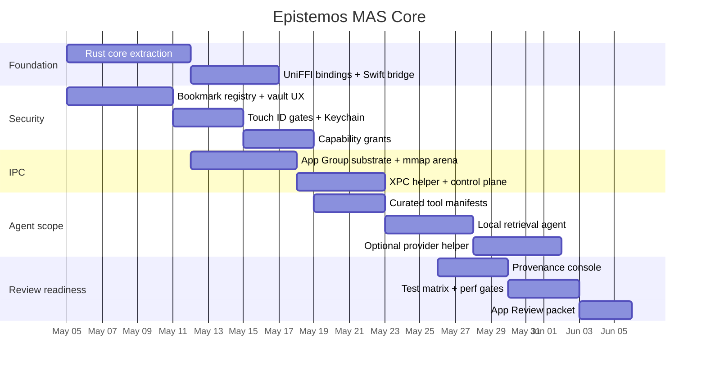

# Epistemos Mac App Store Core

## Executive summary

The App Store–safe version of Epistemos should **not** try to ship the whole research stack. It should ship a **bounded cognitive substrate**: selected-vault intelligence, per-action biometric gating, a sandboxed XPC agent helper, a zero-copy local data plane for large local artifacts, and provenance-first logging. That gives you a product that feels meaningfully agentic, preserves the philosophy of SCOPE-Rex and Resonance Gate, and stays inside a reviewable, supportable security envelope. The two platform facts that matter most are these: inside the sandbox, **privilege separation should use XPC services rather than ordinary child processes**, and **shared local state should live in App Group containers with explicit user-granted file access via security-scoped bookmarks**. citeturn1view2turn2view0turn0search3turn0search17turn3search7turn3search14

The right MAS release is therefore **Core**: local notes, local retrieval, bounded tool orchestration, curated provider adapters, optional cloud escalation, and strong consent. The right Pro release is **the same architecture with wider capability envelopes**: broader networking, more helper roles, and optional automation that would be too risky or too review-fragile for MAS. The right Research release remains where private APIs, raw memory inspection, ANE experimentation, unrestricted browser/shell automation, and unsafe model surgery live. Do not fork the architecture. Keep one substrate and vary only the **capability lattice** and required entitlements. citeturn1view2turn3search15turn32search21

The three features that best wrap the philosophy in a stable MAS product are:

| Feature | Why it belongs in MAS | Why it matters |
|---|---|---|
| **Vault Guard** | Purely local, consent-driven, reviewable | Turns Epistemos into a high-trust vault brain with selected folders, bookmark persistence, and per-action Touch ID |
| **Bounded Agent Service** | XPC + sandbox + typed manifests | Gives you real agent behavior without shells, Docker, downloaded code, or ambient authority |
| **Provenance Console** | Local logging, clear disclosure, accessible UI | Makes every action legible: local vs cloud, what was read, what was written, what required consent |

The two biggest product decisions are equally clear. First, **do not import third-party skill marketplaces into MAS**. The OpenClaw extension ecosystem is a cautionary example: extension marketplaces that mix deep access with community-contributed agent skills create a real malware and review risk. Second, do **copy the config shape** of the best CLI agents—project-scoped configs, tool manifests, explicit approvals, MCP-style adapter boundaries—but **compile those capabilities into curated first-party manifests** for MAS rather than allowing arbitrary remote plugin installation. citeturn20news37turn20news38turn24view0turn25view0turn25view2turn26view0turn26view1turn30view0turn22view2

This report therefore recommends a **6–8 week MAS path** with four owner roles: macOS lead, Rust/IPC lead, security lead, and QA/review lead. The acceptance bar is strict: selected folders only, Touch ID for sensitive actions, XPC helper only, App Group–backed shared arena, capability grants on every agent action, signed provenance logs, and an App Review packet that shows the app is safe enough for real work precisely because it is **bounded**.

## Inventory and feature map

The practical inventory question is not “which agent can we embed whole?” but “which **patterns** are worth porting into a sandbox-safe substrate?” The highest-confidence public baselines are the major agent/CLI surfaces with documented transport, config scope, and tool models: entity["company","Anthropic","ai company"]’s Claude Code, entity["company","OpenAI","ai company"]’s Codex client/app-server surface, and entity["company","Google","technology company"]’s Gemini CLI. The public pattern across all three is convergent: local/remote MCP-style adapters, project/user scoped configuration, explicit approval boundaries, and a host/client split rather than one giant monolith. citeturn24view0turn25view0turn25view2turn26view0turn26view1turn30view0turn22view2

The inventory that matters for MAS is therefore the pattern inventory below.

| Runtime / surface | Verified public surface | Core features worth copying | Transport / IPC pattern | Language / stack signal | MAS-safe subset | Pro / Research only |
|---|---|---|---|---|---|---|
| Claude Code | Official local/remote MCP support, project/user config, approval workflow | Project-scoped tool config, local adapters, explicit approvals | stdio / remote MCP | CLI host with tool config | **Yes**: typed tool manifests, local adapters, approval UI | Remote arbitrary servers, browser-like automation, uncurated plugins |
| Codex client / app-server | MCP support, shared config, app-server protocol | Host/substrate split, app-server bridge, shared tool config | stdio / WebSocket / local bridge | Client + IDE/app server | **Yes**: embedded host, curated adapters | Rich remote control surfaces, broader automation |
| Gemini CLI | Built-in tools, local/remote MCP, reusable skills | Skill packaging, local-first tools, project-local installs | local/remote MCP | CLI with skill model | **Yes**: bundled skills as typed manifests | Downloaded skills or arbitrary remote plug-ins |
| OpenClaw-style ecosystem | Popular open-source ecosystem with extension marketplace pressure | None for MAS except cautionary lessons | Extension marketplace / deep access | Agent with skill hub | **No marketplace in MAS** | Research only; strong security review required |
| Cursor-like UX | Strong UX reference, but not a reliable OSS port target | Inline diffing, task panes, agent composer | Proprietary | Proprietary app | UX inspiration only | Not a port baseline |
| Hermes / NeMoClaw / Flue / OpenClaude | Treat as internal or unverified until repo/licensing is pinned | Port by interface, not by copy | XPC + shared arena in Epistemos | Rust-first target | **Yes**, if rebuilt as bounded helper patterns | Any version that requires unsandboxed helpers, shell, browser drivers, or private APIs |

The conclusion is blunt: **MAS should port patterns, not ecosystems**. Copy the best interaction contracts. Do not ship other people’s unrestricted runtime assumptions into the sandbox.

A second mapping matters even more: which agent capabilities belong where.

| Capability | MAS Core | Pro | Research |
|---|---:|---:|---:|
| Selected-vault retrieval and summarization | ✅ | ✅ | ✅ |
| Touch ID for open/write/export/send actions | ✅ | ✅ | ✅ |
| App Group shared substrate | ✅ | ✅ | ✅ |
| Sandboxed XPC helper | ✅ | ✅ | ✅ |
| Curated local tool manifests | ✅ | ✅ | ✅ |
| First-party cloud provider adapters | ✅, bounded | ✅ | ✅ |
| Arbitrary downloaded skills / code | ❌ | ⚠️ avoid by default | ✅, isolated only |
| Shell / Docker / arbitrary subprocess orchestration | ❌ | ✅ if notarized and explicitly disclosed | ✅ |
| Cross-app automation via Apple Events | defer | ✅ if justified and stable | ✅ |
| Browser automation / computer-use frameworks | ❌ | ✅ | ✅ |
| Raw ANE / private frameworks / memory control room | ❌ | ❌ | ✅ |
| Unrestricted Wasm/JIT plugin runtime | ❌ | ⚠️ selective | ✅ |

That cut line is what keeps the MAS release meaningful rather than hollow.

## MAS-safe architecture

The architecture should be **App Sandbox first**, even if you later distribute a broader Pro build directly. The MAS app should have one foreground app target, one or more XPC helper services, one shared App Group container, and one Rust core exposed into Swift via entity["organization","Mozilla","software organization"]’s UniFFI. Apple’s own platform guidance strongly favors XPC services for privilege separation and restartability, while App Groups are the documented sharing primitive for related executables, and security-scoped bookmarks are the right way to preserve user-granted file authority across launches. citeturn1view2turn0search3turn0search17turn2view0turn3search7turn3search14

The critical choice is the local data plane. For MAS, prefer a **file-backed shared mapping inside the App Group container** over naked `shm_open`. The reason is not performance—it is reviewability and portability across sandboxed executables. App Group shared containers are the documented way to share files and state between the app and helpers, and file-backed `mmap(MAP_SHARED)` gives you the same performance shape you want for large local artifacts while living squarely inside the documented sandbox model. SQLite’s WAL and mmap guidance also fits this architecture naturally for provenance, vault indexes, and local message queues. citeturn0search3turn0search17turn9search0turn9search1turn9search7turn9search10

The resulting MAS-safe topology is:

```text
Epistemos.app
├─ SwiftUI shell
├─ UniFFI Swift bindings
├─ Rust core (retrieval, planner, provenance, capability verifier)
├─ App Group container
│  ├─ arena.dat           # file-backed shared mmap arena
│  ├─ blobs/              # large immutable artifacts
│  ├─ provenance.sqlite   # WAL + mmap
│  └─ vault_index.sqlite  # retrieval index + bookmark registry
└─ XPC services
   ├─ AgentXPC            # bounded agent execution
   └─ ProviderXPC         # optional cloud adapters, bounded network only
```

The MAS entitlement posture should be narrow and explicit.

```xml
<!-- EpistemosMAS.entitlements -->
<?xml version="1.0" encoding="UTF-8"?>
<!DOCTYPE plist PUBLIC "-//Apple//DTD PLIST 1.0//EN"
 "http://www.apple.com/DTDs/PropertyList-1.0.dtd">
<plist version="1.0">
<dict>
    <key>com.apple.security.app-sandbox</key>
    <true/>

    <!-- User-picked vault folders only -->
    <key>com.apple.security.files.user-selected.read-write</key>
    <true/>

    <!-- Shared container between app and XPC helpers -->
    <key>com.apple.security.application-groups</key>
    <array>
        <string>group.com.epistemos.shared</string>
    </array>

    <!-- Optional: if MAS Core includes cloud escalation -->
    <key>com.apple.security.network.client</key>
    <true/>

    <!-- Shared keychain namespace for capability keys / session leases -->
    <key>keychain-access-groups</key>
    <array>
        <string>$(AppIdentifierPrefix)com.epistemos.shared</string>
    </array>
</dict>
</plist>
```

The MAS XPC helper should be even narrower.

```xml
<!-- AgentXPC.entitlements -->
<?xml version="1.0" encoding="UTF-8"?>
<!DOCTYPE plist PUBLIC "-//Apple//DTD PLIST 1.0//EN"
 "http://www.apple.com/DTDs/PropertyList-1.0.dtd">
<plist version="1.0">
<dict>
    <key>com.apple.security.app-sandbox</key>
    <true/>

    <!-- Same App Group so both sides can map arena.dat -->
    <key>com.apple.security.application-groups</key>
    <array>
        <string>group.com.epistemos.shared</string>
    </array>

    <!-- Only if this helper talks to approved providers -->
    <key>com.apple.security.network.client</key>
    <true/>
</dict>
</plist>
```

The direct-distributed Pro build should keep the same internal shape but widen the envelope deliberately.

```xml
<!-- EpistemosPro.entitlements -->
<?xml version="1.0" encoding="UTF-8"?>
<!DOCTYPE plist PUBLIC "-//Apple//DTD PLIST 1.0//EN"
 "http://www.apple.com/DTDs/PropertyList-1.0.dtd">
<plist version="1.0">
<dict>
    <!-- Optional in Pro; keep sandbox on unless a feature truly needs otherwise -->
    <key>com.apple.security.app-sandbox</key>
    <false/>

    <key>com.apple.security.network.client</key>
    <true/>
    <key>com.apple.security.network.server</key>
    <true/>

    <key>com.apple.security.files.user-selected.read-write</key>
    <true/>

    <key>com.apple.security.application-groups</key>
    <array>
        <string>group.com.epistemos.shared</string>
    </array>

    <key>keychain-access-groups</key>
    <array>
        <string>$(AppIdentifierPrefix)com.epistemos.shared</string>
    </array>

    <!-- Only if/when truly needed -->
    <key>com.apple.security.cs.allow-jit</key>
    <false/>
    <key>com.apple.security.cs.disable-library-validation</key>
    <false/>
</dict>
</plist>
```

The important engineering rule is simple: **default both keys above to false until a concrete Pro feature proves it needs them**. That keeps the MAS and Pro builds aligned for as long as possible.

## Porting and code scaffolds

The correct porting strategy is **Rust-first, interface-first, transport-last**. Do not start by embedding Node, Python, or Go runtimes. Start by extracting the durable agent semantics into a Rust core: tool manifest parsing, planner loop, retrieval orchestration, audit/provenance, capability verification, and provider adapter traits. Then expose that Rust core to Swift via UniFFI and run bounded execution inside XPC helpers. If a third-party agent has irreplaceable behavior that cannot be ported immediately, use a **subprocess fallback only in Pro**, never as the MAS baseline.

### Scaffold file layout

```text
Epistemos/
├─ App/
│  ├─ EpistemosApp.swift
│  ├─ Vaults/
│  │  ├─ VaultPickerView.swift
│  │  ├─ VaultConsentSheet.swift
│  │  └─ BookmarkStore.swift
│  ├─ Security/
│  │  ├─ TouchIDGate.swift
│  │  ├─ CapabilityBridge.swift
│  │  └─ AuditConsoleView.swift
│  ├─ XPC/
│  │  ├─ AgentServiceProtocol.swift
│  │  ├─ AgentServiceClient.swift
│  │  └─ ProviderServiceClient.swift
│  └─ Shared/
│     └─ ArenaPathResolver.swift
├─ XPCServices/
│  └─ AgentXPC/
│     ├─ main.swift
│     ├─ AgentService.swift
│     └─ AgentServiceDelegate.swift
├─ rust/
│  ├─ ep_core/
│  │  ├─ src/lib.rs
│  │  ├─ src/arena.rs
│  │  ├─ src/capability.rs
│  │  ├─ src/providers.rs
│  │  ├─ src/tools.rs
│  │  ├─ src/provenance.rs
│  │  └─ src/vaults.rs
│  ├─ ep_bindings/
│  │  ├─ src/lib.rs
│  │  └─ uniffi.toml
│  └─ Cargo.toml
└─ Tests/
   ├─ ArenaTests.swift
   ├─ BookmarkTests.swift
   ├─ CapabilityTests.rs
   └─ XPCSmokeTests.swift
```

### Shared arena

For MAS, use a small fixed control-plane ring and move heavy payloads into blob handles. That keeps the arena stable, page-aligned, and easy to verify.

```rust
// rust/ep_core/src/arena.rs
use std::fs::{File, OpenOptions};
use std::mem::{size_of, MaybeUninit};
use std::os::fd::AsRawFd;
use std::path::Path;
use std::ptr::NonNull;
use std::sync::atomic::{AtomicU32, AtomicU64, Ordering};

pub const ARENA_MAGIC: u32 = 0x45504152; // "EPAR"
pub const ARENA_VERSION: u32 = 1;
pub const SLOT_COUNT: usize = 16;
pub const INLINE_REQ_BYTES: usize = 2048;
pub const INLINE_RSP_BYTES: usize = 4096;
pub const MAX_ARTEFACT_REFS: usize = 8;

#[repr(C, align(64))]
#[derive(Clone, Copy)]
pub struct ArtefactRef {
    pub id: [u8; 32],     // BLAKE3 or SHA-256
    pub offset: u64,
    pub len: u32,
    pub kind: u16,        // prompt pack, search result, note chunk set, etc.
    pub flags: u16,
}

#[repr(C, align(64))]
pub struct RequestSlot {
    pub seq: u64,
    pub state: AtomicU32, // 0 empty, 1 ready, 2 taken
    pub op: u16,          // retrieve, plan, execute, escalate
    pub flags: u16,
    pub capability_len: u16,
    pub artefact_count: u16,
    pub inline_len: u32,
    pub capability: [u8; 256], // serialized HMAC-scoped grant
    pub artefacts: [ArtefactRef; MAX_ARTEFACT_REFS],
    pub inline: [u8; INLINE_REQ_BYTES],
}

#[repr(C, align(64))]
pub struct ResponseSlot {
    pub seq: u64,
    pub state: AtomicU32, // 0 empty, 1 ready, 2 taken
    pub status: i32,
    pub artefact_count: u16,
    pub reserved: u16,
    pub inline_len: u32,
    pub artefacts: [ArtefactRef; MAX_ARTEFACT_REFS],
    pub inline: [u8; INLINE_RSP_BYTES],
}

#[repr(C, align(4096))]
pub struct ArenaHeader {
    pub magic: u32,
    pub version: u32,
    pub req_head: AtomicU64,
    pub req_tail: AtomicU64,
    pub rsp_head: AtomicU64,
    pub rsp_tail: AtomicU64,
    pub signal_epoch: AtomicU64,
    pub _pad: [u8; 4096 - 40],
}

#[repr(C, align(4096))]
pub struct Arena {
    pub header: ArenaHeader,
    pub req: [RequestSlot; SLOT_COUNT],
    pub rsp: [ResponseSlot; SLOT_COUNT],
}

pub struct MappedArena {
    ptr: NonNull<Arena>,
    _file: File,
    len: usize,
}

impl MappedArena {
    pub fn open_or_create(path: &Path) -> std::io::Result<Self> {
        let len = size_of::<Arena>();
        let file = OpenOptions::new().read(true).write(true).create(true).open(path)?;
        file.set_len(len as u64)?;

        let ptr = unsafe {
            libc::mmap(
                std::ptr::null_mut(),
                len,
                libc::PROT_READ | libc::PROT_WRITE,
                libc::MAP_SHARED,
                file.as_raw_fd(),
                0,
            )
        };
        if ptr == libc::MAP_FAILED {
            return Err(std::io::Error::last_os_error());
        }

        let arena_ptr = NonNull::new(ptr as *mut Arena).unwrap();
        let arena = unsafe { arena_ptr.as_ptr().as_mut().unwrap() };

        if arena.header.magic != ARENA_MAGIC || arena.header.version != ARENA_VERSION {
            unsafe {
                std::ptr::write_bytes(arena as *mut Arena as *mut u8, 0, len);
            }
            arena.header.magic = ARENA_MAGIC;
            arena.header.version = ARENA_VERSION;
        }

        Ok(Self { ptr: arena_ptr, _file: file, len })
    }

    pub fn submit_request(&self, mut slot: RequestSlot) -> Result<u64, &'static str> {
        let arena = unsafe { self.ptr.as_ref() };
        let seq = arena.header.req_head.fetch_add(1, Ordering::AcqRel);
        let idx = (seq as usize) % SLOT_COUNT;

        if arena.req[idx].state.load(Ordering::Acquire) != 0 {
            return Err("request ring full");
        }

        slot.seq = seq;
        unsafe {
            std::ptr::write((arena.req.as_ptr() as *mut RequestSlot).add(idx), slot);
        }
        arena.req[idx].state.store(1, Ordering::Release);
        arena.header.signal_epoch.fetch_add(1, Ordering::Release);
        Ok(seq)
    }

    pub fn try_take_response(&self, seq: u64) -> Option<ResponseSlot> {
        let arena = unsafe { self.ptr.as_ref() };
        let idx = (seq as usize) % SLOT_COUNT;
        let slot = &arena.rsp[idx];
        if slot.seq == seq && slot.state.load(Ordering::Acquire) == 1 {
            let mut out = MaybeUninit::<ResponseSlot>::uninit();
            unsafe {
                std::ptr::copy_nonoverlapping(slot, out.as_mut_ptr(), 1);
            }
            slot.state.store(2, Ordering::Release);
            return Some(unsafe { out.assume_init() });
        }
        None
    }
}

impl Drop for MappedArena {
    fn drop(&mut self) {
        unsafe {
            libc::munmap(self.ptr.as_ptr() as *mut libc::c_void, self.len);
        }
    }
}
```

The memory-ordering rule should stay simple and auditable: **writer fills slot, then `store(READY, Release)`; reader checks `load(READY, Acquire)` before reading**. Do not get clever.

### XPC service interface

Use XPC for control-plane signaling only. Pass **sequence numbers and status**, not large payloads.

```swift
// App/XPC/AgentServiceProtocol.swift
import Foundation

@objc protocol AgentServiceProtocol {
    /// The app has placed a request in the shared arena and wants the helper to process it.
    func submit(sequence: UInt64, reply: @escaping (NSError?) -> Void)

    /// Best-effort cancellation for cooperative tasks.
    func cancel(sequence: UInt64, reply: @escaping (NSError?) -> Void)

    /// Health and version probe for diagnostics / review notes.
    func ping(reply: @escaping (String, NSError?) -> Void)
}
```

```swift
// XPCServices/AgentXPC/AgentService.swift
import Foundation

final class AgentService: NSObject, AgentServiceProtocol {
    private let runtime = AgentRuntimeBridge()

    func submit(sequence: UInt64, reply: @escaping (NSError?) -> Void) {
        Task.detached {
            do {
                try await self.runtime.process(sequence: sequence)
                reply(nil)
            } catch {
                reply(error as NSError)
            }
        }
    }

    func cancel(sequence: UInt64, reply: @escaping (NSError?) -> Void) {
        runtime.cancel(sequence: sequence)
        reply(nil)
    }

    func ping(reply: @escaping (String, NSError?) -> Void) {
        reply("AgentXPC ok", nil)
    }
}
```

### UniFFI bridge

Use UniFFI for **typed domain functions**, not for giant payload transfer.

```rust
// rust/ep_bindings/src/lib.rs
use uniffi::Record;

#[derive(uniffi::Record)]
pub struct ToolManifest {
    pub id: String,
    pub title: String,
    pub requires_touch_id: bool,
    pub reads_vault: bool,
    pub writes_vault: bool,
    pub cloud_optional: bool,
}

#[derive(Record)]
pub struct NoteHit {
    pub path: String,
    pub title: String,
    pub snippet: String,
    pub score: f32,
}

#[derive(thiserror::Error, Debug, uniffi::Error)]
pub enum CoreError {
    #[error("capability denied")]
    CapabilityDenied,
    #[error("bookmark stale")]
    BookmarkStale,
    #[error("internal: {0}")]
    Internal(String),
}

#[uniffi::export(async_runtime = "tokio")]
pub async fn retrieve_note_hits(
    query: String,
    vault_ids: Vec<String>,
    limit: u32,
) -> Result<Vec<NoteHit>, CoreError> {
    ep_core::vaults::retrieve(query, vault_ids, limit).await
}

#[uniffi::export]
pub fn curated_tool_manifests() -> Vec<ToolManifest> {
    ep_core::tools::bundled_manifests()
}
```

On the Swift side, keep all UniFFI calls behind an actor.

```swift
actor CoreBridge {
    func retrieve(query: String, vaults: [String], limit: UInt32) async throws -> [NoteHit] {
        try await EpBindings.retrieveNoteHits(query: query, vaultIds: vaults, limit: limit)
    }
}
```

### Touch ID gate

Use LocalAuthentication as a **per-action gate**, not just app unlock.

```swift
// App/Security/TouchIDGate.swift
import LocalAuthentication
import Foundation

enum SensitiveAction: String {
    case openRestrictedVault
    case revealNoteContent
    case writeToVault
    case sendToCloud
}

struct TouchIDGate {
    static func authorize(_ action: SensitiveAction, reason: String) async throws {
        let context = LAContext()
        context.localizedFallbackTitle = "Use Password"
        var error: NSError?

        guard context.canEvaluatePolicy(.deviceOwnerAuthentication, error: &error) else {
            throw error ?? NSError(domain: "TouchIDGate", code: -1)
        }

        let ok = try await context.evaluatePolicy(.deviceOwnerAuthentication,
                                                  localizedReason: reason)
        guard ok else {
            throw NSError(domain: "TouchIDGate", code: -2)
        }
    }
}
```

### Guidance for porting Node, Python, and Go code

Port by strata:

| Code found in third-party agent | MAS strategy |
|---|---|
| Planner loop, prompt templates, tool schema | Re-implement in Rust |
| MCP-style adapter logic | Re-implement as Rust traits and typed manifests |
| Node/Python dependency-heavy tools | Replace with first-party bounded Rust or Swift tools |
| CLI shells / subprocess orchestrators | Pro fallback only |
| Browser drivers / automation stacks | Pro / Research only |
| Python-only ML probes | Rebuild only the inference-time probe or call through XPC helper compiled into the app |

The practical rule is: **if it needs a runtime you do not already trust in the sandbox, it is not MAS baseline**.

## Vault UX and biometric security

The MAS experience should make consent effortless and legible. The user should always know **which vaults are in play, what the agent can do there, and whether Touch ID will be required**.

The core vault flow:

1. User opens **Vaults** settings.
2. Clicks **Add Folder**.
3. App shows `NSOpenPanel` with directory-only, multiselect allowed.
4. App stores security-scoped bookmarks for each selected folder.
5. App indexes only metadata and content that stays local.
6. Sensitive actions on those vaults—opening protected notes, writing files, exporting, sending to cloud—require Touch ID.
7. Every sensitive action writes a provenance entry.

This keeps the MAS version powerful without pretending it is an omnipotent desktop agent.

### Minimal wireframes

**Vaults screen**

```text
┌──────────────────────── Vaults ────────────────────────┐
│ Selected folders                                       │
│                                                        │
│ ● Research Vault         Read/Write   Touch ID on write│
│ ● Clinical Notes         Read-only    Touch ID on open │
│ ● Design Docs            Read/Write   Cloud off        │
│                                                        │
│ [ Add Folder ] [ Re-authorize ] [ Remove ]             │
│                                                        │
│ Status                                                │
│ Bookmarks healthy: 3    Stale: 0    Last audit: Today  │
└────────────────────────────────────────────────────────┘
```

**Agent action consent sheet**

```text
┌──────────────────── Agent request ─────────────────────┐
│ Summarize 4 notes from “Research Vault”                │
│                                                        │
│ Reads: selected vault files                            │
│ Writes: none                                           │
│ Sends to cloud: no                                     │
│ Requires Touch ID: yes                                 │
│                                                        │
│ [ Cancel ]                           [ Continue ]      │
└────────────────────────────────────────────────────────┘
```

**Audit console**

```text
┌──────────────────── Provenance Console ────────────────┐
│ 09:14  Local retrieve     Research Vault     Allowed   │
│ 09:14  Touch ID gate      revealNoteContent  Passed    │
│ 09:15  XPC agent          summarize          Completed │
│ 09:15  Cloud escalation   none               N/A       │
│                                                        │
│ Filter: [All] [Vault] [Cloud] [Writes] [Denied]        │
└────────────────────────────────────────────────────────┘
```

### SwiftUI vault picker scaffold

```swift
// App/Vaults/VaultPickerView.swift
import SwiftUI
import AppKit

struct VaultPickerView: View {
    @State private var selections: [URL] = []

    var body: some View {
        VStack(alignment: .leading, spacing: 12) {
            Text("Selected folders")
                .font(.headline)

            ForEach(selections, id: \.self) { url in
                Text(url.path)
                    .lineLimit(1)
                    .truncationMode(.middle)
                    .accessibilityLabel("Vault folder \(url.path)")
            }

            HStack {
                Button("Add Folder") { pickFolders() }
                Button("Remove All") { selections.removeAll() }
            }
        }
        .padding()
    }

    private func pickFolders() {
        let panel = NSOpenPanel()
        panel.canChooseFiles = false
        panel.canChooseDirectories = true
        panel.allowsMultipleSelection = true
        panel.resolvesAliases = true
        panel.prompt = "Grant Access"

        if panel.runModal() == .OK {
            for url in panel.urls {
                do {
                    let bookmark = try url.bookmarkData(
                        options: [.withSecurityScope],
                        includingResourceValuesForKeys: nil,
                        relativeTo: nil
                    )
                    try BookmarkStore.shared.save(bookmark: bookmark, displayName: url.lastPathComponent)
                    selections.append(url)
                } catch {
                    // surface in app-specific error state
                }
            }
        }
    }
}
```

Accessibility should be deliberate: full keyboard navigation, VoiceOver labels on every consent control, no color-only meaning in audit rows, reduced motion for animated agent states, and text truncation that preserves full-path disclosure via accessibility labels.

## Capability grants, Hermes integration, and local agent parity

### Capability grants

Every bounded agent request should carry a scoped capability token that is short-lived, signed, and independently verifiable by the helper.

```rust
// rust/ep_core/src/capability.rs
use hmac::{Hmac, Mac};
use sha2::Sha256;
use serde::{Serialize, Deserialize};
use std::time::{SystemTime, UNIX_EPOCH};

type HmacSha256 = Hmac<Sha256>;

bitflags::bitflags! {
    #[derive(Serialize, Deserialize)]
    pub struct CapFlags: u32 {
        const READ_VAULT      = 0x0001;
        const WRITE_VAULT     = 0x0002;
        const SUMMARIZE       = 0x0004;
        const SEARCH_WEB      = 0x0008;
        const CALL_PROVIDER   = 0x0010;
        const EXPORT_TEXT     = 0x0020;
    }
}

#[derive(Serialize, Deserialize, Clone)]
pub struct CapabilityGrant {
    pub subject: String,          // helper/service id
    pub action_id: String,        // audit correlation id
    pub flags: CapFlags,
    pub expires_at_unix: u64,
    pub max_input_bytes: u32,
    pub max_output_bytes: u32,
    pub allowed_provider_ids: Vec<String>,
    pub vault_ids: Vec<String>,
    pub nonce: [u8; 16],
    pub sig: [u8; 32],
}

impl CapabilityGrant {
    pub fn sign(mut self, key: &[u8]) -> Result<Self, String> {
        self.sig = [0; 32];
        let payload = postcard::to_stdvec(&self).map_err(|e| e.to_string())?;
        let mut mac = HmacSha256::new_from_slice(key).map_err(|e| e.to_string())?;
        mac.update(&payload);
        self.sig.copy_from_slice(&mac.finalize().into_bytes());
        Ok(self)
    }

    pub fn verify(&self, key: &[u8]) -> Result<(), String> {
        if now_unix() > self.expires_at_unix {
            return Err("expired".into());
        }
        let mut tmp = self.clone();
        let sig = tmp.sig;
        tmp.sig = [0; 32];
        let payload = postcard::to_stdvec(&tmp).map_err(|e| e.to_string())?;
        let mut mac = HmacSha256::new_from_slice(key).map_err(|e| e.to_string())?;
        mac.update(&payload);
        mac.verify_slice(&sig).map_err(|_| "bad signature".into())
    }
}

fn now_unix() -> u64 {
    SystemTime::now().duration_since(UNIX_EPOCH).unwrap().as_secs()
}
```

Store the HMAC root key in Keychain under a shared access group, with `WhenUnlockedThisDeviceOnly`. Do **not** hand the root key to helpers. Instead, the app issues grants and helpers only verify grants against a derived verification key or receive grants validated through the core before execution. If you later need per-action biometrically protected secrets, bind those separately; do not overload the capability key.

### Hermes-like integration

A Hermes-like cloud/runtime helper should be treated as a **bounded XPC helper**, never as an authority. The helper gets requests via the arena and returns structured results plus provenance; the core computes the trust state.

```rust
// rust/ep_core/src/providers.rs
use async_trait::async_trait;

pub struct ProviderRequest {
    pub prompt_summary: String,
    pub artefact_ids: Vec<[u8; 32]>,
    pub capability: CapabilityGrant,
    pub timeout_ms: u32,
}

pub struct ProviderResponse {
    pub provider_id: String,
    pub model_id: String,
    pub output_text: String,
    pub citations: Vec<String>,
    pub latency_ms: u32,
}

#[derive(thiserror::Error, Debug)]
pub enum ProviderError {
    #[error("capability denied")]
    CapabilityDenied,
    #[error("network unavailable")]
    NetworkUnavailable,
    #[error("provider failed: {0}")]
    ProviderFailed(String),
}

#[async_trait]
pub trait ProviderAdapter: Send + Sync {
    fn provider_id(&self) -> &'static str;
    fn required_caps(&self) -> CapFlags;
    async fn invoke(&self, req: ProviderRequest) -> Result<ProviderResponse, ProviderError>;
}
```

After helper execution, run everything through a local **resonance/provenance mediation step**: classify the output as local-only, cloud-assisted, or denied; extract claims; attach provider provenance; and decide whether it can be shown directly, shown with a badge, or held pending. That is the MAS-safe version of your Resonance Gate: no mysticism, just a typed trust lattice.

### Local agent parity

The way to approach CLI-level utility in MAS is not to imitate every terminal trick. It is to **mimic the useful surface area inside the sandbox**.

That means:

- typed tool manifests;
- a small set of first-party local tools;
- vault retrieval;
- note-aware summarization;
- search over selected folders;
- export pipelines for markdown, text, and internal graph nodes;
- optional cloud escalation via bounded provider adapters;
- provenance and approvals everywhere.

It does **not** mean shells, Docker, browser drivers, arbitrary downloaded MCP plugins, or invisible long-lived background agents in the MAS baseline.

A good MAS skill format is a signed, bundled manifest:

```json
{
  "id": "vault.summarize",
  "title": "Summarize selected notes",
  "scope": "local",
  "inputs": {
    "query": "string",
    "vault_ids": "string[]"
  },
  "requires_touch_id": true,
  "reads_vault": true,
  "writes_vault": false,
  "cloud_optional": true
}
```

The safe retrieval strategy is hybrid:

| Problem | MAS-safe answer |
|---|---|
| “Need agent memory” | Selected-vault retrieval + conversation recap + graph notes |
| “Need CLI tool parity” | Typed local tools + XPC helper + provider adapters |
| “Need continuous agent state” | App Group substrate + provenance store + resumable tasks |
| “Need smarter local steering” | Safe feature probes and ranking signals locally; no private model surgery in MAS |
| “Need huge context” | Retrieval, compaction, cache reuse, and blob handles—not giant prompt stuffing |

For Apple Silicon expectations, treat these as **engineering targets**, not promises:

| Target | Warm target |
|---|---:|
| Local 3B assistant model | 25–60 tok/s |
| Local 7B Q4 class model | 12–30 tok/s |
| Warm TTFT, 3B local | 250–500 ms |
| Warm TTFT, 7B local | 500–1200 ms |
| Retrieval over active vault index | <150 ms p95 |
| Control-plane XPC submit | <1 ms p95 |
| Arena handoff for control payload | <50 µs after both sides are mapped |

These numbers are realistic enough to guide engineering and conservative enough not to become liabilities.

## App Review, testing, migration, and risks

### App Review and privacy posture

The review packet should make four things obvious:

1. **The app only reads user-selected folders.**
2. **Sensitive actions require explicit consent and often Touch ID.**
3. **Large local artifacts stay on device inside the App Group substrate.**
4. **Cloud requests are optional, explicit, and provider-scoped.**

Your telemetry policy should be minimal by default: local diagnostics only, no content logging unless the user explicitly exports a support bundle, and no background sending of note content. Privacy disclosures should separate **device-only processing** from **optional cloud processing**. The review notes should also say clearly that the MAS build does not download executable code, does not expose a shell, does not use private APIs, and does not automate other apps in its initial release.

### Test matrix

| Layer | Automated tests | Manual smoke checks | Acceptance gate |
|---|---|---|---|
| Bookmark handling | create/resolve/stale/re-authorize | pick 3 folders, relaunch, re-open | zero stale failures in happy path |
| Touch ID gating | allow/deny/cancel/fallback | open, reveal, write, send-to-cloud | gated actions never bypass |
| Arena | ring full, wraparound, atomic ordering, corruption | helper crash/restart mid-task | no duplicate seq, no stale reads |
| XPC | ping, submit, cancel, helper restart | suspend/resume, relaunch app | helper restart transparent to UI |
| Capability grants | sign/verify/expiry/provider mismatch | expired session, wrong helper id | helper rejects invalid grant every time |
| Retrieval | indexing, ranking, multi-vault filters | same query across 2 vaults | p95 latency within target |
| Provenance | append, tamper detect, filter UI | export audit slice | all sensitive actions logged |
| Review build | entitlement diff, sandbox runs clean | offline mode, cloud-off mode | no accidental prohibited capability |

Use signposts around retrieval, UniFFI calls, XPC submit/complete, and Touch ID prompts. Gate the build on p95 latency budgets and on “no network unless provider action explicitly requested.”

### Migration plan

The lowest-risk migration is **feature-flagged convergence**, not a branch explosion.

| Flag | Meaning |
|---|---|
| `mas_core` | App Sandbox, bookmarks, Touch ID, XPC helper, App Group arena |
| `pro_cloud` | wider provider set, richer helper roles, optional automation |
| `research_unsafe` | raw memory, ANE experiments, unrestricted helpers, unsafe plugins |

Merge features in this order:

1. Move vault indexing, retrieval, and provenance into Rust core.
2. Add UniFFI bindings and swap Swift business logic over to the Rust core.
3. Introduce App Group storage and bookmark registry.
4. Replace in-process “agent” execution with XPC helper + arena for bounded tasks.
5. Add capability grants and audit console.
6. Add optional provider helpers and bounded cloud escalation.
7. Only after MAS ships, widen capability flags in Pro and Research.

### Implementation plan



### Owners and acceptance criteria

| Role | Owner focus | Acceptance criteria |
|---|---|---|
| macOS lead | SwiftUI, XPC, Touch ID, review notes | vault picker, consent sheets, helper lifecycle solid |
| Rust / IPC lead | arena, capability verify, retrieval core | no ring corruption, stable async bridge, benchmarks met |
| security lead | bookmarks, Keychain, audit, privacy | every sensitive action gated/logged, secrets scoped correctly |
| QA / review lead | smoke passes, screenshots, review packet | clean review narrative, no prohibited capabilities present |

### Risks and mitigations

| Risk | Why it matters | Mitigation |
|---|---|---|
| App Review sees “agent” and assumes uncontrolled automation | Could trigger rejection or long back-and-forth | Ship bounded agent vocabulary: selected folders, curated tools, explicit consent, no cross-app automation |
| Helper turns into second authority | Breaks trust model and complicates security | Core owns all permissions; helper only receives scoped grants |
| `shm_open` behaves inconsistently in sandbox | Can waste time late | MAS default is file-backed `mmap` in App Group container |
| Third-party agent ecosystems drag in plugin/code-download assumptions | High review and security risk | Port patterns only; no marketplace in MAS |
| Biometric prompts become annoying | UX regression | Cache a short-lived local authorization session per risk class |
| Performance feels weak on base machines | Perceived capability gap | Bias MAS features toward retrieval and bounded local actions, not giant local models |
| Provider adapters create privacy ambiguity | User distrust, review friction | Separate “local only” and “send to cloud” modes in UI, with visible badges and audit entries |

## Open questions and limitations

A few items should be treated as open until you pin them down in code and policy:

- I do **not** recommend treating `shm_open` as the MAS default without validating it under your exact sandbox/helper setup; file-backed App Group `mmap` is the higher-confidence route.
- I could not verify a clean, canonical OSS baseline for **Hermes**, **NeMoClaw**, **Flue**, or **OpenClaude** from primary public sources in this pass, so the report treats them as **internal interface targets**, not authoritative repos.
- If you later want Apple Events, browser automation, or a JIT/Wasm runtime, do that in Pro or Research first. Keep the MAS release boring enough to trust.

The shortest correct summary is this: **ship a bounded substrate, not a sandbox exception story**. The MAS version of Epistemos can already feel unlike other note apps if it gives users three things: vault sovereignty, biometric trust, and bounded agents that do real work without pretending to own the machine.