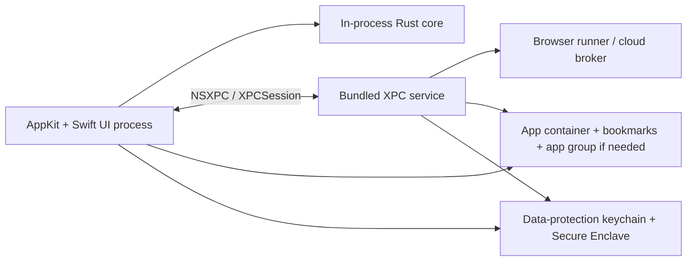

# Epistemos Architecture Report for Native macOS XPC, Local-First Security, and Rust Integration

## Executive summary

For a Mac App Store–targeted AppKit app, the strongest default architecture for Epistemos is: **Swift/AppKit UI + an in-process Rust core for hot-path local work + a bundled XPC service as the privileged boundary for risky or failure-prone work such as browser automation, cloud escalation, and untrusted parsing**. That recommendation follows directly from Apple’s XPC model: bundled XPC services are private to the containing app, are managed by `launchd`, launch on demand, restart after crashes, are terminated when idle, and support privilege separation because each service gets its own sandbox. Apple’s own XPC guide contrasts this with `NSTask`/`posix_spawn`, which do **not** give each component its own sandbox. Apple also states that XPC services cannot elevate themselves to root. citeturn34view0turn13search2turn27search5

For App Store distribution, you should treat **privileged helpers, launch daemons, and “long-lived background machinery” as exceptional, not foundational**. Apple’s App Review rules for Mac apps say apps may not auto-launch or continue running after quit **without consent**, may not download or install additional code or resources that materially change functionality, may not request escalation to root privileges, and must distribute updates through the Mac App Store. That makes a **bundled XPC service** the safest first choice, and an **optional user-consented login item / launch agent** a later optimization only if background indexing or scheduled research proves truly necessary. citeturn16view0

The best way to make Epistemos “research-grade” is **not** to push more logic into background daemons. It is to make every mission packet **deterministic, signed or hashed, provenance-tracked, replayable, and audited**. The strongest standards anchors for that are W3C PROV for provenance modeling, RFC 8785 for canonical JSON, and RFC 8949 for CBOR with deterministic encoding profiles. Combined with Apple’s Secure Enclave, LocalAuthentication, the macOS data-protection keychain, unified logging, and signposts, you can build a local-first research engine whose runs are inspectable and reproducible. citeturn9search1turn9search5turn24search1turn24search0turn37search2turn29search0turn11search0turn11search17

My recommended default for **Epistemos v1** is therefore:

1. **Keep the Rust core in process** for retrieval, indexing, deterministic ranking, packet hashing, provenance generation, and other latency-sensitive work.
2. **Use one bundled XPC service** as a broker for browser automation, cloud calls, and isolated “agent execution.”
3. **Do not ship a privileged helper or launch daemon** in the first Mac App Store build.
4. **Keep Metal in process initially**; move GPU work across process boundaries only if profiling proves isolation is worth the complexity.
5. **Use canonical packets + provenance + structured logs** as the backbone of research, auditing, and replay. citeturn34view0turn31search1turn31search2turn31search27turn24search1turn24search0turn9search1

## XPC, launchd, sandboxing, and App Store constraints

Apple describes XPC as a lightweight IPC mechanism integrated with Grand Central Dispatch and `launchd`, and says the two big reasons to use it are **privilege separation** and **stability**. Their archived but still highly informative XPC guide explains that XPC services are launched on demand, restarted after crashes, killed when idle, should remain as stateless as possible, and by default run in a highly restricted sandbox. Apple also explicitly says a bundled XPC service is **private** and only available to the containing application. citeturn34view0turn13search2

That same guide matters because it captures the crucial design rule for Epistemos: **use process boundaries where trust boundaries exist**. Apple notes that sandboxing plus privilege separation lets you divide an application into smaller pieces with narrower permissions, and that `NSTask` / `posix_spawn` do not let you put each piece in its own sandbox, whereas XPC services do. If your browser runner, external model client, or file-import pipeline touches untrusted input, that is exactly what XPC was designed to isolate. citeturn34view0

On the API surface, `NSXPCConnection` remains the most mature, broadly documented choice for Foundation-based macOS apps. Apple’s documentation describes it as a bidirectional RPC mechanism built around `NSXPCConnection`, `NSXPCInterface`, `NSXPCListener`, and `NSXPCListenerEndpoint`. It also imposes concrete interface constraints that are easy to miss: protocol methods must return `void`, asynchronous replies use one reply block, and object parameters must conform to `NSSecureCoding`; if custom classes appear inside collections, you must explicitly whitelist them on the interface. citeturn34view0turn30search1turn30search3

For newer OS targets, Apple now also exposes the lower-level Swift `XPC` module with types like `XPCSession`, `XPCListener`, and `XPCPeerRequirement`. Those APIs are attractive because they surface **peer code-signing requirements** directly and support typed Swift-message flows. If your deployment target is recent enough and you want stricter built-in peer attestation, they are worth adopting. If you need the most mature end-to-end tooling and examples today, `NSXPCConnection` is still the safer default. citeturn14search0turn14search2turn14search15turn14search32

Apple’s sandbox rules also force a packaging discipline. Apple says App Sandbox is enabled **per target**, not once per overall app, and Apple’s sandbox guidance warns that **every Mach-O executable** in the bundle needs an entitlements file and sandboxing where appropriate, including XPC services and helper tools. That means your app binary, any XPC service executable, and any embedded helper executable all need to be part of your entitlement and signing strategy from day one. citeturn27search1turn27search5turn5search6

For file access, the viable Mac App Store path is: use your app container by default, let the user grant access through standard panels, persist access with **security-scoped bookmarks**, and only introduce **app groups** if multiple targets truly need a shared container or shared keychain-access model. Apple’s docs explicitly call out app groups as enabling shared containers and additional IPC between related apps/helpers, and they describe security-scoped bookmarks as the mechanism for persistent access outside the sandbox. citeturn5search4turn5search11turn12search3turn12search10turn12search13turn12search24

App Store constraints are not a side note here; they determine the shape of the architecture. Apple’s review rules say Mac apps may not auto-launch or keep background code running without consent, may not download or install additional code that changes functionality, may not request root privileges, and must use the Mac App Store for updates. Those rules strongly favor a model where your “agent system” is **bundled, reviewable, same-team signed, sandboxed, and on-demand**. citeturn16view0

The same caution applies to automation. Apple’s sandbox docs explain that sending Apple events to other apps often requires either `scripting-targets` or a temporary `apple-events` exception entitlement, and App Store Connect requires justification for temporary exceptions. Accessibility-based automation similarly sits behind user trust/TCC gates such as `AXIsProcessTrustedWithOptions`. In other words: **computer use is possible, but it is not “free” in review, UX, or permission flow**. citeturn20search1turn20search18turn20search2turn15search1



## Architecture patterns and the recommended default for Epistemos

The cleanest way to think about your options is to separate **API choice** from **process model**. `NSXPCConnection` and `XPCSession` are APIs. A bundled XPC service, a login item or launch agent, an embedded CLI helper, and a launch daemon are process models. For Epistemos, you want the process model that preserves local-first performance while shrinking trust boundaries around the riskiest work. That makes the main decision simple: **in-process Rust for trusted hot-path logic; bundled XPC service for risky or failure-prone work**. citeturn34view0turn13search2

Here is the assessment I would use for decision-making:

| Option | Security | App Store friendliness | Performance | Complexity | Restartability | Best use in Epistemos |
|---|---|---:|---:|---:|---:|---|
| In-process Rust core | Medium | High | Highest | Low-Medium | N/A | Indexing, retrieval, ranking, packet hashing, deterministic math |
| Bundled XPC service + `NSXPCConnection` | High | High | High | Medium | High | Browser runner, cloud broker, untrusted parsing, agent execution |
| Bundled XPC service + `XPCSession` | High | High | High | Medium-High | High | Same as above when targeting newer OS versions and you want peer requirements |
| Embedded CLI helper via `Process` | Low-Medium | Medium | Medium | Low | Low | Temporary migration path, developer tooling, not your core sandbox boundary |
| Login item / launch agent | Medium-High | Medium | Medium | Medium-High | High | Optional user-consented background indexing later |
| Launch daemon / privileged helper | Potentially High, but risky | Low for consumer MAS builds | Medium | High | High | Avoid in v1; reserve for non-MAS enterprise cases |
| Unix domain socket | Medium | Medium | High | Medium | Depends on launcher | Only when interoperating with non-Apple or cross-language agent processes |
| gRPC | Medium | Medium-Low | Medium | High | Depends | Remote services or cross-platform backends, not ideal as primary local IPC |
| Local HTTP server | Low-Medium | Low-Medium | Medium | Low-Medium | Depends | Developer mode only; not ideal for high-trust local brokerage |

The table above is a design judgment, but the key factual anchors are straightforward: Apple positions XPC services as the built-in mechanism for sandboxed privilege separation and crash isolation, `launchd` manages their lifecycle, and App Review sharply constrains auto-running, root-escalating, or code-downloading Mac apps. That is why **bundled XPC** is the center of gravity for a serious Mac App Store architecture. citeturn34view0turn16view0

For Epistemos specifically, I recommend three concrete patterns:

### Minimal default pattern

Use **one app process** and **one bundled XPC service**. The app process owns UI, local state, local vault access negotiation, and the in-process Rust core. The XPC service owns browser driving, remote provider calls, isolated conversion/parsing, and any “long” mission execution that you want crash-contained. This gives you one crisp trust boundary and minimal review complexity. citeturn34view0

### Background indexing pattern

If you later need indexing or scheduled research when the app is not frontmost, add a **separate user-consented login item or launch agent** registered through ServiceManagement, not a launch daemon. That preserves user-space semantics, keeps you away from root, and better matches Apple’s review posture that auto-run behavior must be consented. citeturn16view0turn13search6turn1search22

### High-trust research pattern

If you want “mission packets” to survive process crashes, preserve audit trails, and support replays, persist each run to a local provenance store **before** starting heavy work. The XPC service becomes an executor, not the owner of truth. The truth lives in the app’s research store, with immutable packet/artifact hashes and a run ledger. That pattern aligns much better with Apple’s “services should be as stateless as possible” guidance. citeturn34view0turn9search1turn24search1

A brief note on community projects is also useful. Hermes Agent is terminal-first and already has concepts like a CLI/TUI, a messaging gateway, and a skills system, which makes it a good **semantic** reference for “missions + skills + gateway,” but it is not an Apple-native XPC architecture. Lightpanda is a standalone AI-oriented headless browser written in Zig, not a Rust browser. By contrast, `rust-headless-chrome` and `chromiumoxide` are Rust libraries that **drive Chrome/Chromium over the DevTools Protocol**; they are not standalone browser engines. That distinction matters because it changes packaging, footprint, review posture, and failure modes. citeturn18search0turn18search1turn18search5turn18search11turn17search1turn18search2turn18search3turn18search10

## Rust, Swift, and Metal integration

For Rust↔Swift interop, there are three patterns worth taking seriously.

The most conservative and usually best choice for Epistemos is a **thin C ABI boundary**: write Rust as a `staticlib` or `cdylib`, expose a small `extern "C"` API, and generate headers with `cbindgen`. That matches both Rust’s own FFI guidance and Swift Package Manager’s C-language integration model. Rust’s FFI docs stress that FFI is `unsafe` and should be kept thin; `cbindgen` exists specifically to machine-generate C/C++ headers from Rust public APIs; SwiftPM supports C-language targets, system-library targets, and Apple-platform binary targets for prebuilt artifacts. citeturn32search0turn32search6turn7search2turn7search5turn7search0turn33search3turn33search4

The second option is **UniFFI**, which is attractive when you want a richer, higher-level, strongly typed Swift API over Rust objects and async calls. Mozilla’s UniFFI docs describe Swift binding generation built on Swift’s C-header loading model, with safety as a first-class design goal. For a research engine with many model objects, errors, and async results, UniFFI can be pleasant. For the hottest loops and the smallest review/debug surface, the thin C ABI still wins. citeturn7search1turn7search4turn7search7turn7search16turn7search19

The third option is **packaging Rust as an XCFramework / binary target**. SwiftPM supports binary targets on Apple platforms, so this is viable if you want clean distribution boundaries or reuse the Rust core in multiple Apple apps. For a solo app under active development, it is often slower than simply building Rust as part of your app’s build pipeline and linking through a C bridge. citeturn33search4

For Epistemos, my default would be:

- **In-process Rust static library** for indexing, retrieval, embedding ops, deterministic scoring, canonicalization, hashing, and provenance serialization.
- **Shared Rust crate reused by the XPC service** for packet validation, browser-run coordination, and artifact normalization.
- **One narrow C ABI** at the Swift boundary, even if you later add a higher-level wrapper for developer ergonomics.

A workable layout looks like this:

```text
Epistemos/
  App/
    Sources/
      UI/
      State/
      XPCBridge/
      Security/
      Research/
  XPCServices/
    HermesService/
      Sources/
        ServiceMain.swift
        ServiceDelegate.swift
        BrowserBroker.swift
        ProviderBroker.swift
  Rust/
    crates/
      epistemos_core/
        src/
          retrieval/
          ranking/
          packet/
          provenance/
          canonical/
          security/
      epistemos_ffi/
        src/
          lib.rs
        include/
          epistemos_ffi.h   // generated by cbindgen
  Shared/
    Schemas/
      hermes-mission-packet.schema.json
      prov-run.schema.json
```

On the Metal side, the safest recommendation is **do not split GPU work across processes in v1 unless you have measured need**. Apple absolutely supports cross-process GPU coordination: `MTLSharedTextureHandle` can be passed between processes over XPC, `MTLSharedEvent` / `MTLSharedEventHandle` support cross-process synchronization, and `IOSurface` exists specifically as a shareable framebuffer-like object across process boundaries. Apple also notes that shared textures are for another process using the **same GPU**, which is an important practical constraint. That toolchain is real, but it is materially more complex than keeping Metal in process. citeturn31search1turn31search0turn31search2turn31search4turn31search17turn31search29

So the default guidance is:

- Keep rendering, local preview, and GPU-accelerated note/research visualization **in the main app process**.
- Move GPU work behind XPC only if you need crash isolation for a dangerous renderer or if you truly need an isolated worker.
- If you do move it, pass **handles and IOSurfaces**, not raw texture bytes, and keep the GPU-owner process count small. citeturn31search1turn31search2turn31search0

## Security, biometrics, determinism, and auditability

For local trust, the most important macOS security choice is: **use the data-protection keychain, not legacy assumptions about the file-based keychain**. Apple documents `kSecUseDataProtectionKeychain` as the macOS switch that opts into data-protection-keychain behavior, and Apple’s keychain-sharing docs explicitly note that app keychain-sharing behavior on macOS depends on using that path. Apple’s TN3137 also explains the distinction between file-based and data-protection keychains. citeturn29search0turn29search1turn29search13turn29search17

For biometric gates and hardware-backed signing, Apple’s Secure Enclave and LocalAuthentication stacks are what you want. Apple describes the Secure Enclave as a hardware-isolated key manager, and CryptoKit exposes Secure Enclave–backed P-256 signing and key agreement. Apple also documents `kSecUseAuthenticationContext` for reusing an `LAContext` in keychain operations, and documents Touch ID reuse duration. The right architecture consequence is this: **use Secure Enclave keys for approval, signing, and attestation-like local authorization events; use the keychain for secret storage; do not invent your own secret store.** citeturn37search2turn37search0turn37search1turn28search2turn28search3turn28search0turn28search1

For IPC hardening, newer Apple XPC APIs give you a better story than older ad hoc patterns. `XPCPeerRequirement` lets you require that the peer is from the same team and, if needed, has a specific entitlement value. That is exactly the right primitive for a same-bundle, same-team architecture where the app talks only to its own helper. On older `NSXPCConnection` designs, the best mitigation is to keep the service bundled/private and avoid exposing general-purpose local network or socket listeners unless you have a real interoperability reason. citeturn14search2turn14search21turn21search11turn34view0

For “mission packets,” the security model should be **capability-bearing and deterministic**, not just opaque JSON blobs. The literature on privilege separation and capability systems is useful here. The classic privilege-separation paper argues for splitting code by privilege level, and the Capsicum work describes capabilities as unforgeable tokens of authority and ties them to least-privilege compartmentalization. Those ideas map cleanly onto Epistemos: mission packets should carry only the exact capabilities needed for a run, such as read access to a vault subset, browser permission for a specific domain set, or approval to use a certain provider budget. citeturn9search2turn9search10turn38view0turn39view1

For determinism and provenance, you have a strong standards base. RFC 8785 defines canonical JSON suitable for cryptographic hashing and signatures; RFC 8949 defines CBOR and its deterministic encoding model; W3C PROV defines a domain-agnostic provenance data model with entities, activities, and agents. The best research-pipeline implication is straightforward: serialize packets canonically, hash them before execution, log every artifact and transformation with a PROV-like structure, and make replays compare hashes rather than human-readable text alone. citeturn24search1turn24search3turn24search0turn24search4turn9search1turn9search5turn24search2turn24search6

For logging and auditability on Apple platforms, use unified logging rather than ad hoc console strings. Apple’s `Logger`, `OSLog`, and `OSSignposter` APIs are made exactly for structured telemetry, debugging, and performance analysis; Apple’s WWDC logging guidance also emphasizes subsystems, categories, and typed, privacy-aware interpolation. That is the right place to record mission IDs, packet hashes, provider budgets, browser phases, and wall-time intervals without leaking sensitive content into logs. citeturn11search0turn11search4turn11search5turn11search1turn11search17turn11search7

A compact security checklist for Epistemos looks like this:

- Sandbox **every** executable in the bundle. citeturn27search5
- Prefer **bundled private XPC services** over generic local sockets/HTTP listeners. citeturn34view0
- Store secrets in the **data-protection keychain**; use **Secure Enclave** only for hardware-backed key operations. citeturn29search0turn37search2
- Use **security-scoped bookmarks** for persistent external file access. citeturn12search3turn12search10
- Use **app groups** only when another target truly needs shared storage or shared keychain access. citeturn5search4turn5search11
- Use **same-team / entitlement peer requirements** where available. citeturn14search2turn14search21
- Make every mission packet **canonical, hashed, versioned, and provenance-linked**. citeturn24search1turn24search0turn9search1
- Keep background agents and automation permissions **opt-in and explainable in review notes**. citeturn16view0turn15search1turn20search1

## Concrete protocol design for HermesMissionPacket and XPC messaging

The cleanest transport contract is: **NSXPC moves only secure-coded “boxes”; the actual mission packet inside the box is canonical JSON or deterministic CBOR bytes**. That keeps the XPC boundary Apple-friendly while keeping the payload language-neutral and replayable across Swift and Rust. Apple’s `NSXPCConnection` rules push you toward `NSSecureCoding`; the canonicalization/provenance standards push you toward stable bytes inside the box. citeturn34view0turn24search1turn24search0

A practical mission packet schema should include:

- `packet_id`
- `schema_version`
- `created_at`
- `parent_run_id`
- `requested_capabilities`
- `vault_snapshot_id`
- `input_hash`
- `prompt_bundle_id`
- `tool_manifest`
- `model_manifest`
- `budget`
- `constraints`
- `artifacts`
- `signature` or `mac`
- `provenance_ref`

That is enough to recreate a run, reason about whether the run was authorized, and compare reruns. The PROV mapping is also natural: the packet is an **entity**, the model/browser/helper execution is an **activity**, and the local user plus helper processes plus providers are **agents**. citeturn9search1turn24search2

A JSON sketch:

```json
{
  "packet_id": "01JXYZ8M4H7R1GQK9P4S6A1B2C",
  "schema_version": "1.0.0",
  "created_at": "2026-05-03T20:11:42Z",
  "parent_run_id": null,
  "serialization": "json+jcs",
  "vault_snapshot_id": "vaultsnap_8f2f...",
  "input_hash": "sha256:5d6b...",
  "requested_capabilities": {
    "vault_read_scopes": ["notes/research/*"],
    "browser_domains": ["developer.apple.com", "arxiv.org"],
    "network_providers": ["claude", "gemini"],
    "max_cost_usd": 7.50
  },
  "tool_manifest": {
    "app_version": "0.9.0",
    "xpc_service_version": "0.4.0",
    "rust_core_version": "0.8.1"
  },
  "constraints": {
    "max_duration_s": 900,
    "deterministic_mode": true,
    "allow_external_write": false
  },
  "signature": {
    "alg": "P256-SHA256",
    "key_ref": "se_user_approval_v1",
    "value": "base64..."
  },
  "provenance_ref": "prov:run:01JXYZ..."
}
```

A minimal Swift `NSXPCConnection` protocol can look like this:

```swift
import Foundation

@objc final class HermesPacketBox: NSObject, NSSecureCoding {
    static var supportsSecureCoding: Bool = true
    let payload: Data   // canonical JSON or deterministic CBOR bytes

    init(payload: Data) {
        self.payload = payload
    }

    required convenience init?(coder: NSCoder) {
        guard let data = coder.decodeObject(of: NSData.self, forKey: "payload") as Data? else {
            return nil
        }
        self.init(payload: data)
    }

    func encode(with coder: NSCoder) {
        coder.encode(payload as NSData, forKey: "payload")
    }
}

@objc final class HermesResultBox: NSObject, NSSecureCoding {
    static var supportsSecureCoding: Bool = true
    let payload: Data

    init(payload: Data) {
        self.payload = payload
    }

    required convenience init?(coder: NSCoder) {
        guard let data = coder.decodeObject(of: NSData.self, forKey: "payload") as Data? else {
            return nil
        }
        self.init(payload: data)
    }

    func encode(with coder: NSCoder) {
        coder.encode(payload as NSData, forKey: "payload")
    }
}

@objc protocol HermesAgentService {
    func runMission(_ packet: HermesPacketBox,
                    withReply reply: @escaping (HermesResultBox?, NSError?) -> Void)
}
```

Client-side launch is intentionally boring, because `launchd` should start the bundled service for you on first use:

```swift
import Foundation

enum HermesXPCClient {
    static func runMission(packetBytes: Data) async throws -> Data {
        let connection = NSXPCConnection(serviceName: "com.yourteam.Epistemos.HermesService")
        connection.remoteObjectInterface = NSXPCInterface(with: HermesAgentService.self)
        connection.resume()

        defer {
            connection.invalidate()
        }

        let proxy = connection.remoteObjectProxyWithErrorHandler { error in
            NSLog("XPC proxy error: \(error)")
        } as! HermesAgentService

        return try await withCheckedThrowingContinuation { continuation in
            proxy.runMission(HermesPacketBox(payload: packetBytes)) { result, error in
                if let error {
                    continuation.resume(throwing: error)
                } else if let result {
                    continuation.resume(returning: result.payload)
                } else {
                    continuation.resume(throwing: NSError(
                        domain: "Epistemos.XPC",
                        code: -1,
                        userInfo: [NSLocalizedDescriptionKey: "Missing result and error"]
                    ))
                }
            }
        }
    }
}
```

For streaming events, I would not try to stream raw strings. Instead, define a small event envelope with stable types such as `started`, `progress`, `artifact`, `warning`, `completed`, and `failed`, and either:

- export a client-side progress sink protocol on the same `NSXPCConnection`, or
- if you adopt the newer Swift `XPC` APIs, use typed incoming-message handlers on the session.

For the Rust side, keep serialization simple and explicit:

```rust
use serde::{Deserialize, Serialize};
use std::collections::BTreeMap;

#[derive(Debug, Clone, Serialize, Deserialize)]
pub struct HermesMissionPacket {
    pub packet_id: String,
    pub schema_version: String,
    pub created_at: String,
    pub vault_snapshot_id: String,
    pub input_hash: String,
    pub requested_capabilities: BTreeMap<String, serde_json::Value>,
    pub tool_manifest: BTreeMap<String, String>,
    pub constraints: BTreeMap<String, serde_json::Value>,
}

pub fn to_json_bytes(packet: &HermesMissionPacket) -> anyhow::Result<Vec<u8>> {
    Ok(serde_json::to_vec(packet)?)
}

pub fn to_cbor_bytes(packet: &HermesMissionPacket) -> anyhow::Result<Vec<u8>> {
    Ok(serde_cbor::to_vec(packet)?)
}

pub fn from_json_bytes(bytes: &[u8]) -> anyhow::Result<HermesMissionPacket> {
    Ok(serde_json::from_slice(bytes)?)
}

pub fn from_cbor_bytes(bytes: &[u8]) -> anyhow::Result<HermesMissionPacket> {
    Ok(serde_cbor::from_slice(bytes)?)
}
```

If you want cryptographic signatures on JSON, apply **canonical JSON** before hashing/signing; if you want smaller binary packets, use **deterministic CBOR**. Do **not** sign pretty-printed ad hoc JSON and expect reproducibility later. citeturn24search1turn24search0turn23search1turn23search5

For errors, I would standardize on three classes:

- **transport errors** — XPC failure, invalid connection, missing peer, timeout
- **authorization errors** — missing capability, expired token, bookmark denied, biometric canceled
- **execution errors** — browser failure, provider error, parse error, budget exceeded

That structure keeps review, debugging, and telemetry legible.

## Roadmap, cost controls, developer tooling, and testing

The implementation roadmap should be staged around **trust boundaries**, not feature volume.

**Phase one** should be a mock bridge: Swift UI, in-process Rust core, canonical mission packets, local provenance, and a fake agent executor in-process. The point is to nail packet format, deterministic hashing, logging, and replay before process complexity enters the picture.

**Phase two** should introduce the bundled XPC service with the same mission packet format, but still using mocked tools. That proves lifecycle, sandboxing, packaging, signing, interface design, and error surfaces. Apple’s TN3113 is particularly relevant here because it describes testing XPC logic with an anonymous listener in a single process, which is ideal for early iteration. citeturn35search3turn35search7

**Phase three** should bring in real integrations one class at a time: first network-provider brokering, then browser automation, then isolated content conversion. Keep all three behind the same executor contract so the rest of the app does not care whether the mission ran via mock, provider, or browser. This is where your budget model becomes important.

**Phase four** should add optional background machinery only if real usage proves it needed: a user-consented login item or launch agent for background indexing, notifications, or scheduled refresh. Do that only after the foreground architecture is stable and review notes are clear. citeturn16view0turn13search6

A timeline version:


For research depth and cost control, a simple four-tier policy is enough:

| Mode | Providers | Browser use | Max concurrent tasks | Expected use |
|---|---|---:|---:|---|
| Quick | 1 | Off | 1 | Fast local reasoning, no web fan-out |
| Standard | 1–2 | Limited | 2 | Normal implementation work |
| Deep | 2–3 | On | 3 | Major architecture or research synthesis |
| Ultra | 3+ | On with staged domains | 4 | Explicit, user-approved high-cost runs |

Tie each mode to:

- max wall time
- max provider spend
- max browser tabs/pages
- max artifact size
- whether human approval is required
- whether the run may write back into notes or code

That budget object should live **inside the mission packet**, not in UI-only state.

On the testing side, use Apple-native tooling where it fits and Rust-native tooling where it is strongest. Apple’s XCTest and Swift Testing stacks support structured testing, and XCTest performance APIs support timed metrics and regressions. Apple also recommends signposts and logging for performance analysis. For Rust-core robustness, `cargo-fuzz` is the pragmatic default. citeturn35search9turn35search1turn35search2turn35search17turn11search1turn11search17turn36search0turn36search6

A sensible testing pyramid for Epistemos is:

- **Unit tests** for packet validation, capability enforcement, provenance graph generation, bookmark resolution wrappers, and budget accounting.
- **Interop tests** for Swift↔Rust serialization compatibility across JSON and CBOR.
- **XPC contract tests** using anonymous listeners and then real bundled-service integration tests. citeturn35search3
- **Browser-runner integration tests** with recorded fixtures and quarantined domains.
- **Performance tests** for vault indexing, packet replay, and browser mission startup. citeturn35search2turn35search23
- **Fuzzing** for packet parsers, provenance import/export, and any markup/html conversion path. citeturn36search0turn36search6

For developer ergonomics, community libraries like AsyncXPCConnection, SwiftyXPC, and SecureXPC are worth studying as ideas and temporary scaffolding, especially for concurrency ergonomics and type-safe wrappers around Apple IPC. They should inform your abstractions, but I would still keep your own transport boundary small and explicit so you are not buried under wrapper semantics when something subtle breaks in review or signing. citeturn19search2turn19search3turn19search15

## Open questions and limitations

Apple’s documentation is strongest for **bundled XPC services** and more uneven for the newer lower-level Swift XPC APIs; those newer APIs are promising, but the tutorial surface is still thinner than the long-established `NSXPCConnection` ecosystem. citeturn14search15turn14search32turn30search5

Mac App Store acceptability for more ambitious automation setups — especially combinations of Apple Events, Accessibility permissions, login items, and browser-style automation — is **case-sensitive** even when the APIs are public. Apple’s formal rules give the boundaries, but not exhaustive decision rules for every product shape. For Epistemos, that is another reason to anchor v1 in **bundled XPC + local-first Rust + explicit user approvals**, and treat broader automation as phased expansion rather than a launch dependency. citeturn16view0turn20search1turn20search18

Cross-process Metal is technically supported, but it is easy to overbuild. The official APIs are there; the real question is whether your measured workload justifies the complexity. For most local-first research apps, the answer at first ship is probably no. citeturn31search1turn31search0turn31search2

The recommended default for Epistemos is therefore firm:

**Ship a reviewable, local-first, AppKit-native app whose Rust core runs in process; use one bundled XPC service as the high-trust broker for browser and cloud agenting; use canonical mission packets, provenance, and OS-native security primitives to make research runs deterministic and auditable; postpone privileged helpers and persistent background agents until usage data proves their value.** citeturn34view0turn16view0turn24search1turn9search1turn37search2